# Grafiküberarbeitung · 01.10.2026

## Ergebnis

Die Berliner Stadtansicht bekommt eine ruhigere, filmische Farbgebung mit feineren Oberflächen. Asphalt, Gehwege,
Plätze und Wasser zeigen subtile Materialien statt großer gleichmäßiger Flächen. Fassaden, Fenster, Dächer, Bäume,
Bänke, U-Bahn-Stationen und Tunnel haben zusätzliche Details und räumliche Lichtakzente.

Dämmerung und Nacht sind wärmer beleuchtet, Schatten kühler abgestimmt. Wasser zeigt bewegte Wellenkämme und den
Widerschein naher Lampen. Nasse Straßen und Pfützen spiegeln Licht nur innerhalb ihrer Fläche. Ein zurückhaltender
Leuchthof nutzt die bereits gezeichnete Lichtkarte. Reifen erzeugen je nach Drift, Untergrund, Nässe und Schnee Rauch,
Staub, Gischt oder Schneestaub. Sprünge und Wasserkontakt erzeugen kleine Staub-/Gischtstöße; Schwimmwellen laufen
auch beim Treten auf der Stelle weiter.

Die Bewegungseffekte und Dachbilder haben feste Obergrenzen. Die niedrige Qualitätsstufe reduziert Partikel,
Wetterdichte, fremde Silhouetten, Wasserreflexionen und Bloom. Licht- und Schattencanvases werden in dieser Stufe
bei halber Breite und Höhe berechnet. Schatten außerhalb des Bilds, die nicht hineinragen, werden vor dem Erzeugen
der Flächen verworfen. Simulation, Zufallsfolge und Spielstandformat nutzen die Grafikdaten nicht.

## Vorher und nachher

Alle Szenen verwenden denselben festen Karten-Seed und dieselbe Kamera, 1920 × 1080. Die „Vorher“-Bilder wurden aus
Commit `81fd4d59` erzeugt; beide Seiten zeigen die Qualitätsstufe Hoch.

| Szene | Vorher | Nachher |
|---|---|---|
| Häuserblock, Mittag | 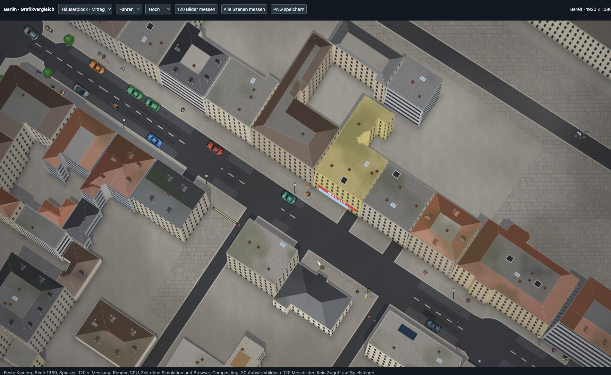 | 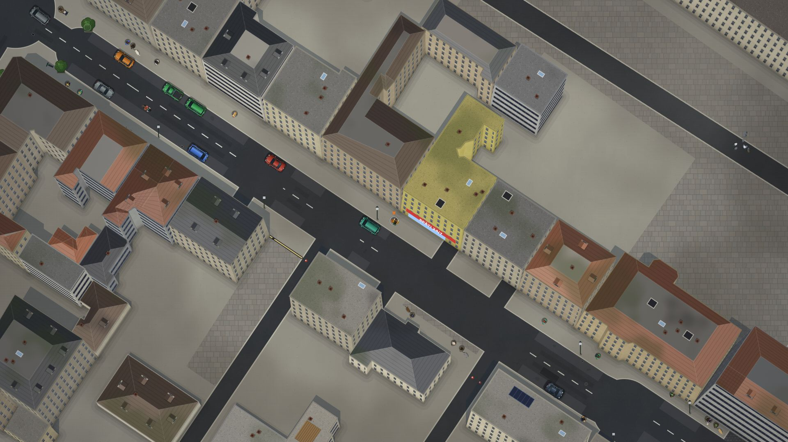 |
| Boulevard, Abend | 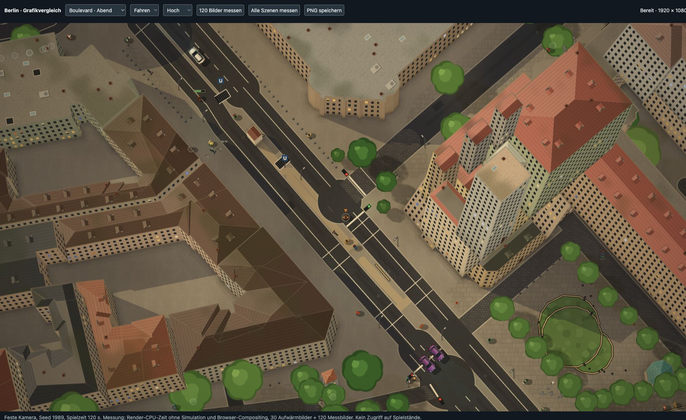 | 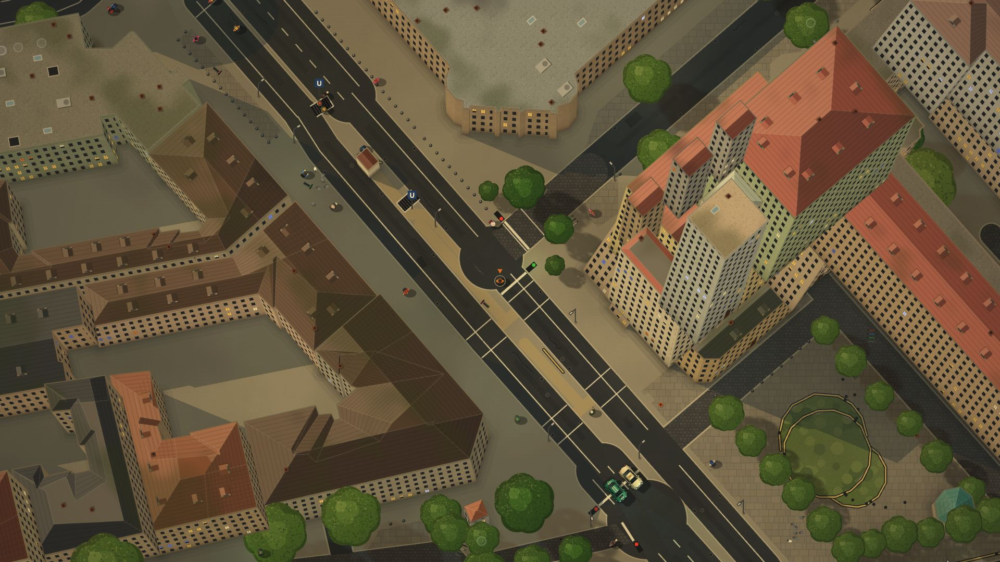 |
| Park, Sonne | 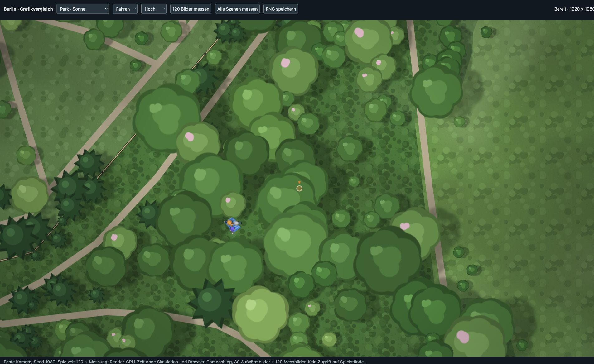 | 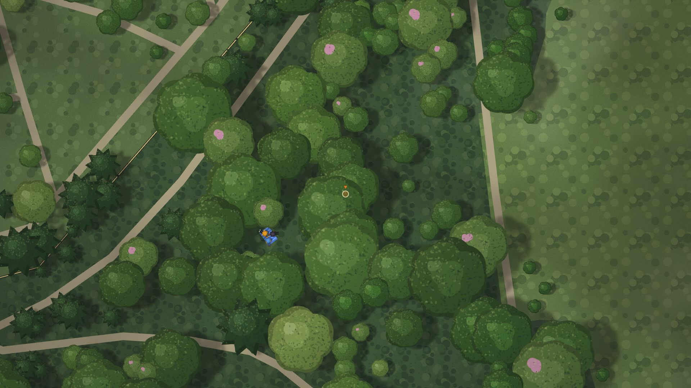 |
| Spree, Abend | 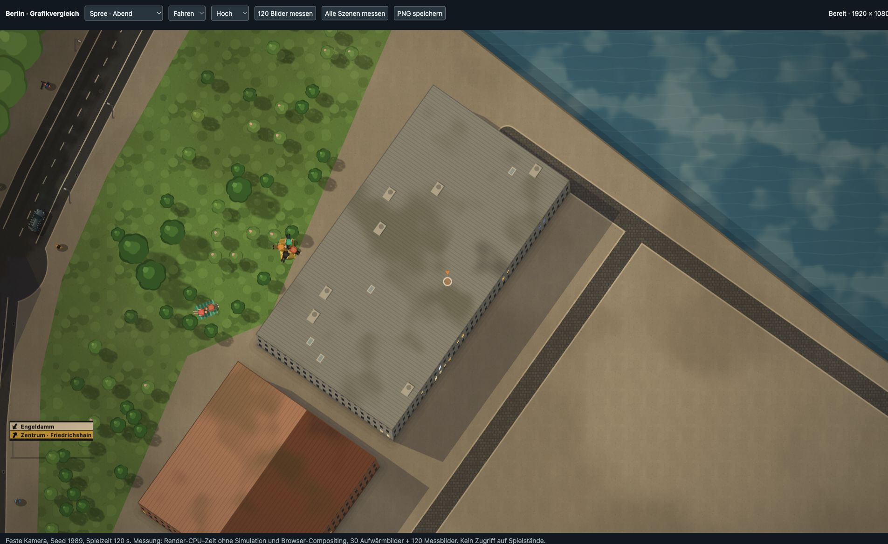 | 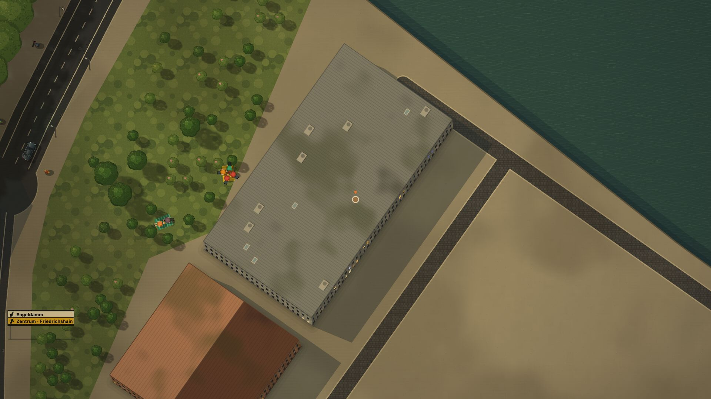 |
| Kiez, Regennacht | 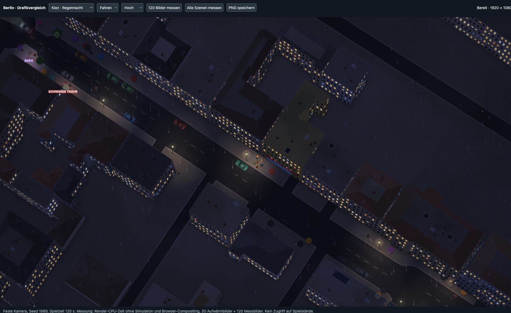 | 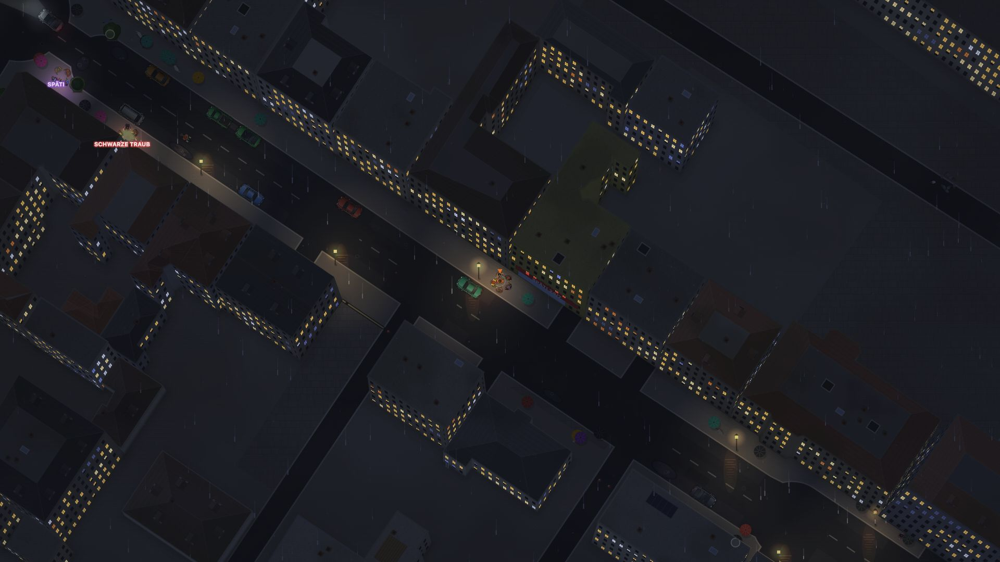 |
| Kiez, Schnee | 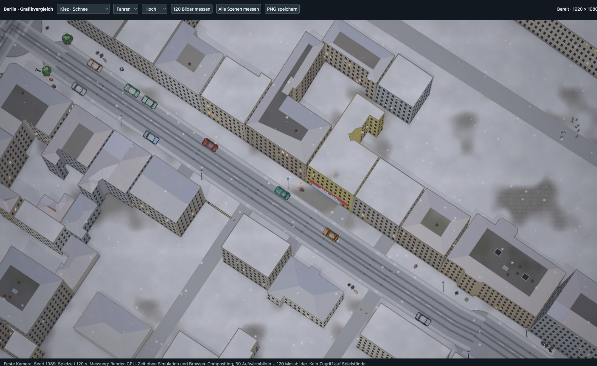 | 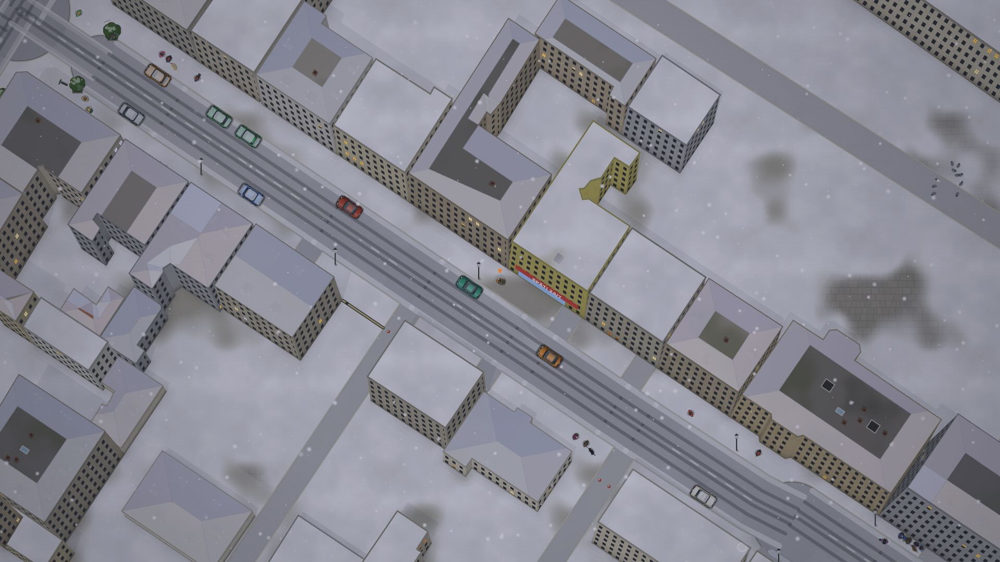 |
| U-Bahn, Innenraum | 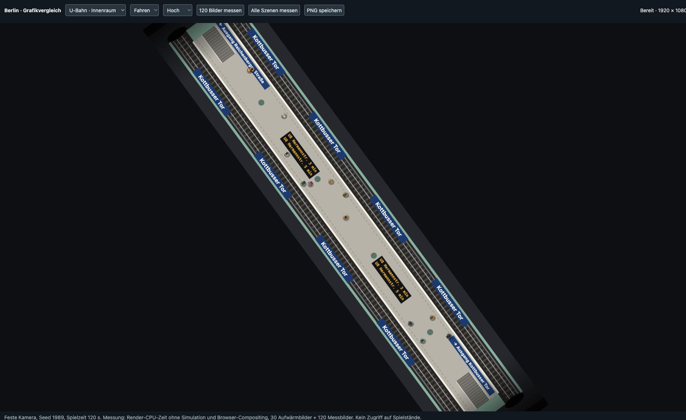 | 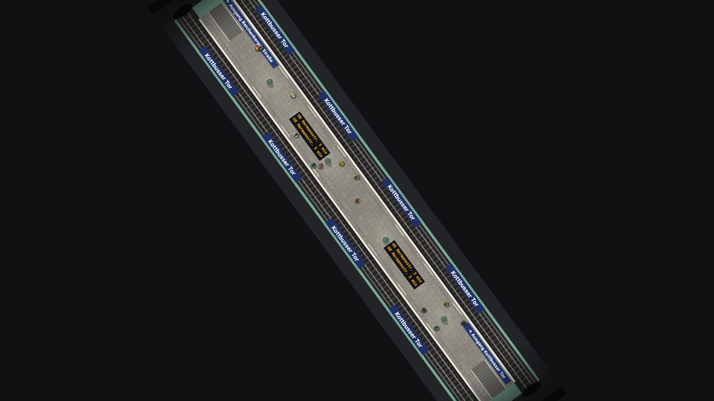 |

## Renderzeit

Die lokale Entwicklungsseite `web/graphics-review.html` erstellt die sieben Testwelten reproduzierbar. Gemessen wurde
bei 1920 × 1080 und Zoom 1,2. Je Stufe 30 Aufwärmframes und 120 Frames; die CPU-Zeit für `drawFrame` wird zwischen
den Browser-Animation-Frames aufgezeichnet. Simulation und GPU-Compositing sind nicht enthalten. Ein Lauf repräsentiert
daher nicht die vollständige Spielbildrate.

Vorher- und Nachher-Werte (Millisekunden) stehen in [`baseline-metrics.json`](images/graphics/baseline-metrics.json),
[`after-metrics-initial.json`](images/graphics/after-metrics-initial.json) und [`after-metrics.json`](images/graphics/after-metrics.json).
Der erste Messlauf nach den Optimierungen ergab als Median 17,9 ms im Häuserblock, 37,2 ms am Boulevard, 10,7 ms im
Park und 12,7 ms am Wasser (jeweils hohe Qualität). Beim späteren Lauf schwankten vor allem Boulevard und Regennacht
stark; Browser-/Systemlast macht einzelne Läufe deutlich langsamer. Werte sind als Vergleichshinweis zu lesen,
nicht als FPS-Versprechen. Der Profiling-Lauf fand Häuserzeichnung, verdeckte Figurenmasken und Dächer als größte
Kostenstellen. Gebäudekacheln außerhalb des projizierten Bildrands werden jetzt früh übersprungen. Dachbilder werden
in einem begrenzten Cache gehalten; Hausmasken bündeln Wandflächen.

Nach dieser Performance-Runde sank im 1080p-Häuserblock die reine Zeichenzeit bei niedriger Qualität von 16,4 auf
12,7 ms Median (P95 von 35,2 auf 27,8 ms). Die Regennacht lag bei 17,7 ms. Der Boulevard braucht auch in niedriger
Qualität rund 27 ms; das 60-FPS-Ziel ist für die dichte Szene weiter offen. Zeiten schließen Simulation und
GPU-Compositing nicht ein.

60 FPS entsprechen 16,7 ms für die gesamte Bild-, Simulations- und Browserarbeit. Die dichte Boulevard-Szene bleibt
auch nach den Änderungen deutlich über diesem Budget. 60 FPS sind damit noch nicht in allen Berliner Szenen erreicht;
die vorhandene automatische Qualitätsstufe nimmt bei langsamen Bildern Details zurück.

## Entwicklung und Prüfung

Für manuelle Durchsicht dient `npm start` → `/graphics-review.html`. Die Seite hat sieben Szenen, zwei Zoomstufen,
hohe/niedrige Qualität, einen Renderprofil-Lauf, 120-Frame-Messung, PNG-Export und eine 180-Frame-Bewegungsprobe.
Sie setzt eine eigene feste Welt auf und schreibt keine Spielstände oder Einstellungen.

Gezielte Prüfung: 82 von 84 Tests aus Renderer, Dächer, Licht, Wetter, Unwetter, Fußsteuerung und Ebenen bestanden.
Zwei Fehler in `foot.test.js` (Einsteigen nach Mausklick und erwarteter HUD-Text) treten unverändert auch auf Commit
`81fd4d59` auf. Die neuen Grafiktests und Dachfarbtests sind grün. Die gezielten neuen Fälle prüfen zusätzlich
Wassereintritt, Sprung/Landung, Schwimmpose, zeitabhängige Schwimmwellen und begrenzte, auslaufende Effekte.

## Grenzen

Der Nacht-Leuchthof hängt von Canvas-Filtern ab und wird nur bei hoher Qualität gerechnet. Spiegelungen nutzen eine
begrenzte Zahl nahe Laternen statt einer vollständigen physikalischen Reflexionsberechnung. Der Dachcache beansprucht
bis zu 16 Mi gespeicherte Pixel (64 MiB RGBA-Rohdaten; Browser-/GPU-Overhead zusätzlich); Einzelbilder über 1 Mi Pixel
werden direkt gezeichnet. Gemessene Renderzeiten variieren mit Browser, Gerät und Hintergrundlast.
