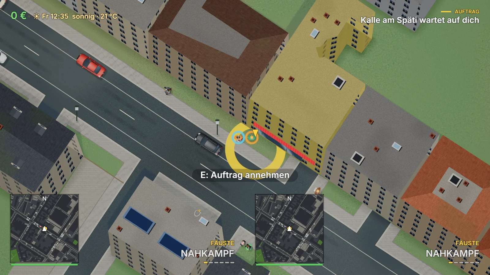
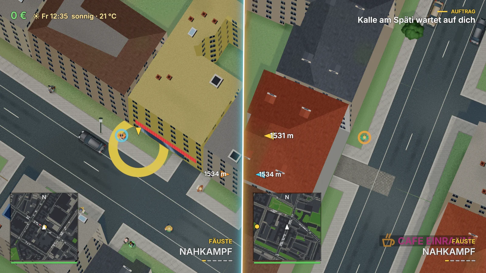
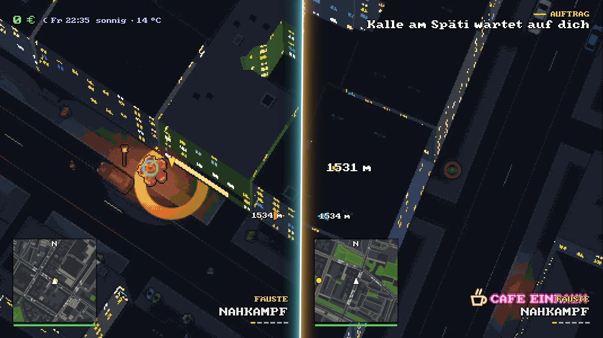

# Native Rust-Portierung

## Stand: Phase 5 + HUD und Gamepad

Rust Edition 2024, mindestens Rust 1.95, Cargo-Workspace mit vier Crates (`berlin-sim` siehe
Abschnitt Phase 3 unten):

- `berlin-engine`: winit 0.30, wgpu 29, WGSL, glam-Kamera, Render-Loop,
  indizierte Kachel-Meshes, Depth-Pass und instanzierter Sprite-Atlas.
- `gta-berlin`: Startprogramm, Geokoordinaten, Datenprüfung und GPU-Aufnahmen.
- `berlin-map-loader`: serde/serde_json-Decoder für Format v3, GRS80-Projektion,
  Geometriehilfen, Berliner Gebäude-/Dachpaletten und Hintergrund-Streaming.

`cargo run` startet am Missionsort in Kreuzberg mit den vorhandenen Daten aus
`web/data/berlin`. Der aktuelle Index enthält **2921 Kacheln**; die Zahl 2920 im
Portierungsprompt ist gegenüber dem vorhandenen Datenstand um eine Kachel kleiner.
Straßen, Gehwege, Wege, Kreuzungen, Landflächen, Wasser, Gleise, Gebäude und
Bäume sind sichtbar. Die Kartenansicht ist noch kein spielbarer Rust-Port:
Seit Phase 3 fahren darauf Verkehr und Spieler (siehe unten); Gamepad und Audio folgen.

## Daten und Streaming

Die bestehenden JSON-Dateien werden unverändert verwendet. Ein benannter
Hintergrundthread liest und dekodiert Kacheln, trianguliert Polygone mit earcutr,
baut Straßen-Meshes und erzeugt Gebäude-/Sprite-Geometrie. Die Render-Schleife
führt keine Dateizugriffe oder Triangulierung aus. Kameraaufträge ersetzen ältere
Aufträge; die Übergabe fertiger Zustände ist auf zwei Snapshots begrenzt.

Geladen wird innerhalb mindestens 7000 Kartenpixeln, gehalten innerhalb mindestens
11000 Pixeln. Große Viewports vergrößern den Radius. Die nächste Kachel kommt
zuerst; höchstens 64 Kacheln bleiben resident. Fehlgeschlagene Dateien werden
nach 500/1000/2000/3000 ms erneut versucht und beim ersten Fehler protokolliert.
Der Fenstertitel zeigt den Ladefortschritt und die Kartenattribution.

Globale Objekt-IDs halten Referenzen auf alle residenten Kacheln. Genau eine
Kachel zeichnet ein geteiltes Objekt; beim Entladen wechselt diese Zuständigkeit
zur nächsten Kachel. Nur betroffene Kachel-Batches werden neu zusammengesetzt
und hochgeladen. Bereiche mit ID −1 gehören ihrer Kachel; ihre Dreiecke werden
am exakten Kachelrand abgeschnitten. GPU-Puffer ferner Kacheln werden freigegeben.

## Geometrie und Darstellung

`geom.rs` portiert Punkt-in-Ring, Gerade-/Ungerade-Füllung, Flächen, Boundingbox,
Segmentabstand, Bogenlängen, Projektion auf Linien, Parallelversatz,
Delta-Koordinaten, Ringindex und Rechteck-Clipping nach glam::Vec2.
Die GRS80/Krüger-Projektion nutzt f64 und entspricht `projection.js`, inklusive
JS-Rundung. Der Decoder kontrolliert Version, Schlüssel, Koordinatenlisten und
Knotenreferenzen. Codes und Bitfelder entsprechen `citycodes.js`.

Polygone werden mit konkaven Außenringen, Innenhöfen, getrennten Außenringen
und Inseln in Löchern trianguliert. Die Verschachtelung folgt der Canvas-
Gerade-/Ungerade-Regel, auch bei Gebäuden mit mehreren getrennten Grundrissen.
Straßen/Gleise verwenden zusammenhängende Vertex-/Index-Batches je Kachel;
begrenzte Gehrungen verbinden Straßensegmente. OSM-Ebenen bestimmen die
Zeichenreihenfolge für Brücken und Unterführungen.

Gebäude erhalten extrudierte Fassaden, offene Wandzüge für Tordurchfahrten und
Dachparallaxe. Dach-/Fassadenstil, Farbprioritäten und Paletten stammen aus
`roofs.js` und `buildcolors.js`: OSM-Farbe vor Material vor geschätztem Stil.
Sattel-, Walm-, Zelt-, Mansard-, Pult- und Berliner Dachflächen werden nach
Grundriss und Hauptachse erzeugt und auf die triangulierten Grundrisse begrenzt.
Kuppel-/Runddächer verwenden variierende Normalen; die Schattierung der
Dachflächen und Fassaden erfolgt im WGSL-Fragment-Shader anhand der Sonnenrichtung.

Boden-/Dachtexturen und Fassadenfenster entstehen prozedural im Shader, mit
Ableitungen für die Detailreduktion. Ein einmal erzeugter Atlas enthält zwei
Baumkronen und Straßendetails (Gully, Kanaldeckel, Flicken, Riss, Öl, Markierung).
Ein Instanzbuffer je Kachel zeichnet sie ohne einzelne Canvas-Aufrufe.

Die GPU-Fassung übernimmt die Kartenstruktur und grundlegenden Material-/Stilregeln.
Die Darstellung ist noch vereinfacht: Gauben, Schornsteine und andere Dachaufbauten,
individuelle Fenster-/Fassadenstile, Zebrastreifen, Schilder, Stadtmöbel und die
vollständigen Gehweg-/Parkstreifendetails des JS-Renderers sind noch nicht umgesetzt.
Kuppeln erhalten noch keine eigene gewölbte Höhengeometrie. Schatten und dynamische
Beleuchtung sind Phase 4; aktuell ist der Sonnenstand statisch wählbar.

## Mac-Entwicklung

Rust über rustup und Xcode Command Line Tools (`xcode-select --install`) genügen.
Kein Node und keine Windows-SDK-Abhängigkeit für den nativen Start.

```bash
cargo run
cargo run --release
cargo run --release -- --fps 120
cargo run -- --smoke-frames 10
cargo run -- --check-map
cargo run -- --geo 52.5163 13.3777 --zoom 0.72
cargo run -- --geo 52.5014 13.4455 --sun-hour 8 --capture /tmp/oberbaum.png
cargo fmt --all -- --check
cargo clippy --workspace --all-targets -- -D warnings
cargo test --workspace
```

Der GPU-Name samt Backend wird beim Start protokolliert. macOS verwendet explizit
Metal, Windows explizit DX12; Linux verwendet Vulkan als Entwicklungsfallback.
Ein Grafikadapter und eine Desktop-Sitzung sind für den Fensterstart erforderlich.
`--smoke-frames N` zählt erst bei vollständig geladenem sichtbaren Kartenausschnitt.
Nach N präsentierten Kartenframes beendet es; Ladefehler und ein Timeout nach
30 Sekunden melden einen Fehler. `--capture PNG` liest ein eigenes GPU-Renderziel
zurück und beendet nach zehn Kartenframes (oder der gewählten Smoke-Framezahl).
`--check-map` prüft alle Kacheldateien und Polygon-Triangulierungen ohne Fenster.
`--data PFAD` wählt einen anderen Datenordner; `--position X Y` setzt Kartenpixel,
`--geo LAT LON` Geokoordinaten. Beide Positionsoptionen schließen sich aus.
`--zoom` erlaubt 0,72–2,6, `--sun-hour` 5,5–20,5 für die Sonnenrichtung.

WASD/Pfeile bewegen die Kamera, Shift erhöht das Bewegungstempo.
Mausrad zoomt zwischen 0,72 und 2,6.
1 = schneller Fahrzeugzoom (0,72), 2 = Standard (1), 3 = Fußzoom (2).
Der Fußzoom der JS-Vorlage beträgt 2 mit Bereich 1,5–2,6; der größere native
Gesamtbereich erlaubt zusätzlich die Fahrzeugansicht. Bei Fokusverlust werden
gedrückte Tasten gelöscht. Esc oder Fensterschließen beendet das Programm.

## Kamera und Frame-Pacing

Der Kartengrundriss verwendet dieselbe affine Projektion wie `render.js`:
Bildschirmmitte + (Weltposition − Kameraposition) × Maßstab × Zoom.
Y zeigt nach Süden. Gebäudehöhen verschieben die Dächer nach oben und erzeugen
positionsabhängige Parallaxe entsprechend `render.js` (heightScale 0,5).
Die Gebäudeparallaxe verwendet den Gebäudemittelpunkt für alle Dachpunkte,
wie die Vorlage. Unit-Tests prüfen
Rückprojektion, Zentrum, Dachversatz und Zoomgrenzen.

FIFO-V-Sync verhindert Tearing; `WaitUntil` begrenzt die Anforderung neuer Frames
auf 60 oder 120 pro Sekunde, mit maximal einem angeforderten Frame Latenz.
Die tatsächliche Rate bleibt vom Monitor und der GPU abhängig. Resize und
HiDPI nutzen physische Pixel. Nullgroße Fenster pausieren Rendering; verlorene
Surfaces werden neu erstellt, veraltete neu konfiguriert, Timeouts übersprungen.
Die Kamera integriert reale Zeit mit einer 100-ms-Obergrenze; die feste
Simulationsschrittweite wird mit Phase 3 ergänzt.

## Windows und Xbox

Ein Windows-Desktop-Build nutzt DX12. Cross-Compilation vom Mac kann vorbereitet
werden mit:

```bash
rustup target add x86_64-pc-windows-msvc
cargo install cargo-xwin --locked
cargo xwin build --release --target x86_64-pc-windows-msvc -p gta-berlin
```

Dieser Workflow ist noch nicht auf Windows oder Xbox validiert.
Ein Windows-Desktop-EXE ist noch kein installierbares Xbox-Dev-Mode-Paket.
Der bestehende UWP/WebView2-Host kann dieses winit-Programm nicht unmittelbar
als natives UWP-Spiel starten. App-Modell, zulässige APIs, Paketierung und
Grafikzugriff müssen separat geklärt und auf echter Hardware geprüft werden.
60–120 FPS auf Xbox sind ein Ziel, kein Messergebnis.

### TODO: Xbox-Teststrategie (vereinbart am 04.10.2026, nächster Schritt)

Ausgangslage: Die Browser-Fassung war auf der Xbox nicht spielbar; die Rust-Fassung läuft dort noch gar nicht
(Dev Mode erlaubt nur UWP-Pakete, Rust-UWP ist Tier 3, winit hat keinen UWP-Weg, die Hülle startet nur die Webseite).
Auf dem M1 Pro gemessen (stehend, nachts, Starkregen): Simulation JS 0,63–0,71 ms je Schritt gegen Rust 0,16–0,17 ms;
Browser hält ~99 fps nur mit selbst abgesenkter Auflösung (1920×1080), ein Ruckler von 41 ms; Rust 1,4 ms Arbeit je
Bild in voller Auflösung. Die Reihenfolge der Schritte nach Aufwand und Aussagekraft:

1. **Schnelltest der Browser-Fassung auf der Konsole** (kostet fast nichts, klärt die Ursache):
   - [ ] Im Xbox Device Portal (`https://<xbox-ip>:11443`) *Settings → Preference Settings* „Treat UWP apps as games by
     default“ einschalten (App-Modus: geteilte Kerne, ~45 % GPU, 1 GB; Spiel: 4 exklusive Kerne, volle GPU, 5 GB).
   - [ ] Spiel starten, Bildrate und Ruckler beim Fahren notieren (Befehlszeile oder `globalThis.__renderer.stats`).
   - [ ] Mit erzwungen niedriger Auflösung wiederholen (`perf.js stepResolution` / Befehl `aufloesung`).
   - Ergebnis festhalten: Lag es am App-Modus, an der Auflösung oder an Canvas 2D selbst?
2. **Rust-Fassung als WebAssembly in der vorhandenen Hülle** (Empfehlung; auf dem Mac entwickel- und testbar):
   - [ ] `wasm32-unknown-unknown`-Build von `crates/game` mit wgpu (WebGPU, Rückfall WebGL2) und winit-Web,
     im Browser auf dem Mac lauffähig.
   - [ ] Kacheln per `fetch` statt Datei; Streaming-Thread ersetzen (Web Worker oder Laden in Häppchen je Bild –
     Threads in WASM brauchen SharedArrayBuffer und COOP/COEP-Header, in der Hülle zu klären).
   - [ ] Ton: cpal hat einen Web-Audio-Rückfall; Autoplay-Regel der Hülle beachten.
   - [ ] Controller: die Nachrichten der Hülle (`{type:'gamepad', pads}` alle 8 ms) an `engine/pad.rs` weiterreichen.
   - [ ] Messung im Browser auf dem Mac gegen die JS-Fassung (gleiche Szene, Fahren durch die Stadt).
   - [ ] Auf der Xbox: Gibt es im WebView2 der Konsole WebGPU bzw. WebGL2? Bildrate im App- und im Spiel-Modus.
3. **Echte UWP-Hülle mit Rust** (nur, falls 2 nicht reicht): C++/WinRT-Hülle, die `CoreWindow` und den
   DirectX-12-Swapchain an Rust übergibt; braucht einen Windows-Rechner (oder Windows-11-ARM-VM) und klärt erst,
   ob wgpu dort eine Oberfläche bekommt. Meiste Unbekannte.

Messgrößen für alle Schritte: Bildrate (Median, p95), längstes Bild, Ruckler beim schnellen Fahren (Kachelnachladen),
Speicher, Eingabelatenz des Controllers.

#### Recherche zu Schritt 3 (05.10.2026): Rust/wgpu als UWP-Spiel im Developer Mode

Geprüft in den Quellen von wgpu 29, cpal 0.18 und gilrs 0.11 (Cargo-Registry) sowie in Microsoft- und Projektdokumentation:

| Baustein | Befund | Bewertung |
|---|---|---|
| DirectX auf der Series S | UWP bekommt DX12 mit **Feature Level 11.0** (App- wie Spielmodus), Shader Model 5.1–6.4; im App-Modus gibt es DX12 im Developer Mode nur über **WARP** (Software) – Spielmodus ist Pflicht (**widerlegt** am 06.10.2026: auch im App-Modus Hardware-GPU, aber gedeckelt, siehe unten). Empfohlene Auflösung Series S: 2560 × 1440. | passt |
| wgpu-DX12 | `wgpu-hal/src/dx12/adapter.rs` legt das Gerät mit **D3D_FEATURE_LEVEL_11_0** an (fragt bis 12_2 ab). Oberflächen: HWND, DirectComposition-Visual, Surface-Handle und **XAML-`SwapChainPanel`** (`SurfaceTargetUnsafe::SwapChainPanel`); **kein `CoreWindow`**. | trägt, wenn die Hülle ein `SwapChainPanel` liefert |
| Fenster/Eingabe | winit hat keinen UWP-Weg. Die Engine braucht einen Betrieb ohne winit: die Hülle treibt die Bilder (Render-Schleife), reicht Größe und Tasten durch. | Umbau nötig (`engine/lib.rs App`) |
| Rust-Ziel | `x86_64-uwp-windows-msvc`: Tier 3, **std wird unterstützt**, aber nur mit Nightly und `-Z build-std=std,panic_abort`; ein `pc-windows-msvc`-Build kann Win32-Funktionen importieren, die es im Xbox-Betriebssystem nicht gibt (DLL lädt dann nicht). | machbar, Nightly festpinnen |
| Controller | gilrs nutzt unter Windows standardmäßig **Windows.Gaming.Input** (`wgi`) – genau die UWP-API. | passt voraussichtlich |
| Ton | cpal 0.18 öffnet das Standardgerät über `ActivateAudioInterfaceAsync` (UWP-tauglich), nutzt daneben aber `IMMDeviceEnumerator` (in UWP eingeschränkt). | prüfen; Rückfall wäre XAudio2 |
| Speicher | Spielmodus 5 GB; das Spiel braucht auf dem Mac 827 MB (mit Grafikspeicher). | passt |
| Dateien | Kacheln liegen im Paket (lesbar), Spielstand/Einstellungen müssen nach `ApplicationData.LocalFolder` statt ins Benutzerverzeichnis. | kleiner Umbau |

Vorbilder: **Cemu-UWP** (XboxEmuPorts) läuft auf der Series S im Developer Mode mit einem nativen Renderer in einem XAML-
`SwapChainPanel` (dort D3D11 FL 11.0, D3D12 nur experimentell) und hält sich an rund 5 GB; **firstuwp-rs** zeigt eine reine
Rust-UWP-App mit XAML. Ein Rust/wgpu-Spiel auf der Xbox ist nirgends belegt (ein Ruffle-UWP-Versuch ist ohne Ergebnis).

**Umsetzung von (a) und (b) (05.10.2026):** `crates/xbox_probe` + `xbox/RustProbe` (Anleitung
`xbox/RustProbe/README.md`).

#### Ergebnis auf der Konsole (05./06.10.2026, Series X, Developer Mode, OS 10.0.26100.9438)

**(a) und (b) sind belegt:** Rust (`x86_64-uwp-windows-msvc`, Nightly, build-std) + wgpu-DX12 zeichnen in einer
C#-UWP-Hülle ins `SwapChainPanel`. Die Systembibliotheken laden im Sandkasten (`d3d12`, `dxgi`, `d3dcompiler_47`,
`dcomp`), der Adapter ist die Hardware-GPU **`SraKmd_arden`** (daneben WARP), Feature Level 11.0, Texturgrenze 16384 px,
Float-Ziele und 4× MSAA gehen. Korrektur zur Tabelle oben: auch im **App-Modus** gab es die Hardware-GPU, nicht nur WARP.

Was auf der Konsole scheiterte und für das Spiel gilt:

| Befund | Ursache | Folge fürs Spiel |
|---|---|---|
| `QueryInterface(ISwapChainPanelNative)` → `E_NOINTERFACE` | Hülle nahm die **WinUI-3-GUID** `63aad0b8-…` (die auch wgpu intern trägt); UWP-XAML kennt nur `F92F19D2-3ADE-45A6-A20C-F6F1EA90554B`. wgpu ruft nur `SetSwapChain` (gleiche vtable). | UWP-GUID verwenden |
| Bild friert nach dem ersten Frame ein | Gezeichnet im UI-Thread (`CompositionTarget.Rendering`); `Fifo`-Warten auf das nächste Bild blockiert das Panel, das selbst den UI-Thread braucht | **eigener Render-Thread**; UI-Thread nur für `SetSwapChain` (erstes `configure`) |
| Nach 7 Bildern „Surface is not configured“ | Fenster 960×540 → 1920×1080 nach dem Start; `configure` → `ResizeBuffers` scheitert („Invalid surface“), wgpu-hal hat die Swapchain da schon per `take()` verworfen | **Swapchain nicht in der Größe ändern** (Startgröße, DXGI streckt) oder neu anlegen; endgültige Größe abwarten |
| Gerät verloren, `DXGI_ERROR_DRIVER_INTERNAL_ERROR` (`0x887A0020`) | **Anlegen der Zeitstempel-Abfragen** (`TIMESTAMP_QUERY`, zweimal an derselben Stelle) | **keine GPU-Zeitstempel** auf der Xbox; Messung per Fence |
| Neuaufbau direkt danach: `DXGI_ERROR_DEVICE_RESET`, dann gar kein Adapter | GPU-Reset nach dem Treiberfehler | nach Geräteverlust Pause (Probe: 10 s), nicht sofort neu |
| „Validation“ ohne Fehlertext | wgpu meldet ein verlorenes Gerät nicht über `on_uncaptured_error`, nur über `set_device_lost_callback`; DX12-Grund über `GetDeviceRemovedReason` (`as_hal::<Dx12>().raw_device()`) | beide Rückmeldungen einbauen |
| Sonderzeichen als `�` | Consolas fehlt auf der Konsole | Standardschrift |

**Messung (Fence: Last einzeln abschicken, Zeit bis die GPU fertig ist; 8 Schichten in 2560×1440, Float, 4× MSAA):**
**53 ms Median, P95 193 ms** – noch im **App-Modus** (laut Microsoft höchstens 45 % der GPU, geteilt, 1 GB). Mac-Vergleich mit
Zeitstempeln 4,46 ms; vergleichbar per Fence (`PROBE_FENCE=1 cargo run --release -p berlin-probe --example mac`, 06.10.2026,
M1 Pro, Fenster 1920×1080, Windows-VM lief nebenher): **Float 4× MSAA 6,95 ms**, Float ohne MSAA 6,98 ms, 8 Bit 6,92 ms
(Median; P95 9,3–11,4 ms).

**Einordnung:** Rechnerisch wäre die Konsole damit 7,6× langsamer als der M1 Pro – das passt nicht zur Hardware (Series X
≈ 12 TFLOPS gegen ≈ 5 TFLOPS). Die 53 ms messen im App-Modus vor allem die **Zuteilung**: höchstens 45 % der GPU in
Zeitscheiben, die Fence-Zeit enthält das Warten auf die nächste Scheibe (darauf deutet auch P95 193 ms). Auf das Spiel
übertragen lässt sich daraus nichts; dafür braucht es die Messung im Spielmodus.

**Offen:** Spielmodus. Der in allen Anleitungen beschriebene Schalter (Dev Home → Ansichtstaste → *View details* → *App type:
Game*) existiert auf dieser Systemversion nicht; die sideloadete App steht unter „Apps“. Noch nicht probiert: Device Portal
*Settings → Preference Settings* „Treat UWP apps as games by default“. Ohne Spielmodus ist die Leistung des Spiels auf der
Konsole nicht beurteilbar.

Arbeitsumgebung: Windows-11-ARM64-VM (Parallels) auf dem Mac genügt. Visual Studio 2022 braucht dafür zusätzlich die
MSVC-Tools **x64 und ARM64** (Buildskripte laufen auf dem ARM64-Host) und die C++-UWP-Unterstützung. Der Debug-Build der Hülle
stürzt in der ARM-VM beim Start ab (x64-CoreCLR von UWP unter Emulation), Release (.NET Native) läuft.

Vorgeschlagene Reihenfolge für Schritt 3: (a) leere C#- oder C++/WinRT-XAML-Hülle mit `SwapChainPanel`, Spielmodus;
(b) Rust als `cdylib` für `x86_64-uwp-windows-msvc` (Nightly, build-std) mit einer Funktion, die den Panel-Zeiger nimmt und
mit wgpu ein farbiges Bild zeichnet – Machbarkeit auf echter Konsole; (c) Engine ohne winit (Hülle treibt Bilder und
Eingaben); (d) Ton prüfen; (e) Pfade, Paket, Messung. Braucht einen Windows-Rechner mit Visual Studio und dem Windows SDK
22621 oder neuer.

## Referenzen

- [winit ApplicationHandler](https://docs.rs/winit/0.30.13/winit/application/trait.ApplicationHandler.html)
- [wgpu Surface](https://docs.rs/wgpu/29.0.4/wgpu/struct.Surface.html)
- [earcutr](https://docs.rs/earcutr/0.5.0/earcutr/fn.earcut.html)
- [cargo-xwin](https://github.com/rust-cross/cargo-xwin)

Die bestehenden Karten bleiben unverändert. Browser- und UWP-Dokumentation
beschreibt bis zum Abschluss der Migration weiterhin den spielbaren JS-Prototyp.

## Validierung am 03.10.2026

Auf diesem Mac (Apple M1 Pro, Metal) erfolgreich ausgeführt:
`cargo fmt --all -- --check`, Clippy mit `-D warnings`, `cargo test --workspace`
(zwei Kameratests), sowie jeweils zehn präsentierte Frames im 60- und
120-FPS-Zielmodus. Dies bestätigt Start und GPU-Pipeline, keine gemessene
120-FPS-Dauerleistung. Windows-Cross-Build und Xbox-Hardwaretest stehen aus.

## Validierung Phase 2 am 04.10.2026

Alle 2921 Kacheln mit 2423429 Einträgen (inklusive mehrfach abgelegter Objekte)
wurden gelesen und dekodiert, alle darin enthaltenen Gebäude-/Flächen-/Wasser-
Polygone erfolgreich trianguliert. Die Rust-Tests prüfen unter anderem Innenhöfe,
konkave Grundrisse, getrennte Ringe/verschachtelte Inseln, Projektionsparität,
Referenzzählung und Besitzerwechsel, asynchrones Entladen/Neuladen nach Teleports
sowie Fehler und Wiederholversuche. Drei reale Berlin-Kacheln werden vollständig
in Meshes umgesetzt und auf gültige Indizes sowie endliche Attribute geprüft.

Metal-Läufe auf dem Apple M1 Pro wurden am Kreuzberger Startpunkt und am
Brandenburger Tor (120-FPS-Zielmodus) geprüft; die GPU-Aufnahmen wurden visuell
kontrolliert. Auch die Oberbaumbrücke wurde mit Spree, Gleisen und Baumkronen
bei Morgenlicht geprüft: [GPU-Aufnahme](images/native/phase2-oberbaum.png).
Formatprüfung, Clippy mit `-D warnings` und alle 13 Rust-Tests sind erfolgreich.
Diese Tests belegen Rendering und Streaming, keine gemessene
60-/120-FPS-Dauerleistung. Windows/DX12 und Xbox sind weiter ungeprüft.

## Phase 3: Physik, Kollision und Spiellogik (04.10.2026)

Neues Crate `crates/sim` (`berlin-sim`): die deterministische Simulation ohne Fenster und GPU, portiert aus
den JS-Modulen. Lagen werden in `f64` gerechnet (Kartenpixel bis ~300 000, Schritte von Bruchteilen eines
Pixels). Zufall ist bitgleich `mulberry32`, `hash01` folgt der JS-Umwandlung über ToUint32.

| Rust-Modul | Vorlage | Inhalt |
|---|---|---|
| `collision.rs` | `collision.js`, `grid.js` | Kreis/Rechteck/OBB/Segment, SAT mit kürzestem Ausweg (Wände ohne Dicke), `SpatialHash` mit Handles und Entfernen, `Grid` mit aufsteigenden Indizes |
| `city.rs` | Simulationsteile von `map.js` | eigener Decoder der v3-Kacheln (Knoten mit Kreuzungsradius, Kanten mit Querschnitt, Wände, Gebäude, Flächen, Poller, Bäume, Querungen, Ampeln, Abbiegeverbote, Portale), referenzgezählte geteilte Objekte, Fokus-Streaming mit Wiederholversuchen, `surface_at`, `in_building`, `on_road`, `nearest_edge`, Stadtgrenze |
| `levels.rs` | `levels.js` | Ebenen, Portale, `touch` |
| `car.rs`, `dynamics.rs`, `carmodels.rs`, `traction.rs` | gleichnamige JS-Module | Arcade-Physik für Verkehr, Einspurmodell für das gefahrene Auto (Lastverschiebung, Kammscher Kreis, ESP/ASR, ABS, Handbremsen-Drift, Wheelie/Stoppie), 37 Pkw-Modelle + Sonderfahrzeuge, Haftung je Untergrund und Nässe/Schnee/Glätte, Schaden, umfahrbare Poller |
| `roadgraph.rs` | `roadgraph.js`, `street.js`, `signals.js` | Fahrspuren aus dem Querschnitt, Bézier-Verbinder, Abbiegeregeln, Ampelumlauf |
| `traffic.rs` | `traffic.js` | Pure Pursuit, Kurven-/Ampel-/Zebra-/Abstandsregeln, Blockadelösung, Kreuzungs- und Engstellen-Reservierungen, `spawn_allowed` (kein neues Auto an einer Haltelinie, deren Einfahrt belegt ist – sonst trüge `entry_gate` es im ersten Schritt ungeprüft ein, auch gegen den Gegenverkehr einer Engstelle) |
| `pedestrians.rs` | `pedestrians.js` | Gehwege, Abbiegen, Queren am Zebrastreifen, Warten vor Autos, Flucht und Rückkehr |
| `mission.rs`, `save.rs` | `mission.js`, `save.js` | Zustandsmaschine „Kisten für den Kiez“; Spielstand als JSON-Datei (gleiches Format wie die Browserfassung, atomar geschrieben) |
| `world.rs` | Kern von `world.js` | fester Schritt 1/60 s, Ein-/Aussteigen, Kollisionen, Bevölkerung um die Kamera, Parker, Mission, Kamera, Spielstand |

Rust-spezifische Entscheidungen: Die KI liest eine Momentaufnahme aller Fahrzeuge (`Agent`), statt während der
Schleife auf andere Autos zuzugreifen – das entspricht der JS-Fassung, in der sich während der KI-Schleife nichts
bewegt. Reservierungen und die Ansprüche je Auto liegen gemeinsam in `Reservations`. Kacheln lädt im Spiel ein
eigener Thread (`ThreadedSource`); die Simulation baut sie nur ein und steht still, bis der Ausschnitt da ist.

Spielstand: macOS `~/Library/Application Support/GTA Berlin/save.json`, Windows `%APPDATA%\GTA Berlin\save.json`,
sonst `$XDG_DATA_HOME/gta-berlin/save.json`; `--save DATEI` wählt eine andere Datei, `--new` beginnt ohne Laden.

Darstellung: Die Engine zeichnet bewegte Objekte über eine instanzierte Pipeline (`Body`: Rechteck mit
abgerundeten Ecken, Ellipse oder Ring, Kantenglättung per SDF). Autos haben Schatten, Dach, Frontscheibe,
Bremslichter und Kisten; Passanten Körper und Kopf; das Missionsziel einen pulsierenden Ring.
[GPU-Aufnahme](images/native/phase3-play.png). Hinweis: In WGSL darf kein Bezeichner `half` heißen – Naga
übernimmt ihn nach Metal, wo `half` ein Typname ist.

**Noch nicht portiert:** Wetter- und Tagesverlauf (Nässe/Schnee/Glätte sind Zustand und wirken, werden aber
noch nicht fortgeschrieben), Pfützen/Aquaplaning-Auslösung und Sturmböen, Waffen und Nahkampf, Räder, Tiere,
Nahverkehr und U-Bahnhöfe, Aufenthaltsorte, Einsatzfahrzeuge, Tagesrhythmus der Bevölkerung, Klick-Steuerung,
Gamepad, HUD-Texte (Hinweise stehen im Fenstertitel), Audio und Licht. Der JS-Bot, der die Mission über
A*-Routen selbst fährt, ist seit dem 04.10.2026 portiert (`crates/sim/tests/autopilot.rs`).

### Validierung Phase 3 am 04.10.2026

Formatprüfung, Clippy mit `-D warnings` und alle 58 Rust-Tests erfolgreich. `berlin-sim` hat 35 Unit-Tests
(SAT-Fälle inklusive gedrehter Boxen und Wände ohne Dicke, Hash mit Entfernen und Stempelüberlauf, Raster-
Reihenfolge, JS-Referenzwerte für `mulberry32`/`hash01`, Fahrdynamik: Beschleunigung, Spitze, Bremsweg trocken
gegen Glätte, Drift, Wheelie; Mission, Spielstand) und 10 Integrationstests auf den echten Kacheln um den
Missionsort: Bevölkerung, 60-s-Dauerlauf (keine KI im Haus, ≥ 70 % der Autos fahren mehr als 30 m), Ampeln
nie gleichzeitig grün, Spielerauto nie im Haus, Beschleunigen/Bremsen auf gerader Spur, Wände zu Fuß, Mission
über Welteingaben, Spielstand über Datei, Determinismus.

`cargo run --release -- --check-sim 120` auf dem Apple M1 Pro: 120 s Spielzeit in 1,4 s (0,19 ms je Schritt mit
22 KI-Autos, 55 Passanten und rund 30 Parkern), alle KI-Autos in Fahrt, keine Unfälle. Ein Metal-Lauf mit
90 Frames und GPU-Aufnahme wurde visuell kontrolliert. Das belegt Simulation und Zeichnen auf dem Mac, keine
Dauer-Bildrate; Windows/DX12 und Xbox sind weiter ungeprüft.

## Phase 4: Tageslicht, Schatten und Licht (04.10.2026)

Die Uhr der Simulation (1 Echtsekunde = 1 Spielminute) treibt jetzt das Licht. `berlin-sim` enthält die reinen
Rechenteile, die Engine die GPU-Pässe.

| Rust | Vorlage | Inhalt |
|---|---|---|
| `sim/daylight.rs` | `daylight.js` | Sonnenhöhe/-azimut, Schattenrichtung, -länge (≤ 2,4 × Höhe) und -stärke, Umgebungslicht je Kanal, Dunkelheit, Laternen an/aus, erleuchtete Fenster; `format_clock`/`parse_clock` |
| `sim/lamps.rs` | `lamps.js` | Laternenstandorte je Kante (Abstand nach Straßenklasse, beidseitig ab 10 m, Ecken frei, nie auf Fahrbahn/im Haus/im Wasser), Gas-/Haupt-/Nebenstraßenlicht, `LampCache` |
| `map_loader/mesh.rs` | `lighting.js addBuildingShadow` | je Gebäudewand ein Schatten-Viereck (`ShadowVertex`: Fuß, gestauchte Höhe max(18, h × 0,5), Extrusionsflag) |
| `engine/lightpass.rs`, `lighting.wgsl` | `lighting.js` | Schattenmaske, Lichtkarte, Auftragen |

Ablauf je Bild:
1. **Schattenmaske** (R8, volle Auflösung): Der Vertex-Shader versetzt die Wandvierecke um
   `min(900, Höhe × Länge)` entlang der Sonne; zusammen ergeben sie den Schatten des Prismas. Baumkronen werden aus
   dem Sprite-Atlas als Kronenbild in der Höhe der Kronenmitte versetzt und entlang der Sonne gestreckt
   (`treeShadowGeom`). Max-Mischung: Überlappungen dunkeln nicht doppelt. Auch Häuser bis 900 px außerhalb des
   Bildes werfen hinein.
2. **Lichtkarte** (RGBA16F, halbe Auflösung, nur bei Dunkelheit): mit dem Umgebungslicht gefüllt, Lichtquellen
   additiv – Laternen, Scheinwerferkegel, Stand-, Rück- und Bremslichter, Ampeln (Farbe aus dem Umlauf), Schein um
   den Spieler und das Missionsziel. Verlauf und Kegelform wie die Canvas-Sprites der JS-Fassung.
3. **Auftragen** über die vorhandene Tiefe: ein Vollbild-Dreieck in Tiefe 0,5. Boden, Straßen, Autos und Personen
   liegen dahinter (0,55–0,94) und bekommen Schatten (bläulich, 34 % × Sonnenstärke) bzw. die Lichtkarte
   (Multiplikation); Dächer, Fassaden und Kronen liegen davor (≤ 0,45) und bekommen nur das Umgebungslicht – so
   leuchten Laternen nicht auf Dächer, wie `lightOccluders` in der JS-Fassung. Schatten werden vor Bäumen und
   bewegten Objekten aufgetragen, das Licht danach.

Steuerung: `--uhr HH:MM` setzt die Startzeit (auch mit `--free`), `--sun-hour` nimmt jetzt 0–24, Taste T stellt
die Uhr eine Stunde vor. Die Engine erhält das Licht über `Game::lighting`/`Game::lights` (`Lighting`,
`LightSource`); ohne Spiel gilt das Licht aus den Optionen.

**Noch offen:** erleuchtete Fenster, Laternenköpfe als eigene Lichtpunkte, Ladenlicht aus POIs, Blaulicht
(keine Einsatzfahrzeuge), Bloom, Farbabstimmung (`drawGrade`), Vignette, Wetterlicht (Wolken, Nässe, Nebel)
und Silhouetten verdeckter Figuren.

### Validierung Phase 4 am 04.10.2026

Formatprüfung, Clippy mit `-D warnings` und alle 62 Rust-Tests erfolgreich. Neu: Tageslicht (Mittag, Nacht,
Abend, Uhrzeit-Text), Abbildung Tageslicht → Engine-Licht (Sonnen- und Schattenrichtung entgegengesetzt), und
ein Integrationstest der Laternen auf echten Kacheln: genau 41 Laternen um den Späti – dieselbe Zahl liefert
`lamps.js` auf derselben Karte im selben Ausschnitt –, keine im Haus oder auf der Fahrbahn.

Metal-Aufnahmen auf dem Apple M1 Pro wurden visuell geprüft: [19:00 mit langen Schatten nach Osten](images/native/phase4-evening.png),
[22:30 mit Scheinwerfern und Laternen](images/native/phase4-night.png), dazu 9:00 an der Oberbaumbrücke
(Schatten nach Westen) und 17:30 mit Baumkronenschatten. Pixelprobe Mitternacht gegen Mittag: Wiese 105 → 28,
ein rotes Auto unter Laternenlicht 227 → 124. Beobachtet: Der Smoke-Test lief beim ersten Start nach einem
Neubau zweimal in den 30-s-Timeout (danach jeweils erfolgreich); vermutlich wurde das neue Fenster verdeckt
gemeldet und präsentierte keine Bilder – nicht weiter untersucht.

## Phase 5: Synthetisierter Klang (04.10.2026)

Wie in der Browserfassung gibt es keine Aufnahmen: alles wird erzeugt. Die Mischregeln sind rein und getestet in
`berlin-sim`, die Klangerzeugung liegt im neuen Crate `crates/audio` (`berlin-audio`), die Ausgabe läuft über
`cpal` (macOS CoreAudio, Windows WASAPI).

| Rust | Vorlage | Inhalt |
|---|---|---|
| `sim/enginevoice.rs` | `enginevoice.js` | 17 Motorcharaktere (Dreizylinder bis V10, Diesel, Boxer, Zweitakter, Motorrad, Elektro), Zuordnung je Modell, Fourierspektrum eines Arbeitszyklus mit Bankversatz (Crossplane-V8) |
| `sim/soundscape.rs` | `soundscape.js` | Motoren je Art/Modell (Leerlauf, Abregeldrehzahl, Zylinder, Gänge), Drehzahl mit Schalten, Last, Turbo, Rekuperation; Reifen (Abrollen, Pflaster, Nässe, Schnee, Quietschen/Rutschen, Fahrtwind); die vier nächsten Fremdautos mit Pegel, Panorama und Dopplerfaktor; Schritte je Untergrund |
| `sim/ambience.rs` | `ambience.js` | Stadtrauschen, Verkehr, Vögel (Grün, Tageszeit), Wasser, Dämpfung im Auto |
| `audio/dsp.rs` | Web-Audio-Knoten | `setTargetAtTime`-Glättung, Oszillatoren mit PolyBLEP, Wellentabellen (`PeriodicWave`, auf Spitze 1 normiert), Rauschen, Biquad nach Web-Audio-Spezifikation (Tief-/Hochpass mit Q in dB, Bandpass, Peaking, Low-Shelf), Gleichleistungs-Panorama, Sättigung, Kompressor, Hüllkurven |
| `audio/synth.rs` | `audio.js` | Motor (Wellentabelle aus dem Zylinderspektrum, Kurbelwellenton, Ansaugung, Auspuff und Diesel-Nageln im Zündtakt moduliert, Turbo und Abblasen, Auspuffknallen, Rückwärtssummer, Elektro-Summen), Reifen/Wind/Quietschen, Regen aufs Dach, vier Fremdfahrzeug-Stimmen, Umgebungsschichten, Vogelstimmen, Einzelklänge (Unfall, Hupe, Poller, Tür, Mission, Schritte); Bus „draußen“ mit Karosserie-Tiefpass, Hauptpegel 0,55, Kompressor |
| `audio/output.rs` | – | Echtzeit über `cpal` (f32/i16/u16), Offline-WAV |
| `game/sound.rs` | `main.js` | je Simulationsschritt ein Klang-Frame: Ereignisse mit Hörweite 1400 px, eigenes Fahrzeug, Schritte, Stimmen, Umgebung |

Bedienung: M schaltet den Ton um, `--stumm` startet ohne Ausgabe. Ohne Ausgabegerät läuft das Spiel stumm weiter.
`cargo run --release -- --audio-wav fahrt.wav [--audio-seconds 14]` simuliert ohne Fenster eine Messfahrt
(einsteigen, Vollgas, bremsen, Teillast auf einer geraden Spur nahe dem Späti), protokolliert Tempo, Drehzahl,
Gang und Zündton je Sekunde und schreibt den Klang als 16-Bit-WAV (48 kHz).

**Noch offen:** Nachtleben (Stimmengewirr, Lachen, Clubbass), Hochbahn-Rumpeln, Martinshörner, Regen- und
Sturmschichten mit Tropfen und Pfeifen (warten auf das Wettersystem), Donner, Kirchenglocken, Austausch gegen
Dateien über das Asset-Manifest. Die Kompressorkennlinie ist eine eigene Näherung, nicht die exakte
`DynamicsCompressorNode`.

### Validierung Phase 5 am 04.10.2026

Formatprüfung, Clippy mit `-D warnings` und alle 77 Rust-Tests erfolgreich. Neu geprüft: Glättung entspricht
`setTargetAtTime` (1 − e⁻¹ nach einer Zeitkonstante), alle Wellenformen treffen ihre Frequenz, Wellentabellen
geben die Fourieranteile wieder, Filter lassen durch bzw. sperren wie spezifiziert (Bandpass 0 dB in der Mitte,
Peaking +6 dB), Panorama mit konstanter Leistung, Kompressor; Synthesizer: still ohne Eingabe, immer endlich
und begrenzt, Einzelklänge laufen aus, Motor klingt auf seiner Zündfrequenz und folgt der Drehzahl,
Fremdfahrzeug nach links gepannt und per Doppler höher, Karosserie dämpft oberhalb 4 kHz; Gangwahl beim
Beschleunigen nur aufwärts; Motorspektren (Vierzylinder nur auf jeder vierten Zyklusharmonischen, V8 mit
Zwischenanteilen); Klang-Frames auf der echten Karte (Schritte beim Joggen, Tür, Motor des Sechszylinders,
Dämpfung im Auto).

Messfahrt: 0 → 118 km/h in 6 s durch fünf Gänge; der stärkste Ton im Spektrum der WAV-Datei liegt jeweils beim
protokollierten Zündton (z. B. 149/143 Hz, 222/223 Hz, 199/203 Hz); Spitze 0,11, kein Übersteuern. 14 s Klang
rendern in unter einer Sekunde. Echtzeitausgabe auf dem Mac über das Standardgerät (44,1 kHz) gestartet. Gehört
habe ich den Klang nicht – die Prüfung ist rein messtechnisch.

## HUD und Gamepad (04.10.2026)

**HUD** (`engine/hud.rs`, `hud.wgsl`, Anordnung in `game/hud.rs` nach `hud.js`): eine instanzierte Pipeline im
Bildschirmraum für abgerundete Rechtecke, Ellipsen, Kreisbögen, Dreiecke und Schriftzeichen. Die Schrift ist der
gemeinfreie 8×8-Bitmapfont aus `font8x8` (MIT-Crate; Basic Latin und Latin‑1 mit Umlauten und ß), proportional
gesetzt, in ganzzahligen Pixelgrößen für scharfe Kanten, mit dunkler Kontur statt Kästen; €, →, ✓, ★, ☀, ☾ und
⚠ sind selbst gezeichnet, typografische Striche und Anführungszeichen werden auf ASCII abgebildet. Das Spiel legt
die Elemente in Basiseinheiten an (720 Zeilen), skaliert wird auf die Fensterhöhe. Angezeigt werden: Geld,
Wochentag und Uhrzeit (Sonne/Mond), Auftrag mit Restzeit (blinkt unter 15 s) und Zusatztext, Tacho mit
Drehzahlbogen, rotem Bereich, Strichen je 1000 U/min, km/h, Gang (R/D) und Schadensbogen, ESP/ABS-Zustand und
Kisten-/Schrott-Hinweis, Fahrzeugname und Technik nach dem Einsteigen (ein- und ausblendend), Zielpfeil am
Bildrand mit Entfernung bzw. wippende Marke über dem Ziel, Hinweise unten mittig (Ein-/Aussteigen,
Missionshinweise mit E statt A, Meldungen), Ladebalken beim Einladen, Briefing, Ergebnis mit Lohnabrechnung und
Ladeanzeige. Aufnahmen: [Tag](images/native/hud-day.png), [Nacht im Auto](images/native/hud-night.png).

**Gamepad** (`engine/pad.rs` über `gilrs`): erster verbundener Controller, Tastenflanken bleiben bis zum nächsten
Simulationsschritt erhalten. Belegung wie `input.js`: linker Stick Gehen/Lenken (radiale Totzone 0,22), RT Gas,
LT Bremse/rückwärts, RB oder B Handbremse, X Hupe, Y Ein-/Aussteigen, A Aktion (halten: einladen; zu Fuß
sprinten), View Stadtplan (bis 04.10.2026: Ton an/aus; Ton jetzt nur Taste M). Tastatur und Controller lassen sich mischen; ausgelenkte Sticks haben Vorrang.

`--im-auto` setzt den Spieler beim Start ins eigene Auto (für Aufnahmen und Tests).

**Noch offen:** Minikarte und große Karte, Pausenmenü und Titelbildschirm, Tastensymbole je Eingabegerät, Waffen-
und Lebensanzeige (keine Kämpfe portiert). Ein echter Controller wurde nicht angeschlossen; die
Belegung ist per Unit-Test geprüft, die gilrs-Anbindung nur durch einen Start ohne Controller.

### Validierung am 04.10.2026

Formatprüfung, Clippy mit `-D warnings` und alle 82 Rust-Tests erfolgreich. Neu: Schrift deckt deutschen Text ab,
Atlas hat die Glyphen, proportionale Breiten und Ausrichtung, Skalierung mit der Fensterhöhe; Formatierung von
Zeit und Geldbeträgen; Tastenflanken des Controllers; Mischung von Tastatur und Controller samt Totzone.
GPU-Aufnahmen bei Tag zu Fuß und nachts im Auto visuell kontrolliert.

## Wetter (04.10.2026)

**Simulation** (`sim/weather.rs`, Port von `weather.js`): elf Wetterarten in Dreistundenblöcken mit 45 Minuten
Überblendung, Tagestypen (normal, wechselhaft, Winter) aus Seed und Spieltag, Wolkenzug, Böen, Blitzeinschläge und
Donner als reine Funktionen von Seed und Spielzeit, Temperatur je Tag und Uhrzeit. Die Welt schreibt Nässe,
Schneedecke und Glätte fort (`World::step_weather`), die Reifenhaftung kommt aus `traction.rs`. Sturmböen
schieben fahrende Autos quer (`World::gust_accel`, auf Brücken stärker); `World::road_warning` liefert das
Warnschild wie `roadWarning` (Aquaplaning, Glätte, Schnee, Sturm, Nässe).

**Bild** (`game/weatherfx.rs`, vereinfacht gegenüber `wetfx.js`): Das Tageslicht wird mit `weather_light`
gedämpft, sodass Wolken die Schatten nehmen und Regen und Nebel den Tag grau machen. Regenstriche fallen schräg
nach dem Wind, Schneeflocken pendeln. Beide entstehen aus Hashes und Spielzeit, ohne Partikellisten. Nebel legt
einen Schleier über das Bild, Blitze hellen Szene und Bild kurz auf. Das HUD zeigt Wetter und Temperatur neben
der Uhr und das Warnschild links vom Tacho.

**Klang:** Regen auf dem Dach im Auto, Regenrauschen, Tropfen und Wind mit Böenpfeifen in der Umgebung. Donner
grollt mit Hüllkurve und Filtergleiten, nahe Einschläge krachen.

**Bedienung:** `--wetter ART` legt ein Wetter fest. Erlaubt sind clear, cloudy, overcast, rain, heavyrain, storm,
thunder, fog, densefog, snow und heavysnow. Taste N schaltet vom Tagesverlauf durch alle Arten und zurück.

Aufnahmen: [Starkregen](images/native/weather-heavyrain.png), [Schneesturm](images/native/weather-heavysnow.png).

**Noch offen:** Diese Effekte aus `wetfx.js` fehlen noch:
- nasse Straßen mit Pfützen und Spiegelungen
- Schneedecke und Matsch am Boden sowie Reifenspuren
- Wolkenschatten und Bodennebel als Rauschmuster
- Regenvorhänge
- Leuchtreklame

### Validierung am 04.10.2026

Formatprüfung, Clippy mit `-D warnings` und alle 86 Rust-Tests sind erfolgreich. Neu geprüft:
- Wetterfunktionen gegen Referenzwerte der JS-Fassung
- verschneite Straße mit Warnschild und stumpfen Reifen im eigenen Auto, danach Trocknen bei klarem Wetter
- 90 s Gewitter mit Donner und Regen im Klangmix

GPU-Aufnahmen bei Starkregen, Schneesturm und dichtem Nebel wurden visuell kontrolliert.

## Minikarte (04.10.2026)

Unten links liegt eine Minikarte wie `hud.js drawMinimap`: 176 Einheiten groß, ~400 m Ausschnitt um den Spieler
bzw. das eigene Auto, nach Norden ausgerichtet. Sie zeichnet die echten Kartenmeshes mit einer zweiten Kamera
(`hud::MapInset`, eigener Uniform-Puffer) im HUD-Durchgang in ein Viewport-/Scissor-Rechteck. HUD-Elemente vor dem
Ausschnitt liegen darunter, spätere darüber. Im Kartenmodus (`params.y = 1` in `scene.wgsl`) gibt es keinen
Höhenversatz und keine Texturen; Häuser sind dunkle Grundrisse, der Boden behält seine Farben, etwas abgedunkelt.
Darüber liegen andere Autos als Punkte, Kistenautos gelb, das eigene geparkte Auto rot. Das Ziel ist ein gelber
Punkt, außer Sicht am Rand festgehalten. Dazu kommen der Spielerpfeil, ein Rahmen und „N“. Neu im HUD ist
`Hud::line` (gedrehtes Rechteck mit runden Enden). Aufnahme: [Minikarte](images/native/minimap.png).

**Noch offen:**
- Bahnhofssymbole (kein Nahverkehr portiert)
- Lebensleiste
- (große Karte: siehe unten)

**Validierung:** Clippy und Formatprüfung sind sauber, alle 87 Rust-Tests laufen erfolgreich. Neu ist ein Test
der Ausschnittsgeometrie: Mitte am Spieler, Trennung unter/über, Ziel am Rand. Die GPU-Aufnahme wurde visuell
kontrolliert.

## Große Karte (04.10.2026)

Tab bzw. die View-Taste öffnet den Stadtplan von ganz Berlin (`hud.js drawBigMap`). Das Spiel läuft weiter, der
Spieler bekommt solange keine Eingaben.
- **Bedienung:** WASD, Pfeiltasten oder der linke Stick verschieben die Karte. +/−, Bild↑/↓ bzw. RT/LT zoomen
  stufenlos von ganz Berlin (1) bis 64. Tab oder B schließt sie wieder.
- **Startoption:** `--stadtplan ZOOM` öffnet die Karte gleich beim Start, ab Zoom über 1 um den Spieler. Das
  ist für Aufnahmen gedacht.
- **Daten:** `map_loader/overview.rs` liest `overview.json` und dazu Grenze und Bezirke aus `index.json`.
  - Flächen und Wasser werden mit earcut trianguliert, Löcher sind dabei berücksichtigt.
  - Straßen in vier Klassen, Bahnen, Bezirksgrenzen und die Stadtgrenze werden zu Linien-Vierecken.
  - Ihre Breite steht in Bildschirmpunkten und hat zwei Stufen; ab Zoom 4 sind die Linien dicker.
  - Außerhalb der Stadtgrenze wird der Plan abgedunkelt.
- **Engine:** Die Zeichnung wird einmal hochgeladen (`Game::take_overview` → `Renderer::set_overview`). Die eigene
  `overlay.wgsl`-Pipeline dehnt die Linien im Vertex-Shader je Zoom. Gezeichnet wird über denselben
  Kartenausschnitt-Mechanismus wie die Minikarte (`Hud::overview_inset`).
- **Beschriftung** (`game/bigmap.rs place_labels`, nach `maplabels.js`): Je nach Metern pro HUD-Pixel erscheinen
  Bezirke, Ortsteile, Kieze sowie U- und S-Bahnhöfe. Bahnhöfe haben ein U- bzw. S-Symbol. Gesetzt wird gierig,
  das Größere zuerst; was sich überlappen würde, entfällt. Freigehalten bleibt die Hinweisleiste. Die Platzierung
  wird je Ansicht gemerkt.
- **Punkte:** Späti rot, Ziel gelb, Spieler weiß.

Aufnahmen: [ganz Berlin](images/native/stadtplan-1.png), [Kreuzberg, Zoom 12](images/native/stadtplan-12.png).

**Noch offen:**
- Straßennamen entlang der Straßen (die Bitmapschrift kann noch nicht gedreht werden)
- Mausbedienung
- Teleport per Klick

**Validierung:** Clippy und Formatprüfung sind sauber, alle 91 Rust-Tests laufen erfolgreich. Neu getestet:
- Rückrechnung der Deltas, Füllung mit Loch und Linien-Geometrie
- der echte Stadtplan: 12 Bezirke, alle Indizes gültig
- Begrenzung der Ansicht auf Berlin
- Stufen und Überlappungsfreiheit der Beschriftung

GPU-Aufnahmen bei Zoom 1 und 12 wurden visuell kontrolliert.

## Titelbildschirm und Pausenmenü (04.10.2026)

Bildschirme nach `game.js`/`hud.js` (`game/menu.rs`, Zustand `play::Screen`):
- **Titel:** Die Stadt läuft dahinter, ohne Spieler-Eingaben, mit langsam kreisender Kamera. Darüber stehen
  die Schrift „GTA BERLIN“, eine Skyline mit Fernsehturm, die Version und der OSM-Hinweis. Das Menü bietet
  Fortsetzen (nur mit lesbarem Spielstand), Neues Spiel, Steuerung und Beenden.
- **Pause:** Esc, P oder die Menü-Taste öffnen sie; die Welt steht still. Im Kopf stehen erledigte Aufträge und
  die Bestzeit. Das Menü bietet Weiterspielen, Spiel speichern, Mission neu starten, Steuerung und Zum
  Hauptmenü. Esc oder B geht zurück ins Spiel. Ist der Stadtplan offen, schließt Esc zuerst ihn.
- **Steuerung:** eine Tafel mit der nativen Belegung; die Spaltenbreiten werden aus der Bitmapschrift gemessen.

Bedienung in allen Menüs:
- **Auswahl:** ↑/↓, W/S, Steuerkreuz oder Stick; deaktivierte Einträge werden übersprungen, am Ende springt die
  Auswahl wieder an den Anfang.
- **Bestätigen:** Enter, Leertaste, E oder A.
- **Zurück:** Esc, Rücktaste oder B.
- **Klang:** Jede Auswahl spielt einen UI-Klick.

**Neues Spiel und Fortsetzen** bauen jeweils eine frische Welt mit eigener Stadt; „Fortsetzen“ spielt den
Spielstand ein.

Mit Spiel beendet Esc die Engine nicht mehr; das Spiel meldet `Game::quit` (Menü „Beenden“). Der Betrachter
`--free` beendet weiter mit Esc.

**Startoptionen:**
- ohne Option: Titelbildschirm
- `--new`: sofort ein neues Spiel
- `--fortsetzen`: sofort weiter mit dem Spielstand
- `--im-auto`, `--stadtplan` und `--bildschirm pause|steuerung` springen ebenfalls ins Spiel; die letzte
  Option ist für Aufnahmen gedacht.

Aufnahmen: [Titel](images/native/menu-title.png), [Pause](images/native/menu-pause.png),
[Steuerung](images/native/menu-steuerung.png).

**Noch offen:**
- Maus in Menüs
- Einstellungen
- (Statistik und Ergebnis-Menü: siehe unten)

**Validierung:** Clippy und Formatprüfung sind sauber, alle 94 Rust-Tests laufen erfolgreich. Neu getestet:
- Menülogik: deaktivierte Einträge überspringen, Umlauf, Bestätigen und Zurück
- Bildschirme im 720er-Rahmen, Steuerungstafel passt in 16:9
- ein Spieldurchlauf auf echten Kacheln: Titel → Neues Spiel → Pause (Welt steht) → Speichern (Datei
  geschrieben) → Hauptmenü mit „Fortsetzen“ → Steuerung → Beenden

GPU-Aufnahmen aller drei Bildschirme wurden visuell kontrolliert.

## Ergebnismenü und Statistik (04.10.2026)

**Ergebnis** (`game.js resultMenu`): Nach einem Auftrag steht die Welt still, unter der Abrechnung erscheint ein
Menü. Erfolg bietet „Weiter“. Ein Fehlschlag bietet „Erneut versuchen“, was den Auftrag am Start neu beginnt,
und „Frei weiterspielen“, was den Auftrag zurücksetzt, während der Spieler bleibt, wo er ist. Esc pausiert wie im
Browser. Der Spielstand wird nach einem Erfolg weiterhin automatisch gespeichert.

**Statistik:**
- **Zähler** (`sim/stats.rs`, Port von `stats.js`): Strecke gesamt, im Auto und zu Fuß (Sprünge über 60 m
  zählen nicht), Höchstgeschwindigkeit (Rekord statt Summe), Spielzeit, Zeit im Auto und Brücken. Dazu kommen
  Aquaplaning (Flanke), überfahrene Menschen, Unfälle, Poller, geklaute und gefahrene Autos, eigene Schrottautos,
  erledigte und verpatzte Aufträge sowie verdientes Geld.
- **Speichern:** Gebucht wird in zwei Stände, „dieses Spiel“ und „insgesamt“. Beide liegen in `stats.json` neben
  dem Spielstand, zusammen mit dem Stand zum Zeitpunkt des letzten Speicherns, damit „Fortsetzen“ ihn
  zurückholt. Geschrieben wird beim Speichern, beim Verlassen ins Hauptmenü, beim Beenden und alle 60 Spielsekunden,
  jeweils atomar über eine temporäre Datei.
- **Bildschirm:** Er ist aus Titel und Pause erreichbar und zeigt zwei Spalten mit beiden Ständen.
- **Seit dem 04.10.2026 vollständig:** alle Abschnitte wie in `stats.js` (siehe „Statistik vollständig“ unten).

Aufnahme: [Statistik](images/native/menu-statistik.png) (`--bildschirm statistik`).

**Validierung:** Clippy und Formatprüfung sind sauber, alle 97 Rust-Tests laufen erfolgreich. Neu getestet:
- Formatierung wie im Browser, Rekord als Höchstwert, JSON hin und zurück mit Prüfung fremder Werte
- auf echten Kacheln: Strecke zu Fuß, kein Sprung-Kilometer, Einsteigen einmal gezählt, beide Stände gleich
- im Spieldurchlauf: gescheiterter Auftrag friert ein, „Frei weiterspielen“ setzt den Auftrag zurück und lässt den
  Spieler stehen; die Statistik zählt und `stats.json` wird geschrieben

Die GPU-Aufnahme wurde visuell kontrolliert.

## Kampf (04.10.2026)

**Simulation** (`sim/combat.rs`, Port von `combat.js`):
- **Waffen:** sechs Waffen wie im Browser (Fäuste, Baseballschläger, Messer, Pistole, Maschinenpistole,
  Schrotflinte) und der Tritt. Munition ist unbegrenzt, Magazine werden nachgeladen.
- **Schüsse** sind sofortige Strahlen. Hauswände, Stadtgrenze, Bäume, Kisten und stehende Poller halten sie auf,
  Zäune, Gleise und Geländer nicht. Getroffen wird, was zuerst im Weg ist, Passant oder Auto, auf der eigenen
  Ebene.
- **Streuung** kommt aus dem Welt-Zufall und wächst mit dem Tempo der Figur. Die Schrotflinte fächert acht Kugeln.
- **Nahkampf** trifft im Bogen vor der Figur.
- **Zielhilfe:** am Stick ein Kegel mit freier Sichtlinie; ohne Stick zielt die Figur in Blickrichtung.
- **Treffer auf Passanten:**
  - Blut, ab 0 LP tot (Sturzrichtung).
  - Zivilisten fliehen; die festen 15 % Kämpfer (aus der Personennummer) schlagen zurück, 9 LP je Schlag.
  - Schüsse erschrecken alle im Umkreis von 42 m, Schläge des Spielers ziehen Kämpfer in der Nähe in die Schlägerei.
- **Treffer auf Autos:** Schaden ×0,45 bis zum Wrack. Ein beschossener KI-Fahrer steigt aus und rennt weg.
- **Spielfigur:**
  - 100 LP, nach 8 s ohne Treffer 4 LP/s zurück.
  - Bei 0 LP K. o., nach 3 s im nächsten Krankenhaus. Liegt es mitten im Gelände, steht die Figur auf dem
    nächsten Gehweg.
  - Das kostet 10 % des Geldes, und ein laufender Auftrag platzt.

**Bedienung:**
- **Angreifen/Schießen:** Strg bzw. RT. Pistole und Schrotflinte je Druck, MP und Nahkampf solange gehalten.
- **Treten:** V bzw. B.
- **Springen:** Leertaste bzw. L3 (über Zäune, Poller, Kisten).
- **Nachladen:** R bzw. X.
- **Waffe wechseln:** Q oder RB vor, LB zurück, 1–6 direkt.
- **Zielen:** rechter Stick (mit Zielhilfe) oder Maus (siehe unten).

**Trefferzonen und Zufall (05.10.2026, `combat.rs`):** Schaden = Grundschaden der Waffe × Zone × (1 ± 20 %).
Bei Schüssen bestimmt der seitliche Abstand des Strahls zur Mitte der Figur die Zone (`ray_zone`: unter 30 % des
Radius Kopf ×2,2, unter 72 % Rumpf ×1, sonst Arme/Beine ×0,55); im Nahkampf wird sie gewürfelt (`melee_zone`:
Schläge Kopf 25 %/Rumpf 55 %, Tritte Kopf 8 %/Rumpf 50 %, Rest Arme/Beine). Der Zufall kommt aus dem
deterministischen Welt-Zufall. Eine Pistole tötet damit in 2 (Kopf) bis 8 Treffern (Arme/Beine).

**Lebensbalken über Passanten (05.10.2026, `hud.rs ped_health_bars`):** über jedem lebenden, schon getroffenen
Passanten auf der Ebene des Spielers; Farbe grün → gelb → rot, frisch getroffen blitzt der Balken 0,35 s weiß auf
(`Ped::hurt_t` = Sekunden seit dem letzten Treffer). Die Breite folgt dem Zoom.

**Springen (05.10.2026, `world.rs`):** Leertaste zu Fuß (Controller L3, umbelegbar als „Springen“; im Auto bleibt
die Leertaste die Handbremse). Absprung 3,2 m/s, Schwerkraft 9,8 m/s² → ~0,65 s in der Luft, ~0,5 m hoch, nur vom
Boden, nicht schwimmend, nicht im U-Bahnhof. Ab 0,15 m Höhe (`JUMP_CLEAR`) halten niedrige Hindernisse die Figur
nicht auf (`jumpable`): Zäune, Gleisseiten, Poller, Kisten. Hauswände, Mauern und Hecken, Bäume, Kaikanten und
Brückengeländer bleiben Hindernisse (ein Sturz von der Brücke ließe die Figur auf der Brückenebene stehen – die
Ebenen kennen keinen Fall). In der Luft wird die Figur größer, ihr Schatten bleibt am Boden und rückt ab; Absprung
und Landung klingen als Schritt auf dem Untergrund.

**Sprung-Schwung (05.10.2026, Fehlerbehebung „kann nicht über Zäune springen“):** Gemessen an 85 Zäunen gelang der
Sprung im Gehtempo nur bei einem: in den ~0,55 s über `JUMP_CLEAR` kam die Figur mit 15 px/s nur 8 px weit, braucht
aber 14 px (2 × Radius) über die Zaunlinie, landete im Zaun und wurde zurückgeschoben (der alte Test verlangte nur
drei gelungene Zäune und joggte). Jetzt trägt der Absprung die Figur in der Laufrichtung mit mindestens
`JUMP_CARRY` = 45 px/s (sprintend mit Sprinttempo), in der Luft wird nicht gelenkt (`Player::jump_v`); aus dem Stand
geht es senkrecht hoch. **Klicksteuerung:** der Laufweg zu einem Ziel hinter einem Zaun endet ~14 px davor (letzte
freie Rasterzelle); die Leertaste springt dann Richtung Klickziel (`Player::click_goal`), nicht entlang eines
Umwegs, und nach der Landung (`Player::landed`) wird der Weg zum Ziel neu geplant. Tests
`jumping_clears_fences_at_every_pace` (Gehen, Joggen, Sprinten: je ≥ 90 % der Zäune) und
`click_walking_jumps_toward_the_clicked_spot`.

**Darstellung** (`game/effects.rs`, Waffeneffekte in `game/gunfx.rs`, Figuren in `play.rs`):
- Mündungsfeuer (05.10.2026): heißer Kern, Flammenzunge und 2–4 seitliche Strahlen, je Schuss anders, 35–60 ms
  (ein bis zwei Bilder), Schrotflinte größer; nachts als Lichtquelle. Pulverdampf quillt vor der Mündung auf und
  verweht in ~1 s.
- Geschossbahn: ein heller Streifen fliegt mit ~350 m/s (`BULLET_SPEED`) zum Ziel, statt die ganze Strecke auf
  einmal aufleuchten zu lassen.
- Hülsen: Messing fliegt nach rechts aus, springt einmal auf und bleibt 30 s liegen (höchstens 160); die
  Schrotflinte wirft ihre rote Hülse erst beim Repetieren aus (0,42 s nach dem Schuss).
- Einschläge: Staub und Splitter zurück zum Schützen und ein Einschussloch, das 30 s bleibt; auf Blech
  Funkenregen. Die Richtung kommt aus der Geschossbahn desselben Schritts (Einschläge stehen vor dem Schuss im
  Ereignisstrom). Streuung nur aus Hashes, nie aus dem Welt-Zufall.
- Blutstropfen in Schlagrichtung bleiben 90 s liegen und dunkeln nach.
- Tote liegen in Sturzrichtung, Kämpfer zeigen ihren Schlag. Die Spielfigur trägt die gewählte Waffe; Schlag
  und Tritt sind sichtbar.

**HUD:**
- Lebensleiste unter der Minikarte (wird rot, blinkt unter 25 %).
- Waffenanzeige unten rechts mit Magazin, Nachladebalken und Waffenleiste.
- Roter Rand bei Treffern, K. o.-Schriftzug.

**Klang:** Pistole, MP und Schrotflinte (hörbar bis zur doppelten Ereignisweite; seit 05.10.2026 echte Aufnahmen,
siehe `docs/audio.md` „Schüsse“), Schlag, Treffer, Blech,
Einschlag, Nachladen und Waffenwechsel.

**Statistik:** neuer Abschnitt Kampf mit Getöteten (erschossen bzw. im Nahkampf), Schüssen, Kugeln, Treffern,
eigenen K. o. und Krankenhauskosten.

Aufnahme: [Pistole, Waffenanzeige und Blut](images/native/kampf.png). `--kampf-demo` zieht für Aufnahmen die
Pistole und schießt auf den nächsten Passanten.

**Noch offen:**
- Klicksteuerung zum Laufen (Diablo-Schema)
- Waffenrad
- Waffen-Statistik je Waffe

**Validierung:** Clippy und Formatprüfung sind sauber, alle 104 Rust-Tests laufen erfolgreich. Neu getestet:
- Strahl gegen Kreis, Strecke und gedrehtes Rechteck; Kämpferanteil ~15 %; Waffentabelle
- Effekte erscheinen und vergehen
- auf echten Kacheln: freie Schusslinie gesucht, drei bis sechs Pistolenschüsse töten, das Magazin zählt mit
- Faustschlag trifft, blutet und macht 20 Schaden
- K. o.: die Figur liegt still, wacht beim Krankenhaus auf einem Gehweg auf, 10 % Gebühr
- ein beschossener KI-Fahrer steigt aus und flieht

Die GPU-Aufnahme wurde visuell kontrolliert.

## Maus (04.10.2026)

Die Engine meldet dem Spiel die Maus (`engine::Mouse` in `Keys`). Die Lage gibt es dreifach: im Bild, auf dem
Boden (über die Kamera zurückgerechnet) und im HUD (720er-Einheiten). Dazu kommen die Tasten gehalten und als
Flanke, das Mausrad in Rasten und ob sich die Maus bewegt hat. Flanken und Rad gelten wie die Tasten genau einen
Simulationsschritt.

- **Zu Fuß** (klassisches Schema):
  - Die Figur schaut zum Zeiger. Die linke Taste greift an bzw. schießt, die rechte tritt.
  - Der Zeiger rastet auf Personen und Autos darunter ein (`combat::pick_target`); sonst gibt es mit der Maus
    keine Zielhilfe.
  - Ein Fadenkreuz zeigt das Ziel, beim Nahkampf ein Punkt.
  - Wer zuletzt bewegt wurde, zielt: Maus oder rechter Stick bzw. Trigger.
  - Das Mausrad zoomt wie bisher.
- **Menüs:** Zeigen wählt aus, Klicken bestätigt; deaktivierte Einträge reagieren nicht. Steuerungstafel und
  Statistik schließt ein Klick.
- **Stadtplan:** Das Rad zoomt um den Zeiger (der Ort darunter bleibt stehen), Ziehen mit der linken Taste
  verschiebt.

**Noch offen:**
- (Diablo-Schema: siehe unten)
- Teleport per Klick auf den Stadtplan

**Validierung:** Clippy und Formatprüfung sind sauber, alle 106 Rust-Tests laufen erfolgreich. Neu getestet:
- Trefferflächen der Menüeinträge samt Lücken; Zeigen und Klicken; deaktivierte Einträge reagieren nicht
- auf echten Kacheln: der Zeiger rastet auf die Person ein, und Figur und Ziel zeigen genau auf ihre Mitte

Mit echter Maus wurde nicht gespielt.

## Steuerung: freie Belegung, Controller-Kennlinien, Vibration (04.10.2026)

Nutzerbefund: Gas und Bremse über die Trigger waren zu aggressiv. **Gemessen** (Limousine, trocken, 0–50 km/h): 10 %
Gas 8,7 s, 30 % 2,7 s, **50 % schon 1,7 s und damit fast Vollgas (1,5 s)** – die Antriebskraft überstieg ab halbem
Pedal die Reifenhaftung, die obere Hälfte des Triggers war wirkungslos (Muscle-Car schon ab 30 %). Die Bremse ging
linear bis 1,42 g, ein Drittel Druck gab 0,5 g.
- **Pedal auf die Haftung** (`dynamics.rs pedal_force`): bis 90 % Pedal wächst die Antriebskraft gleichmäßig bis
  zum Haftungslimit der angetriebenen Achse(n) (mit ESP dessen Grenze), die letzten 10 % geben die übrige
  Motorkraft frei. Vollgas (1, jede Taste) ist exakt wie vorher, samt Durchdrehen ohne ESP. Test
  `half_pedal_accelerates_about_half_as_hard`, gegengeprüft (mit der alten Abbildung: halb 32,7 gegen voll
  33,5 km/h nach 1 s).
- **Trigger-Kennlinie** (`bindings.rs trigger_curve`): Totzone 6 % (Ruherauschen), voll ab 96 %, progressiv
  (Gas γ 1,35, Bremse γ 1,7). Ergebnis Limousine: Trigger 40 % → 0–50 in 6,6 s, 60 % 3,1 s, 80 % 1,8 s, 90 % 1,5 s;
  Bremse 40 % 0,33 g, 60 % 0,69 g, 100 % unverändert 1,42 g.
- **Lenkstick** (`steer_curve`): Totzone 10 % statt 22 %, Expo-Kurve mit feiner Mitte, Empfindlichkeit 50–150 %
  einstellbar; Laufen behält die runde Totzone (jetzt 18 %).
- **Freie Belegung** (`bindings.rs`): 29 Aktionen mit je zwei Tastaturtasten und einer Xbox-Taste (Trigger zählen ab
  halbem Weg als Taste, Gas/Bremse lesen sie analog). Kontexte zu Fuß/im Auto/überall: dieselbe Taste darf in
  getrennten Bereichen doppelt liegen (B tritt zu Fuß, X hupt im Auto und lädt zu Fuß nach); echte Doppelungen
  zeigt die Tafel rot mit Partner. Fest – damit man sich nicht aussperrt – bleiben Menübedienung, Ziffern 1–6,
  Maus und Sticks. `settings.json` → `"bindings"` speichert nur die Abweichungen vom Standard.
- **Neu belegt am Controller:** ESP auf Steuerkreuz ↑, ABS auf rechten Stick drücken, Kamera näher/weiter auf
  Steuerkreuz →/←, LT zu Fuß = langsam/ruhig zielen. Handbremse nur noch RB (B tritt zu Fuß).
- **Belegungstafel** (`bindmenu.rs`, Steuerungstafel → Enter/A oder Klick): Vibration, Lenkempfindlichkeit, alles
  auf Standard, dann jede Aktion; Enter/A/Klick auf eine Zelle wartet auf die neue Taste (Esc bricht ab,
  Rücktaste/Entf/X leert, Controller-Zellen geben nach 6 s auf). Die Steuerungstafel zeigt die aktuelle Belegung.
  `--bildschirm belegung` öffnet sie direkt.
- **Vibration** (`rumble.rs` + `pad.rs rumble`, `Game::rumble`): Stöße bei Unfall (nach Stärke), Treffer und Tod, ein
  kurzes Zucken beim eigenen Schuss (Schrotflinte kräftiger), feines Rattern bei durchdrehenden oder blockierenden
  Rädern (alle 90 ms nachgelegt); abschaltbar. **Nicht auf Hardware geprüft:** gilrs bietet Force-Feedback unter
  Windows und Linux; unter macOS meldet der Controller keins, dann geschieht nichts (einmalige Meldung).
- **Prüfung:** Unit-Tests für Kennlinien, Belegung (Konflikte, JSON hin und zurück, kaputte Einträge), Tafel
  (Belegen, Leeren, Abbrechen, Zeitlimit, Maus, Standard, Zeichnen ohne Überlappung – dieser Test fand zu breite
  Beschriftungen), Vibrationsregeln und Eingabe. **Die Tafel ist nicht im Bild abgenommen:** zum Zeitpunkt der
  Arbeit stellte der Mac keine Fenster dar (alle GPU-Aufnahmen blieben ohne Bild, auch bisher funktionierende).

## Mausbelegung (04.10.2026, Nutzerwunsch)

In beiden Schemata (Diablo und klassisch) gilt am PC:
- **Keine Maustaste steigt ein oder aus** (seit 05.10.2026; im Auto geht die Maus gar nicht an die Simulation,
  geprüft in `mouse_left_walks_right_shoots_both_open_the_wheel`). **Linke Maustaste schießt nie.** Diablo: laufen, Auto/Rad anlaufen; eingestiegen
  wird nur per Taste (F/Y). Ein Klick auf eine Person
  oder einen fahrenden Radler läuft nur hin (`Input::click_attack` aus, auch Strg + Links greift nicht mehr an).
  Klassisch: keine Funktion.
- **Rechte Maustaste schießt bzw. schlägt immer**, zum Mauszeiger (gehalten: Dauerfeuer bzw. weiter zuschlagen).
- **Beide Maustasten zusammen** öffnen das Waffenrad am Zeiger; gewählt wird, wohin der Zeiger zeigt, wenn beide
  Tasten los sind. Solange das Rad gedrückt oder offen ist, wird weder gelaufen noch gefeuert; ein kurzes
  Doppeltippen tut nichts. Treten bleibt auf V, Strg schießt weiter über die Tastatur.
- Test `mouse_left_walks_right_shoots_both_open_the_wheel` im echten Spiel (Pistole, Person vor der Figur),
  gegengeprüft mit zwei Mutationen (Linksklick darf angreifen; beide Tasten feuern) – beide machen ihn rot.

## Diablo-Schema (04.10.2026)

Wie im Browser ist zu Fuß am PC jetzt das Diablo-Schema der Standard. Die Steuerungstafel schaltet mit ←/→ auf
das klassische Schema (WASD, die Maus zielt) um. Die Wahl liegt in `settings.json` neben dem Spielstand.

- **Wegsuche** (`sim/footpath.rs`, Port von `footpath.js`):
  - A* auf einem 8-px-Raster im Rechteck um Start und Ziel (Rand 20 m, höchstens 250 m Kante, 60 000 Knoten).
  - Zellen werden erst beim Besuch mit derselben Hindernisprüfung wie die Kollision geprüft (Häuser, Wände,
    Bäume, Poller, Kisten, stehende Autos).
  - Keine Diagonale schneidet eine Ecke. Ein unerreichbares Ziel (geschlossener Hinterhof) führt zur
    nächstgelegenen erreichbaren Zelle.
  - Der Weg wird über Sichtlinien geglättet.
- **Klick** (`World::click_control`/`click_intent`, Port von `clickControl`/`clickIntent`):
  - Boden: hinlaufen. Gehalten läuft die Figur dem Zeiger nach, der Weg wird alle 0,15 s neu gesucht.
  - Person: hinlaufen bis in Waffenreichweite und angreifen; gehalten weiter, bis sie liegt. **Seit der neuen
    Mausbelegung (s. unten) nur noch mit `Input::click_attack` – am PC ist das aus, ein Linksklick läuft dann bloß
    hin.**
  - Auto: hinlaufen und danebenstellen (`Click::Approach`). ~~Einsteigen per Klick oder Doppelklick~~ – seit
    05.10.2026 entfernt (Nutzerwunsch), eingestiegen wird nur per Taste; `Input::click_double` gibt es nicht mehr.
    Ein Wrack zählt als Boden.
  - ~~Strg + Klick: am Platz angreifen~~ und ~~rechte Taste: treten~~ – abgelöst, s. „Mausbelegung“. WASD bricht
    jeden Klickauftrag ab.
  - Ein Ring am Boden zeigt das Laufziel.
- **Engine:** Im Smoke-Test und bei Aufnahmen gibt die Engine keine Eingaben mehr an das Spiel. Eine Taste, die
  zufällig ins Aufnahmefenster ging, hatte die Steuerungstafel geschlossen.
- **Behoben:** Aus der Steuerungstafel zurück in die Pause stand dort das Titelmenü.

**Validierung:** Clippy und Formatprüfung sind sauber, alle 108 Rust-Tests laufen erfolgreich. Neu auf echten
Kacheln getestet:
- Wege zu Zielen hinter Häusern verlaufen nie durch ein Haus; mindestens eines ist erreichbar und braucht Ecken.
- Klick auf den Boden: die Figur kommt an.
- Klick auf eine Person: hinlaufen und treffen.
- ~~Doppelklick aufs eigene Auto: einsteigen~~ – seit 05.10.2026: Klick stellt daneben, F steigt ein
  (`click_walks_attacks_and_never_enters`).

## Polizei und Rettungsdienst (04.10.2026)

`sim/services.rs` ist ein Port von `services.js`:
- **Tote:** Ein Toter auf der Straße alarmiert nach 12 s einen Rettungswagen. Tote nahe einem schon laufenden
  Einsatz werden zusammengefasst.
- **Schüsse:** Ein Schuss alarmiert nach 9 s einen Streifenwagen, höchstens einen je 45 s. Je Art sind höchstens
  zwei Fahrzeuge gleichzeitig unterwegs.
- **Anfahrt:** Einsatzfahrzeuge entstehen außer Sicht (100–200 m vom Ziel, nicht im Bild) und fahren
  mit Martinshorn über eine **Zielfahrt** zum Einsatzort.
  - Zielfahrt (`traffic::goal_field`/`set_goal`): Dijkstra rückwärts vom Zielspurstück über den Spurgraph, im
    Rechteck um Start und Ziel. An jeder Kreuzung wählt die Route die Nachfolgespur mit der kleinsten
    Restentfernung.
  - Mit Sondersignal fahren sie über Rot nur langsam und 30 % schneller als normal.
- **Einsatzort:** Der Rettungswagen hält 14 s mit Blaulicht und nimmt die Toten im Umkreis von 15 m mit. Danach
  fährt er mit Martinshorn weiter. Der Streifenwagen hält 18 s.
- **Abbruch und Abbau:** Ohne Ankunft nach 150 s wird der Einsatz abgebrochen. Fertige Fahrzeuge verschwinden
  außer Sicht.
- **Vorbeifahrten:** Alle 150–330 s fährt ein Einsatz einfach an der Kamera vorbei, als Stadtgeräusch.
- **Bild:** Blaulichtbalken auf dem Dach im Wechsel; nachts leuchtet das Blaulicht die Umgebung an.
- **Klang:** Martinshorn des nächsten Fahrzeugs bis 300 m, 440/585 Hz im 1,2-s-Wechsel, hinter der Dämpfung
  „draußen“.

`World::put_npc_car` setzt KI-Autos beliebiger Art auf eine Spur; `World::services = false` schaltet die Einsätze
ab.

**Noch offen:**
- Polizei verfolgt den Spieler nicht (im Browser auch nicht)

**Validierung:** Clippy und Formatprüfung sind sauber, alle 110 Rust-Tests laufen erfolgreich. Neu auf echten
Kacheln getestet:
- Ein Toter ruft einen Rettungswagen mit Martinshorn. Der hält mit Blaulicht am Einsatzort und nimmt den Toten
  mit.
- Ein Schuss meldet genau einen Einsatz, der zweite gleich danach keinen. Nach 12 s fährt ein Streifenwagen mit
  Martinshorn und Zielfahrt, entstanden außer Sicht.

Außerdem wächst die Frist des Smoke-Tests jetzt mit der Bildzahl (30 s plus Bilder/30), damit lange Aufnahmen
möglich sind.

## Fahrzeugarten im Verkehr (04.10.2026)

`sim/fleet.rs` ist ein Port von `fleet.js`. Neue Verkehrsteilnehmer bekommen ihre Art nach Uhrzeit, Wochentag und
Straßenklasse:
- **Lkw** werktags tagsüber vor allem auf Hauptstraßen.
- **Paketwagen** 8–19:30 Uhr außer sonntags.
- **Müllautos** werktags 6–12 Uhr in Wohnstraßen, höchstens eines in der Nähe.
- **Motorräder und Roller** tagsüber, am Wochenende mehr.

Farben kommen aus der Palette der Art. Die Maße standen schon in `carmodels::KINDS`; daraus ergeben sich Leistung
und Motorklang.

**Arbeitshalte** (`world::update_service`, Port von `updateService`):
- Paketwagen halten alle 150–500 m für 12–28 s in zweiter Reihe, mit Warnblinker.
- Müllautos halten alle 35–80 m für 6–10 s, mit Rundumleuchte und zwei Müllwerkern samt Tonne am Heck.
- Gehalten wird nur auf passenden Straßen und nicht nahe einer Kreuzung.

**Darstellung:**
- Kastenwagen (Lkw, Paketwagen, Müllauto, Rettungswagen) haben einen Aufbau und eine Frontscheibe am Fahrerhaus.
- Motorräder und Roller tragen einen Fahrer mit Helm.

`World::rhythm = false` lässt nur Pkw fahren. Für Aufnahmen stellt `--fahrzeugschau` je ein Fahrzeug jeder Art
hintereinander auf die Fahrspur vor der Figur ([Aufnahme](images/native/fahrzeuge.png)).

**Validierung:** Clippy und Formatprüfung sind sauber, alle 113 Rust-Tests laufen erfolgreich. Neu getestet:
- Auswahlanteile nach Zeit, Tag und Straße (Mittwoch 10 Uhr auf einer Klasse-5-Straße: 80 % Pkw) und die
  Haltregeln
- auf echten Kacheln, Freitag 10 Uhr über vier Minuten: Pkw, Paketwagen, Müllauto, Motorrad und Polizei; ein
  Paketwagen hält mit Warnblinker; ohne Tagesrhythmus nur Pkw

Die GPU-Aufnahme wurde visuell kontrolliert.

## Fahrräder und E-Roller (04.10.2026)

`sim/bikes.rs` ist ein Port von `bikes.js`.
- **Wo sie fahren:** auf dem Spurgraph (Einbahnstraßen und Abbiegeverbote gelten), nur auf der rechten Spur. Wo
  der Querschnitt einen Radstreifen hat, fahren sie auf dessen Mitte, sonst 0,8 m vom Fahrbahnrand.
  Hauptstraßen ohne Radstreifen meiden sie. Die Fahrlinien werden je Spur gemerkt.
- **Verhalten:**
  - 80 % halten bei Rot.
  - Vor Autos, Menschen, anderen Rädern und der Spielfigur bremsen sie. Stehender Querverkehr zählt nicht,
    er wartet auf sie.
  - Wer 6 s ohne Ampel festsitzt, schiebt sich 2 s vorbei.
  - Kreuzungen queren sie geradlinig zur nächsten Fahrlinie.
- **Bestand:** 15 % der Fußgängerzahl, bei Regen, Nebel, Schnee und Sturm weniger; davon ein Viertel E-Roller.
  Gilt nur mit Tagesrhythmus.
- **Zusammenstoß:** Ein Auto ab 6 km/h holt den Fahrer vom Rad. Das Rad bleibt liegen, der Fahrer läuft als
  Passant davon (Ereignis `Hit` mit `bike`).
- **Rad nehmen:** F bzw. Y nimmt ein Rad in 3,4 m Reichweite, wenn es näher ist als jedes Auto. Daraus wird ein
  Fahrzeug der Art Fahrrad bzw. E-Roller. Ein fahrender Fahrer wird heruntergezogen und flieht, bei Tempo stürzt
  er.
- **Kampf:** Fahrende Radfahrer sind Ziele für Strahl, Nahkampf, Zeiger und Zielhilfe. Ein Treffer holt sie vom
  Rad, der Fahrer nimmt den Treffer als Person (`combat::hurt_bike`, Ereignis `BikeDown`).
- **Klicken (Diablo):** Ein Klick auf einen fahrenden Radfahrer oder ein liegendes Rad läuft hin (angegriffen wird
  mit rechts); genommen wird ein Rad seit 05.10.2026 nur per Taste.
- **Darstellung:** zwei Räder, Rahmen bzw. Trittbrett, Lenker und der Fahrer im Trikot, beim Rad mit
  Tretbewegung. Liegende Räder sind gekippt und ohne Fahrer.
- **Statistik:** Radfahrer umgefahren, vom Rad geholt, Räder gekapert.

**Noch offen:** abgestellte E-Roller am Gehweg (`parkedScooters`, reine Darstellung).

**Validierung:** Clippy und Formatprüfung sind sauber, alle 115 Rust-Tests laufen erfolgreich. Neu getestet:
- Hinderniserkennung nur voraus
- auf echten Kacheln bei klarem Wetter: der Bestand füllt sich, die Räder kommen voran und sind nie in einem Haus
- Kapern ergibt das passende Fahrzeug samt Ereignis
- ein Treffer holt den Fahrer vom Rad, er wird ein Passant

## Waffenrad (04.10.2026)

`game/wheel.rs` ist ein Port von `weaponwheel.js`: eine Taste, die getippt etwas anderes tut als gehalten.
- **Maus rechts:** tippen tritt, halten (zu Fuß, nach 0,22 s) öffnet das Rad am Zeiger, im Bild gehalten.
  Gewählt ist das Feld in Zeigerrichtung ab der Mitte (Totzone 14). Loslassen oder Linksklick nimmt die Waffe,
  1–6 wählt direkt.
- **Controller LB:** tippen nimmt die vorige Waffe, halten öffnet das Rad in der Bildmitte; der rechte Stick
  wählt, losgelassen bleibt die Wahl.
- **Bei offenem Rad:** Das Spiel läuft weich in Zeitlupe (×0,3). Schießen, Klicken und Zielen ruhen. Steigt die
  Figur ein oder geht K. o., schließt das Rad ohne Wahl.
- **Darstellung:** sechs Felder mit Waffenname, Magazin und Taste; das gezeigte ist gelb, die gewählte Waffe
  gelb beschriftet. Die Mitte zeigt Name und Magazin, darunter steht ein Bedienhinweis. Am Controller zeigt ein
  Zeiger die Stickrichtung.

`--bildschirm waffenrad` öffnet das Rad für Aufnahmen ([Bild](images/native/waffenrad.png)).

**Validierung:** neue Tests für Feldzuordnung (oben = 0, im Uhrzeigersinn, Totzone), Tippen gegen Halten, Wahl
per Zeiger, Stick und Ziffer, Schließen beim Einsteigen und Zeitlupe; 117 Rust-Tests.

## Teleport per Stadtplan (04.10.2026)

Ein Linksklick ohne Ziehen auf den Stadtplan (`bigmap.rs control`, Weg ≤ 6 Pixel) wählt ein Ziel; Ziehen
verschiebt die Karte weiterhin.
- **Ziel suchen:** `World::find_teleport_spot` lädt die Kacheln um das Ziel (`city.focus("teleport")`).
  Solange sie fehlen, ist das Ergebnis `Pending`; außerhalb Berlins `None`. Zu Fuß landet man auf dem
  nächsten freien Gehwegpunkt, im Auto auf der nächsten Fahrspur in Fahrtrichtung. Der Ortsname kommt aus
  `City::location_name` (Straße und Hausnummer, sonst Ortsteil/Kiez).
- **Rückfrage:** Ein Dialog („Hierhin teleportieren?“ mit Ortsname, Ja per Enter/A oder Klick, Nein per
  Esc/B) liegt über dem Plan. Die Welt steht still, und fehlende Kacheln werden weitergeladen.
- **Sprung:** `teleport_to` versetzt Figur bzw. Auto, setzt die Bevölkerung neu und gibt den Zielfokus frei.
  Die Statistik zählt Teleports.
- **Während eines Auftrags:** Unterwegs zu Abholung oder Ablieferung lehnt der Plan mit einem Hinweis ab.

Dafür liest `city.rs` jetzt POIs, Hausnummern, Stadtmöbel und Einwohnerdichte aus den Kacheln (`pois_near`,
`nearest_address`, `density_at`) sowie Bezirke und Ortsteile aus `index.json` (`district_at`).
`--bildschirm teleport` zeigt die Rückfrage für einen Punkt 2 km nördlich ([Bild](images/native/teleport.png)).
Behoben: Der Dialog wurde über dem offenen Plan nie gezeichnet, weil `hud()` dort früh zurückkehrte.

**Validierung:** Integrationstests für Teleport zu Fuß und im Auto (frei von Gebäuden, Bevölkerung am neuen Ort,
außerhalb = nichts) und für Ortsnamen, Ortsteil, POIs und Dichte; 119 Rust-Tests.

## Stadtleben (04.10.2026)

Vier Teile, alle nur bei der Standardbevölkerung (`World::day_rhythm`; Tests mit festen Zahlen bleiben ruhig):
- **Tagesrhythmus (`rhythm.rs`, nach `rhythm.js`):** Verkehrs- und Menschenkurven für Werktag und Wochenende,
  Nachtleben (die Nacht zählt bis 6 Uhr zum Vortag), örtlicher Verkehr aus den Kfz-Zählungen der Kanten,
  Wohndichte, Läden und Lokale im Umkreis. `World::set_targets` stellt alle 2 s die Zielzahlen um die Kamera;
  Regen, Nebel, Schnee und Sturm drücken die Passanten (`people_factor`). Überzählige verschwinden außer Sicht,
  einer je Schritt. `traffic_scale`/`ped_scale` sind für die Befehlszeile vorbereitet.
- **Lebensorte (`life.rs`, nach `life.js`):** deterministisch aus Ort, Stunde und Wochentag. Wartende an
  Haltestellen, Straßenmusik am U-Bahnhof, Raucher vor Bars, Schlange vor Clubs (Fr/Sa-Nacht), Leute mit Flasche
  am Späti, Cafégäste, Plaudernde vor Imbissen, Schaufenstergucker, Sitzende auf OSM-Bänken und Gruppen auf Decken
  in großen Grünflächen; dazu die Runde vor Kalles Späti. Die Vorplätze (Gehweg vor dem POI, Blick zur Straße)
  und Bankrichtungen sind gecacht. `World::manage_life` setzt daraus Passanten im neuen Zustand `PedState::Hang`
  (stehen am Platz, Blick wandert, Tippeln beim Warten); neue entstehen außer Sicht, beim Aufbau eines Ortes
  sofort. Wer erschreckt wird, flieht wie alle und geht danach normal weiter; sein Platz wird frei.
- **Tiere (`animals.rs`, nach `animals.js`):** Taubenschwärme vor Imbissen, Cafés und Bahnhöfen sowie auf
  Plätzen, Enten ufernah auf großen Gewässern. Tauben picken und fliegen bei Spielfigur, schnellen Autos,
  Fliehenden, Schüssen und Hupen auf (Schatten nach Flughöhe), landen woanders; Enten schwimmen weg.
- **Abgestellte E-Roller (`bikes.rs parked_scooters`):** aus der Kanten-ID an der Hauswandseite des Gehwegs,
  jeder fünfte liegt. `World::scooters` hält sie für die Kanten um die Kamera (nur Darstellung).

Darstellung (`play.rs life_bodies`, `hang_bodies`): Bank und Decke je Gruppe, Liegende, Flasche, Zigarettenglut,
Gitarre; Tauben (wenige weiß oder braun) mit Flügelschlag, Enten mit grünem Kopf bzw. braun. Aufnahme Freitag
22 Uhr am Späti: [Bild](images/native/stadtleben.png).

Noch offen: die Auslastung echter Bars (Nachtleben-Feed) sowie Jogger und Hundehalter (die Rust-Passanten haben
noch keine Personentypen).

**Validierung:** Unit-Tests für Kurven, Nachtleben, Tätigkeiten je Uhrzeit, Gruppenanordnung und Parkbelegung;
Integrationstest auf echten Kacheln (Nacht < Nachmittag, Späti-Runde am Freitagabend, Plätze bleiben stehen,
Tauben fliegen bei Annäherung auf, aufgescheuchte Gäste geben den Platz frei); 124 Rust-Tests.

## Wetter am Boden und Aquaplaning (04.10.2026)

**Simulation (`traction.rs`, nach `wetfx.js edgePuddles` und `traction.js`):** Pfützen je Kante, deterministisch aus
der Kanten-ID, an der Rinne (nicht auf Brücken, in Durchfahrten oder kurzen Stücken, nie im Haus). Ab Nässe 0,3 lösen
sie Aquaplaning aus: `apply_weather` prüft bei Tempo über `Aqua::SPEED` Mitte und beide Vorderräder
(`World::puddle_at`), setzt `car.aqua`/`aqua_yaw` (Gieren aus dem Pfützen-Hash) und meldet `Event::Aquaplane`
(Klang: Spritzwasser). Die Wirkung selbst stand schon in `car.rs`/`dynamics.rs`. Geprüft werden alle Fahrbahnen
derselben Ebene unter dem Punkt, nicht nur die nächste: an Fahrbahnrändern überlappen Nachbarstücke. Die Pfützen
der Kanten um die Kamera liegen in `World::puddles` (Cache, auch für die Darstellung).

**Darstellung (`weatherfx.rs ground_bodies`, `snowtracks.rs`):**
- Nasser Asphalt (dunkler, bläulich, tags matter Himmelsglanz), nasser Boden daneben, Pfützen mit dunklem Rand und
  gespiegeltem Himmel, bei Regen Ringe darin und Aufschlagringe überall ([Bild](images/native/boden-heavyrain.png)).
- Schneedecke auf Gehwegen, Höfen und Grün; auf den Straßen Schnee je Straßenklasse (viel Verkehr = freier) und
  festgefahrene Matschspuren je Fahrstreifen; Reifenspuren aller Autos am Boden in einem Ringpuffer (12 000 Stücke,
  verblassen in 240 s, bei Schneefall schneller) ([Bild](images/native/boden-heavysnow.png)).
- Bodennebel als Dunst plus ziehende Schwaden; Häuser ragen heraus. Wolkenschatten (je Wolke vier weiche Klumpen
  wie das Sprite in `wetfx.js`) und grauer Himmel bei Bedeckung legt das HUD im Bildraum über Dächer und Straßen.

Technik: Die Bodenschichten liegen zwischen Straßen (Tiefe 0,85) und Autos (0,62). Innerhalb einer Schicht steigt die
Tiefe je Körper um 1,5·10⁻⁷; mit dem Tiefentest `LessEqual` deckt so jede Stelle nur einmal, Gelenke und Kreuzungen
dunkeln nicht doppelt nach. Dafür kennt der Body-Shader harte Rechtecke/Ellipsen (Form 4/5): ein weichgezeichneter
Rand schriebe schon Tiefe und ließe halbdeckende Nähte stehen. Dazu kommt ein weicher Fleck (Form 3, im HUD 5) für
Nebel und Wolken. Wolkenschatten gehen bewusst nicht als Welt-Körper über die Dächer: Körper vor Tiefe 0,5 würden den
Lichtpass ausstanzen. `--wetter ART` setzt für Aufnahmen auch den Boden (Regen: nass, Schnee: Decke 0,8).

**Validierung:** Integrationstest (Pfützen deterministisch, trocken keine, nass da, schnelles KI-Auto schwimmt auf und
meldet das Ereignis) und Unit-Test der Reifenspuren (Schritt, Sprung, vier bzw. zwei Räder, Verblassen); 126 Tests.

## Befehlszeile (04.10.2026)

`game/console.rs` ist ein Port von `console.js`, rein und ohne Fenster. Enter öffnet die Zeile, solange sie offen ist,
steht die Welt (fehlende Kacheln laden weiter).
- **Befehle:** `hilfe`, `zeit`, `tag`, `wetter` (Enter allein öffnet die Wettertafel: Typ, Temperatur, Schnee, Nässe,
  Glätte mit ←/→), `schnee`, `nass`, `glaette`, `temp`, `tempo` (Uhrtempo), `verkehr`, `passanten`, `tp`, `geld`,
  `leben`, `munition`, `esp`, `gott`, `auto` (Pkw-Modell oder Fahrzeugart neben der Figur), `reparieren`, `stats`,
  `fps`, `ebenen`, `silhouetten`. Deutsche und englische Aliasse wie im Browser.
- **Anzeige-Schalter (`console::Debug`, gehören dem Spiel, nicht der Welt):** `fps` blendet oben mittig Bildrate,
  mittlere Arbeitszeit je Bild (Simulation, Aufbau, Zeichnen bis zur Abgabe) und das längste Bild der letzten
  Sekunde ein (grün ab 50, gelb ab 30, sonst rot; `game/fps.rs`, die Engine reicht die Zeiten über
  `Game::frame_stats` durch). `ebenen` färbt Straßen und Wege nach ihrer Ebene (−2 lila, −1 blau, 0 weiß,
  1 orange, 2 rot) mit der Zahl in der Mitte und zeigt Portale als gestrichelte Kreise mit „unten..oben“
  (`game/levelview.rs`). `silhouetten` schaltet die Umrisse verdeckter Figuren. [Bild](images/native/ebenen-fps.png)
  (Oberbaumbrücke). **Nicht portiert:** `qualitaet` und `aufloesung` – die native Fassung kennt keine
  Qualitätsstufen und keine interne Auflösung; gemessen braucht ein Bild auf dem M1 Pro rund 2 ms, die Stellschrauben
  des Browsers hätten hier nichts zu regeln.
- **Palette:** Vorschläge für Befehle, feste Werte je Argument und Orte; Tippfehler werden verziehen (Levenshtein, ab
  4 Zeichen ein Fehler, ab 7 zwei). Ohne Befehlswort versteht die Zeile Uhrzeit („22:30“, „nacht“), Wochentag, Wetter
  und sichere Ortstreffer. Enter übernimmt zuerst einen abweichenden Vorschlag, das nächste führt aus; Erfolg
  schließt (Umschalt hält offen), Fehler bleiben mit Hinweis stehen („meintest du …?“). ↑/↓ Vorschläge bzw. Verlauf,
  Tab/→ übernimmt, Strg/Alt+Rücktaste löscht ein Wort, Esc leert bzw. schließt (Controller: B).
- **Orte für `tp`:** Bezirke, Ortsteile, Bahnhöfe und Kieze aus dem Stadtplan, dazu Straßen: `overview.rs
  street_points` nimmt je Name die Mitte des längsten Stücks. Der Teleport läuft über denselben Weg wie der
  Stadtplan-Klick, nur ohne Rückfrage (sobald das Ziel geladen ist).
- **Schummeln:** Befehle mit `cheat` zählen in der neuen Statistikzeile „Konsolenbefehle (Cheats)“; Schummelgeld
  zählt nicht als verdient (`Tracker::set_money`). Neu in der Welt: `force_temp`, `clock_rate`, `god` (in
  `hurt_player` geprüft) und `spawn_vehicle`.

Die Engine liefert dafür getippten Text (`Keys::typed`, aus `KeyEvent::text`, beachtet die Tastaturbelegung).
`--bildschirm konsole` zeigt die Zeile mit „tp kott“ ([Bild](images/native/konsole.png)).

**Validierung:** Unit-Tests für Uhrzeit-/Wochentagslesen, Suchform, Tippfehler-Abstand, Zerlegung in Wörter,
Rangfolge und Vorschläge; ein Test gegen die echte Welt prüft Uhrzeit, Wetter, Wochentag, Geld (als Cheat gezählt),
`tp` mit Ortsliste aus `overview.json`, Fahrzeug abstellen, Tippfehler-Hinweis, Grenzen und den Ablauf
Enter-übernimmt/Enter-führt-aus; 129 Rust-Tests.

## Nachtleben (04.10.2026)

`sim/nightlife.rs` ist ein Port von `nightlife.js`:
- **Verlauf je Lokal:** typischer Verlauf je OSM-Lokalart (Bar, Kneipe ab Feierabend, Biergarten abends, Club ab
  23 Uhr und vor allem Freitag-/Samstagnacht).
- **Feed lesen:** `parse_bar_feed` liest das gostumblr-Format (`bars` mit Koordinaten, `occupancy_percent`,
  `usual_percent`, `last_scraped`, `trend` und `weekly` als Wochenschnitt) und allgemein Listen, `{ bars | venues | … }`
  oder GeoJSON. Wochenprofile kommen als Google-„Stoßzeiten“, Tagesobjekte, 7×24 oder 24.
- **Ortszeit:** Zeitstempel (Unix-Sekunden, Millisekunden, ISO 8601) werden in Berliner Ortszeit umgerechnet, mit
  MEZ/MESZ nach EU-Regel, ohne Zeitzonen-Bibliothek.
- **Zuordnung:** `attach_bars` projiziert die Bars mit `projection::geo_to_px` (die Stadt behält dafür `meta` aus
  `index.json`). `feed_bar_for` ordnet Feed-Bars OSM-Lokalen zu: gleicher Name in 150 m, sonst eine Bar in 30 m.
- **Hören:** `nightlife_at` liefert Stimmengewirr, Musik, Richtung und Feed-Anteil. Regen und Schnee treiben die
  Leute nach drinnen.

**Folgen:**
- **Stadtleben:** Vor vollen Feed-Bars rauchen mehr Leute, Clubs haben eine Schlange. Feed-Bars, die OSM nicht kennt,
  bekommen Raucher an ihrer Koordinate.
- **Klangmix:** `Mix` hat `bar`, `music`, `bar_pan` und `night_feed`; Leute am Lebensplatz zählen mit.
- **Klang** (`synth.rs set_bar`): Stimmengewirr in drei Formantbändern mit Silbentakt, Lachen, Gläserklirren und
  gedämpfter Club-Bass (124 BPM, Kick und Bass auf der Offbeat), alles in Richtung der lautesten Quelle.

**Feed im nativen Spiel:** Standard ist `web/data/bars.json` neben den Kacheln, so wie `npm run bars:fetch` sie
schreibt (gitignored). Alternativ `--bars DATEI` (oder `--bars aus`) und in der Befehlszeile `bars` (Stand zeigen),
`bars neu`, `bars aus` oder `bars <Datei>`. Eine Live-Abfrage per HTTP gibt es nativ bewusst nicht (keine
Netzwerk-Abhängigkeit); live gilt jede Auslastung als frisch.

**Validierung:** Unit-Tests für Lokalverläufe, Ortszeit samt Sommerzeit und ISO-Zeitstempel sowie das tolerante
Feed-Lesen. Ein Integrationstest prüft am echten Kiez: Feed-Bar lauter, Quelle in der richtigen Richtung, Raucher am
Lebensplatz, Mix mit Feed-Anteil, Regen macht leiser. Ein Spieltest liest den echten Feed, wenn er vorhanden ist:
121 Bars, mindestens 90 % in Berlin, Wochenprofile. 134 Rust-Tests.

## Nahverkehr A: Fahrplan, Busse, Straßenbahnen, S- und U-Bahn (04.10.2026)

- **Fahrplan (`sim/transit.rs`, nach `transit.js`):** liest `transit.json` (VBB-GTFS, 2707 Fahrtverläufe, in
  ~40 ms) mit Linienwegen samt Bogenlängen, Halten, Fahr-/Haltezeiten und Abfahrten je Tagesart. Der Fahrplan
  bestimmt nur den Takt zur Spielzeit (Abfahrten je Stunde ±30 min, Fahrten nach Mitternacht zum Vortag); die
  Fahrzeuge fahren in Echtzeit. Verfolgt werden Muster in 1,2 km um die Kamera, je Muster virtuelle Fahrzeuge aus
  ihrer Fahrzeit τ (`scan` einmal je Sekunde, dann `advance`). `train_cars` legt die Wagen entlang des Weges.
- **In der Welt (`sim/transitlive.rs`):**
  - **Straßenbahnen** halten vor Hindernissen (Figur, Autos, Räder, Passanten 2–8 m voraus), klingeln nach 2,5 s
    und schieben frontalen Gegenverkehr nach 20 s beiseite. Ihre Wagen sind feste, fahrende Hindernisse
    (`World::rail_obs`): Autos und Figur werden herausgeschoben, schnelle Autos nehmen Schaden. Die KI wartet hinter
    ihnen, und ein Auto, dem eine Bahn frontal entgegenkommt, setzt zurück (`traffic.rs tram_head_on`, der
    Hintermann mit).
  - **Busse** werden in 220 m um die Kamera zu KI-Fahrzeugen (außer Sicht, beim Aufbau sofort) auf der Spur, die
    am Linienweg liegt und in seine Richtung zeigt. Sie folgen dem Weg (`Ai::follow`, auch über Busspuren) und
    halten an jeder Haltestelle für die Haltezeit; Wartende am Lebensplatz steigen ein (`Event::BusStop`/`BusBoard`).
    Wer den Weg 8 s verliert oder 25 s nicht vorankommt, gibt die Linie auf; ferne und fertige Busse verschwinden
    außer Sicht, ein gekaperter bleibt.
  - **S- und U-Bahn** erscheinen nur, wo ihr Gleis oberirdisch liegt (`tunnel.rs`, mit Fahrtrichtung ±35°). Die
    Sim-Stadt liest dafür die Gleismittellinien der Kacheln (`City::rails`).
- **Darstellung (`play.rs rail_bodies`):** Wagen nach `railart.js` (Kasten, Dach mit Geräten, Zierlinie,
  Führerstand mit Scheinwerfern, Schlusslichter, Stromabnehmer), auf dem Viadukt über dem Verkehr; Straßenbahngleise
  als zwei Schienen in der Fahrbahn. Klingel als Klang. Busse sind gelbe Fahrzeuge der Art `bus`
  ([Bild](images/native/strassenbahn.png), Alexanderplatz).
- **Aufnahmen:** `--befehl "tp Alexanderplatz"` führt beim Start einen Befehl der Befehlszeile aus.

**Validierung:** Unit-Tests für Takt, Lage zur Fahrzeit, Wagenfolge, Musterindex, Tramgleis-Nähe, Abfahrten und
Anhalten. Ein Integrationstest prüft in Kreuzberg mit dem echten Fahrplan: Busse und U-Bahn werden verfolgt, Busse
fahren als KI auf ihrer Linie voran, S- und U-Bahn sind am oberirdischen Gleis sichtbar. 137 Rust-Tests.

## Nahverkehr B: Mitfahren und Bahn führen (04.10.2026)

`sim/ride.rs` portiert `ride.js`, `playertrain.js`, `trainphysics.js` und den Mitfahr-Teil von `world.js`.
- **Referenzen statt Kopien:** Fahrzeuge werden referenziert, nie kopiert: `Ref::Veh` (Fahrplan-Fahrzeug),
  `Ref::Car` (Bus als KI-Auto) oder `Ref::PlayerTrain`. `vehicle_state` löst eine Referenz auf; ist das Fahrzeug
  weg, endet die Fahrt an der letzten Haltestelle, bei S-/U-Bahn an deren Straßenausgang (Bahnhofs-POI mit passendem
  Namen, sonst der nächste Gehweg).
- **Mitfahren (G, Controller: Steuerkreuz unten):** Einsteigen in 2,5 m Reichweite eines Wagens, auch in Fahrt
  (Aufspringen ab 25 km/h); auf die Hochbahn von der Straße nur, solange sie hält. Aussteigen neben dem Wagen,
  schnell = Abspringen mit Sturz, ab 40 km/h mit Verletzung. Unter Tage und auf der Hochbahn nur am Bahnhof.
  Die Figur sitzt im Wagen (Ebene des Gleises bzw. unter Tage −2), die Kamera folgt, Kampf und Laufen ruhen.
- **Bahn führen (F am Führerstand):** Das Fahrplan-Fahrzeug verlässt den Fahrplan; ein stehengelassener Zug kehrt
  später an seiner Stelle zurück (Fahrzeit per Bisektion). Fahrphysik je Art (Straßenbahn 60, U-Bahn 70,
  S-Bahn 100 km/h; Anfahren mit abnehmender Zugkraft, Bremse, Notbremse, Ausrollen; Schienenhaftung nach Wetter,
  im Tunnel trocken). Zwangsbremsung vor dem Endhalt, dem Heck des Zugs voraus auf derselben Strecke und, bei der
  Straßenbahn, vor Hindernissen (nach 20 s zählt Gegenverkehr nicht mehr). Fahrplan-Züge desselben Musters warten
  hinter dem eigenen.
- **Türen und Trinkgeld:** Türen (E) nur im Stand an einer Haltestelle; Fahrgäste steigen aus und ein. Das
  Trinkgeld (bis 10 €) gibt es für einen genauen Halt (±3 m) und sanftes Bremsen. Am bedienten Endhalt wendet E in
  die Gegenrichtung derselben Linie.
- **Darstellung:** Der eigene Zug wird mitgezeichnet (S-/U-Bahn nur oberirdisch) und ist für den Verkehr ein festes
  Hindernis. Die Fahrgast-/Fahrerleiste oben zeigt Linie (in Linienfarbe), Ziel, nächsten Halt, am Führerstand
  Tempo, Fahrgäste und was E gerade tut; sie weicht dem Auftragsfeld aus. Klänge für Türgong, Klingel, Trinkgeld.
  `--bildschirm zugfahrt` übernimmt die nächste Straßenbahn und gibt Gas ([Bild](images/native/zugfahrt.png),
  M6 am Alexanderplatz, daneben die S-Bahn auf dem Viadukt). Ein Spielstand während der Fahrt landet an der
  letzten Haltestelle.

**Validierung:** Unit-Tests für die Fahrphysik (Anfahren, Höchsttempo, Zwangsbremsung vor einem Hindernis, Türen,
Nässe) und das Trinkgeld. Ein Integrationstest am Alexanderplatz steigt in eine fahrende Straßenbahn, fährt mit,
steigt aus, übernimmt eine Bahn am Führerstand, fährt an, bremst mit der Notbremse und verlässt den Führerstand.
140 Rust-Tests.

## Nahverkehr C: begehbare U-Bahnhöfe und Tunnelansicht (04.10.2026)

`sim/station.rs` portiert `station.js` und den Bahnhofsteil von `world.js`, `game/underground.rs` portiert
`stationview.js` und `tunnelview.js`.
- **Bahnhöfe aus dem Fahrplan:** Die Karte kennt keine Grundrisse. Alle unterirdischen Halte gleichen Namens
  (aus dem ganzen Fahrplan, nie aus einer Umkreisabfrage) mit gleich verlaufender Strecke bilden einen
  Mittelbahnsteig genau unter der echten Strecke: so lang wie der längste Zug plus Rand, je ein Gleis rechts der
  Fahrtrichtung, Säulen in der Mitte, an beiden Enden eine Treppe. Unterirdisch heißt: an fünf Punkten entlang jedes
  haltenden Zugs liegt in 15 m kein gleich gerichtetes sichtbares Gleis.
- **Eingänge:** am nächsten Gehweg über den Treppen, dazu einer am OSM-Bahnhofssymbol, wenn dort keiner in Reichweite
  liegt. An der Straße als Treppenschacht mit Geländer und U-/S-Schild gezeichnet; in 7 m Reichweite zeigt der HUD
  „F: Hinunter zur U-/S-Bahn …“. Die Liste wird alle 0,5 s erneuert, auch im Auto.
- **Drinnen:** Die Figur behält ihre echten Koordinaten auf Ebene −2; Bewegung und Kollision laufen im
  Bahnhofsrahmen (entlang der Strecke / quer), die Bahnsteigkante und die Wände halten fest. Die Treppe führt zum
  zugehörigen Ausgang hinauf. Straßenbahnen, Gleiskollision, Passanten und Schussreaktionen übergehen eine Figur im
  Bahnhof. Ein Spielstand landet am nächsten Ausgang.
- **Züge:** Fahrplanzüge halten am Bahnsteig, wo der Fahrplan sie hinstellt; G steigt in den Wagen vor der Figur.
  Wer unter Tage aussteigt, steht auf dem Bahnsteig des nächsten Halts. Die Abfahrtstafeln nennen die nächsten zwei
  Züge je Richtung, wartende Fahrgäste stehen je nach Tageszeit am Bahnsteig.
- **Darstellung:** Innen- und Tunnelansicht liegen im Bildraum über der Stadt (nach dem Lichtpass), damit der Bahnhof
  immer beleuchtet ist; die Kamera zoomt im Bahnhof auf 1,1. Während einer Fahrt unter Tage zeichnet die
  Tunnelansicht die Röhren mit Licht und den Zug, die Stadt bleibt gedämpft darunter.
  `--bildschirm bahnhof` geht am Kottbusser Tor hinunter ([Bild](images/native/bahnhof.png)),
  `--bildschirm tunnelfahrt` setzt die Figur in eine fahrende U-Bahn ([Bild](images/native/tunnelfahrt.png),
  U8 Richtung Moritzplatz).

**Validierung:** Ein Integrationstest am Kottbusser Tor findet den U8-Bahnhof, geht über den Eingang hinunter,
läuft auf dem Bahnsteig, steigt in einen haltenden Zug, steigt am nächsten Halt aus und kommt über die Treppe wieder
hinauf. 142 Rust-Tests.

Bahnhofssymbole auf der Minikarte, die Bar-Belegung über HTTP sowie Jogger und Hundehalter folgen in den nächsten
Abschnitten.

## Menschen-Typen, Jogger und Hundehalter (04.10.2026)

`sim/figure.rs` portiert `figure.js` (Typen, Gewichte, Auswahl) und `walkerStyle` aus `life.js`,
`game/figure.rs` einen vereinfachten Teil von `figureLook` und `drawDog`.
- **Zwölf Typen:** Alltag, Büro, Tourist, Senior, Jugendliche, Kiez, Handwerk, Punk, Kopftuch, Kinderwagen, Jogger,
  Gassi. Gewichtet nach Bezirk (neu: `City::bezirke`, `bezirk_at`), Uhrzeit, Wochentag und, bei Leuten des
  Stadtlebens, ihrer Tätigkeit (kein Kinderwagen beim Musikmachen, Büroleute rauchen vor der Tür). Gewählt wird
  über einen Hash der Nummer, ohne den Welt-Zufall. In der Simulation wirkt der Typ nur aufs Gehtempo
  (Senioren 0,62-fach, Jogger 2,3-fach).
- **Jogger und Hundehalter** würfelt der Welt-Zufall beim Erzeugen, wie in JS: Jogger morgens und abends, Hundehalter
  tagsüber; nur mit Tagesrhythmus (Standardbevölkerung). Jogger tragen Sporttrikots und scheuchen Tauben auf.
  Ein flüchtender Autofahrer ist Büro- oder Alltagsmensch.
- **Darstellung von oben:** Oberteil je Typ, Haare (Glatze, graue Haare, Punk-Farben) oder Mütze, Hut, Helm,
  Kopftuch, Rucksack und Beutel. Dazu Zubehör, das die Silhouette prägt: Kinderwagen vor der Person, Hund an der
  Leine, der im Schritt trabt und mit dem Schwanz wedelt, Stock, Aktentasche, Einkaufstüte, Kamera, Handy, Flasche.
  `--bildschirm leute` stellt je eine Person jeder Art in eine Reihe ([Bild](images/native/leute.png),
  vergrößerter Ausschnitt). Dafür gibt es `World::foot_zoom` (`world.js w.footZoom`).

**Validierung:** Unit-Tests für Gewichte (Ort, Zeit, Wochenende, Tätigkeit), deterministische Auswahl,
Stil-Häufigkeiten je Uhrzeit und die Darstellung je Typ. Ein Integrationstest am Morgen prüft gemischte Typen,
Jogger und Hundehalter, die Zuordnung Stil → Typ, das höhere Jogger-Tempo und dass ohne Tagesrhythmus kein Stil
gewürfelt wird. 147 Rust-Tests.

## Bahnhöfe auf der Minikarte und Bar-Feed aus dem Netz (04.10.2026)

- **Minikarte:** U- und S-Bahnhöfe (OSM-Symbole: blaues Quadrat mit U, grüner Kreis mit S) und, weiß umrandet, die
  Eingänge der begehbaren Bahnhöfe in der Nähe – wie `hud.js`. Die Minikarte hat nur Lesezugriff auf die Welt,
  deshalb läuft sie über die geladenen POIs statt über das Raster.
- **Bar-Feed live:** `game/barfeed.rs` portiert `tools/bars-source.mjs`. `--bars live` (gostumblr) oder `--bars URL`
  bzw. der Befehl `bars live|URL` holt die Auslastung in einem eigenen Faden (ureq mit rustls), bei
  `…/bars/busyness` samt Wochenschnitt je Wochentag, und erneuert alle zwei Minuten; `BARS_TOKEN` setzt eine
  Anmeldung. Ein Fehlschlag lässt den letzten Stand stehen. Ohne diese Angabe bleibt es bei der Datei
  `web/data/bars.json` – das Spiel geht von sich aus nicht ins Netz. Aufnahmen warten bis zu 30 s auf die erste
  Antwort.

**Validierung:** Unit-Tests für Adressen, Wochenschnitt-Erkennung und das Zusammenführen; ein Netz-Test
(`cargo test -p gta-berlin -- --ignored live_feed`) holt gostumblr mit sieben Wochentagen. Live geprüft: 121 Bars.
149 Rust-Tests (dazu einer, der Netz braucht).

## Erleuchtete Fenster (04.10.2026)

Port von `windows.js`: Abends, nachts und bei trübem Wetter brennt Licht in einzelnen Wohnungen. Entschieden wird je
Fenster im Fragment-Shader (`scene.wgsl window_fs`), deterministisch aus einem Hash von Haus (Grundrissmitte),
Fassade (Wandrichtung in 16 Stufen), Etage und Wohnung: je Etage bilden zwei bis vier Fenster eine Wohnung, die
Räume einer Wohnung gehen kurz nacheinander an. Wie viele brennen, gibt der Tagesgang vor
(`daylight windows_lit`, mit Wetter); nachts geht hier und da kurz Licht in einem einzelnen Raum an (je 9 Minuten
neu). Lichtfarben warm, neutral, kaltweiß, gedimmt und abends bläulich flackernde Fernseher; ein Teil der Fenster hat
den Vorhang halb zu.
- **Eigener Durchgang nach dem Licht:** Die Lichtkarte multipliziert die Szene mit dem Umgebungslicht; ein Fenster in
  der Fassade wäre nachts mit abgedunkelt. Deshalb zeichnet eine zweite Pipeline dieselben Gebäude-Meshes nach den
  Licht-Compositen, mit Tiefentest `LessEqual` ohne Tiefenschreiben, und verwirft alles außer brennenden Scheiben.
  Am Tag (Anteil 0, außerhalb der Nachtstunden) entfällt der Durchgang ganz.
- Uniform: `params.z` = Anteil brennender Fenster, `sun.w` = Spieluhr in Minuten (`Lighting::windows/minutes`).
  [Bild](images/native/fenster.png), 22 Uhr.

**Arbeitsstätten** (öffentliche Gebäude, Industrie, Lager) tragen an der Fassade Material 12 statt 11 und folgen
dem Bürotagesgang aus `windows.js` (abends noch Licht, nachts fast dunkel, tagsüber gedämpft).
Nebel dämpft das Fensterlicht wie `render.js fogK` (bis −65 % bei Nebel 1,4): der Wert steht im bisher freien
Uniform-Platz hinter `scale` (`camera.fog`, `Lighting::fog`). [Bild](images/native/nebel-fenster.png), 21:30 bei
dichtem Nebel. **Abweichung:** Das Fensterlicht strahlt nicht in die Lichtkarte ab. Geprüft per Aufnahme (Nacht: Fenster, Tag: kein einziges warmes Fensterpixel).

## Farbabstimmung und Vignette (04.10.2026)

Port von `lighting.js drawGrade`, `visualstyle.js filmMood` und `grime.js drawVignette` als ein Vollbild-Durchgang
am Ende des Szenenbilds (`lighting.wgsl grade_fs`, Mischung „multiply“, ohne Tiefentest): ein warmer Verlauf von oben
links, dessen Stärke in der Dämmerung am größten ist (`daylight::film_mood`, rein und getestet), ein kühler von unten,
nachts stärker, und ein dunkler Rand auf 17 % in den Ecken. [Bild](images/native/daemmerung.png), 19:35.

**Abweichungen:** Soft-Light gibt es als feste Mischfunktion nicht; bei 2–6 % Deckkraft ist es eine Tönung mit dem
Faktor 1 + a·(2c − 1), auf das hellste Glied normiert, weil das Bildziel nicht über 1 aufhellen kann. Die Vignette
dunkelt ab, statt die fast schwarze Farbe einzumischen.

## Silhouetten verdeckter Figuren (04.10.2026)

Port des Gedankens von `occlusion.js` + `render.js drawCovered`: Steht die Spielfigur (oder das eigene Fahrzeug) unter
einem Dach, einer Baumkrone oder einem Viadukt, erscheint sie als heller Umriss mit Ring. Umgesetzt über die Tiefe
statt über Masken: `Game::silhouettes` liefert eigene Körper, die die Engine nach dem Licht mit `body_fs`, Tiefentest
`Greater` und ohne Tiefenschreiben zeichnet – sie erscheinen also genau dort, wo etwas Näheres davor liegt. Die
Silhouette liegt minimal vor den eigenen Teilen, damit sie über der frei sichtbaren Figur nicht doppelt erscheint.
`--bildschirm verdeckt` stellt die Figur nördlich eines Hauses ab ([Bild](images/native/silhouette.png),
vergrößert). Gegenprobe ohne Verdeckung: kein Umriss.

Andere Autos, Passanten, Radfahrer/E-Roller und Bahnwagen erscheinen unter Verdeckendem als blasse Umrisse; die
Umriss-Tiefe liegt jeweils knapp vor dem vordersten eigenen Teil, damit das Fahrzeug sich nicht selbst verdeckt.

**Neugestaltung („X-Ray“, Nutzerwunsch: dezenter, professionell, trotzdem gut sichtbar):** Statt hellblauer Flächen
und Rechtecke zeichnet ein eigener Fragment-Shader (`scene.wgsl silhouette_fs`) die verdeckte Form als feine helle
Kontur (gut 1 Bildschirmpixel) genau am Rand, innen einen schmalen dunklen Saum, der die Linie auf hellen wie dunklen
Dächern lesbar macht, und eine kaum getönte Fläche (10 %). Gemessen wird in Bildschirmpixeln (`fwidth`), die Linie
bleibt bei jedem Zoom gleich fein.
- **Echte Form:** Pkw und Nutzfahrzeuge bekommen den Umriss ihres Fahrzeugbilds aus dem Atlas (Abstand zum Rand über
  Ringe von Stichproben, 1–4 px in acht Richtungen), samt Nick-/Wankversatz des eigenen Autos (`body_shift`, gemeinsam
  mit der Karosserie). Zweiräder, Passanten und Radfahrer als Ellipse, Bahnwagen als Rechteck.
- **Hierarchie:** eigene Figur bzw. eigenes Auto warmweiß und deutlich (`SIL_OWN`), alle anderen neutral und
  zurückhaltend (`SIL_OTHER`, Stärke 0,32) – man findet sich sofort, die Straße wird nicht unruhig. Zu Fuß kommt ein
  dünner Ortungsring dazu.
- `--bildschirm verdeckt` stellt mit `--im-auto` jetzt auch das eigene Auto unter den Hausrand.
[Bild](images/native/silhouette-neu.png): links die Figur, rechts das Auto unter einem Haus (vergrößert).

## Kirchenglocken (04.10.2026)

Port von `ambience.js bellStrikes` und `audio.js bells`: Überschreitet die Spieluhr eine volle Stunde und steht
eine Kirche in Hörweite (1 800 px), schlägt die Glocke die Stunde (1–12 Schläge, je Schlag Grundton 196 Hz und vier
unharmonische Teiltöne, 3,2 s Nachhall, Abstand 2,1 s) über den Außen-Bus, also im Auto gedämpft. Dafür liest die
Rust-Stadt jetzt die Gebäudeart (Feld 2 der Gebäudezeile, `Poly::bkind`) und fragt `City::church_near` ab – nur im
Moment des Stundenwechsels. `ambience::bell_strikes` ist rein und getestet; ein Integrationstest findet Kirchen in den
geladenen Kacheln.

## Ladenlicht und Leuchtreklame (04.10.2026)

`game/neon.rs` portiert `render.js shopGlowPoint`/`neonSigns` und `wetfx.js neonText`/`neonColor`/`neonOn`/`drawNeon`.
- **Schaufensterlicht:** Supermärkte, Spätis, Lokale, Imbisse, Cafés, Hotels und Bahnhöfe werfen nachts warmes
  Licht (70 px, 255/210/150) auf den Gehweg vor sich – der Punkt liegt zwischen POI und nächster Fahrbahn, knapp
  vor dem Bordstein, und wird je POI zwischengespeichert. Kleine Läden, Dienstleister (Ärzte, Banks …) und Kultur
  bleiben seit dem 05.10.2026 dunkel (nur Anzeige – die POI-Daten nutzt das Stadtleben weiter).
- **Schilder am Eingang** (seit 05.10.2026 statt einheitlicher Schriftzüge): Bars, Kneipen, Clubs, Biergärten,
  Spätis, Imbisse (Döner, Pizza, Currywurst, Eis), Cafés und Hotels; Restaurants nur mit Licht. Jedes Lokal hat aus
  Ort-Hashes eine eigene Bauart (`neon::Style`), gewichtet nach Art: Röhrenschrift (bei zwei Wörtern zweifarbig),
  Neon im Rahmen, Leuchtkasten, Glühbirnentafel mit Lauflicht, senkrechtes Nasenschild (≤ 8 Zeichen), Schrift mit
  Symbol (Cocktailglas, Bierkrug, Tasse, Note, Stern, Pfeil zur Tür) oder Kreidetafel mit Lampe. Dazu acht
  Röhrenfarben, sechs Kastenfarben, vier Tafelfarben, Größe 0,85–1,3; Namen werden an Wortgrenzen gekürzt.
  Tagsüber matt auf einer Trägerplatte, ab der Dämmerung leuchtend mit Schein und farbigem Licht in der Lichtkarte;
  etwa jede achte Röhre flackert. Höchstens 40 Schilder, die nächsten zuerst; zwei Einträge für dasselbe Lokal
  ergeben ein Schild.
- `--bildschirm reklame` stellt die Figur an die Stelle mit den meisten Schildern auf 30 m im Umkreis von 2 km
  ([Bild](images/native/reklame.png), 23 Uhr); `--bildschirm schilder` zeigt alle Bauarten tags und nachts
  ([Bild](images/native/schilder.png)).

**Validierung:** Unit-Tests für Schriftzüge und gestrichene Arten, Vielfalt der Bauarten und Farben über 300 Orte, Zeichnen jeder Bauart tags und nachts, Kürzen an Wortgrenzen, Flackern. **Abweichung:** die Schrift ist die
Bitmapschrift des HUD statt einer serifenlosen Systemschrift.

## Rumpeln der Bahnen und Bahnhofshalle (04.10.2026)

Port von `ambience.js trainRumble` und dem Bahnhofszweig von `ambienceAt`: Mit Fahrplan rumpeln echte Züge in der
Nähe (S-/U-Bahn bis 450 px, auch im Tunnel unter der Straße; Straßenbahn bis 250 px und halb so laut; Busse nicht),
ohne Fahrplan fährt im festen Takt (zwei Züge je 150 s) ein Zug über die nächste Hochbahn. Klang: tiefes Rauschen
(Tiefpass 90 Hz, `Mix::rumble`). Im U-Bahnhof ist die Mischung eine gedämpfte Halle: Grundrauschen, stark gedämpft,
Züge rumpeln lauter (×1,3), von oben kommt nichts an (`Mix::station`). Geprüft im Kottbusser-Tor-Test: oben unter dem
U1-Viadukt rumpelt binnen einer Minute ein Zug, unten gilt die Hallenmischung; Unit-Test für den festen Takt.

## Bloom (04.10.2026)

Port von `lighting.js drawBloom`: Nachts (Dunkelheit über 0,3) überstrahlen helle Stellen der Lichtkarte –
Ampeln, Scheinwerfer, Leuchtreklame, Laternen. `lighting.wgsl bloom_fs` nimmt die Lichtkarte wie
`brightness(0,55) contrast(5)`, zeichnet sie mit 13 Abtastungen auf zwei Ringen weich und legt sie mit der Mischung
„screen“ (Quelle·(1 − Ziel) + Ziel) über das Bild, Stärke max(0, Dunkelheit − 0,3)·0,32 wie in JS. Kein eigenes
Ziel nötig: die Lichtkarte liegt ohnehin in halber Auflösung vor. Das Reklamebild oben zeigt den Bloom.

## Regenwände, Sturmtrümmer, Gischt und Blitzstrahl (04.10.2026)

Die restlichen Effekte aus `wetfx.js` (`drawRainLayers`, `drawStormDebris`, `drawSpray`, `drawLightning`), im Bildraum
nach dem Licht gezeichnet (`weatherfx::storm_overlay`), damit Blitze nicht mit der Nacht abgedunkelt werden:
- **Regenschleier:** kühles Grau über dem Bild, bei Starkregen dichter.
- **Regenwände:** lange, weiche Bänder quer zum Wind, die bei Starkregen oder Sturm mit dem Wind durchs Bild
  ziehen (Abstand 520 px, Tempo 140–460 px/s mal Böe). JS nimmt dafür ein gekacheltes Rauschmuster.
- **Sturmtrümmer:** ab Sturmstärke 0,2 bis zu 60 Blätter (drei Herbsttöne) und Papierfetzen, die mit dem Wind
  und den Böen übers Bild fegen und sich drehen; Lebensdauer und Bahn aus Hashes ([Bild](images/native/sturm.png)).
- **Gischt** hinter schnellen Autos auf nasser Straße, **Schneestaub** auf Schnee (ab 120 px/s).
- **Blitzstrahl** bei nahen Einschlägen: Zickzack aus 22 Stücken vom Himmel (2 400 px oberhalb) mit Ästen, in drei
  Schichten (blauer Schein, heller Kern, weiß), dazu ein heller Fleck am Einschlag – zeitgleich mit Donner und
  Himmelsblitz aus derselben reinen Einschlagsfunktion.

**Validierung:** Unit-Tests für den Blitzpfad (Ende am Einschlag, Äste) und die Trümmer (nur im Sturm, ziehen mit
dem Wind). Der Strahl wurde per Aufnahme mit vorgerückter Blitzzeit angesehen; in einer normalen Aufnahme fällt
ein naher Einschlag selten ins Bild.

## Statistik vollständig (04.10.2026)

Der Statistikbildschirm zeigt jetzt alles, was `stats.js` zählt, im Layout von `hud.js drawStats`: drei Spalten
(Unterwegs + Verkehr | Kampf + Aufträge | Nahverkehr) und darunter die Waffentabelle (Schüsse bzw. Schläge, Kugeln,
Treffer, Quote, Tote je Waffe, jeweils dieses Spiel / insgesamt). Neu gezählt werden: Mitfahrten, Strecke als
Fahrgast und als Zugführer, geführte Bahnen, bediente Halte (erneutes Öffnen am selben Halt zählt nicht), Trinkgeld
(zählt nicht noch einmal als verdientes Geld), Auf- und Abspringen, zerstörte Autos (`Event::Wreck` trägt dafür
`player`) und die Zähler je Waffe (flach als `w:<id>:<feld>` in `stats.json`). Ein Sprung ans Fahrtende ist keine
Strecke. Die Schrift ist mit 11 Einheiten kleiner als im Browser, weil die Bitmapschrift breiter läuft
([Bild](images/native/menu-statistik.png)). Der Mitfahrtest am Alexanderplatz bucht dabei die Statistik mit.

## Menschen mit Körperbau und Gangart (04.10.2026)

Vereinfachter Port von `people.js drawPerson` und `gait.js`: Jede Person hat Schuhe und Hosenbeine, die im Schritt
vor- und zurückgehen, einen Oberkörper mit Schultern (dreht beim Gehen leicht gegen die Hüfte), zweiteilige Arme
mit Ellbogen und Händen, die gegengleich zu den Beinen schwingen, und einen Kopf mit Ohren, Gesicht, Haaransatz bzw.
Kopfbedeckung. Zubehör sitzt in der Hand (Aktentasche, Tüte, Handy, Kamera, Flasche), mit dem Stock geht der Arm
mit, am Kinderwagen liegen beide Hände am Griff, die Hundeleine führt von der Hand zum Hund, dessen Beine traben.
Die Spielfigur wird genauso gezeichnet (orange Jacke, dunkle Jeans, weiße Turnschuhe).

**Ohne eigenen Zustand:** JS führt je Person eine Animation mit. In Rust zeichnet das Spiel aus `&self`, darum hängt
die Schrittphase an der zurückgelegten Strecke (Doppelschritt 28 px gehend, 52 px rennend – entspricht der Kadenz in
`gait.js`), der Ausschlag am Bewegungszustand. Der Fuß hebt sich dadurch nie ab, wenn die Figur steht, und gleitet nie
über den Boden. Unit-Test `pose_follows_distance_and_state`. [Bild](images/native/leute.png).

## Fahrzeugbilder aus dem Atlas (04.10.2026)

Port von `vehicleart.js paintPassenger`/`paintLamps` und `vehicles.js paintSpecial`/`drawCarBody`. Statt eines
Rechtecks mit Dach trägt jedes der 37 Pkw-Modelle und der sechs Sonderfahrzeuge (Lkw, Paketwagen, Müllwagen,
Polizei, Rettungswagen, Bus) sein eigenes Bild: Umriss mit Taille, Lack mit Glanzband und Schultern, Kabine aus
Front-, Heck- und Seitenscheiben mit Spiegelung, Dach (Glasdach, Reling, zweifarbig), Türfugen und Griffe,
Spiegel, Stoßfänger, Kennzeichen, Endrohre, Scheinwerfer und Rückleuchten, Modellmerkmale (Streifen,
Lüftungsgitter, Heckflügel, Reserverad, Ladefläche, offenes Verdeck, Taxischild), bei den Sonderfahrzeugen
Fahrerhaus, Aufbau, Rippen, Leuchtstreifen und Dachaufbauten.
- **`game/raster.rs`:** kleiner Vektor-Rasterer ohne Abhängigkeiten (Pfade, Bézier, Nonzero-Füllung über
  Scanlinien mit vier Unterzeilen, Striche). **`game/carart.rs`** malt jedes Modell beim Start einmal in einen
  2048 × 1408-Atlas (68 ms), je Modell zwei Zellen: die **Lackebene** speichert nur die Schattierung
  (`assets.js shade`), die Farbe des einzelnen Autos setzt der Shader ein – so genügt ein Bild je Modell für alle
  Farben; die **Detailebene** (Glas, Gummi, Chrom, Leuchten) liegt darüber.
- **Engine:** zweite Atlas-Textur mit vier Mip-Stufen (`Game::take_vehicle_atlas`, `Renderer::set_vehicle_atlas`);
  Bodies mit `shape ≥ 16` lesen daraus (`scene.wgsl vehicle`, `textureSampleGrad` mit vor jeder Verzweigung
  gebildeten Ableitungen).
- **Dynamisch** bleiben Räder (Vorderräder lenken mit), Bremslicht, **Blinker** (aus dem Spurgraph) und
  **Rückfahrlicht**, Warnblinker, Blaulicht und das **Nicken und Wanken** des gefahrenen Autos (`bodyShift`).
- [Bild](images/native/fahrzeuge.png) (`--fahrzeugschau`, vergrößert). Unit-Tests für den Rasterer (genaue
  Abdeckung, Kreisfläche, keine Doppeldeckung von Strichen) und dafür, dass jedes Modell Lack und Details bekommt.
  Zweiräder sind unverändert.

## Gebrauchsspuren und Wasserglitzern (04.10.2026)

Port von `grime.js`:
- **Ölband** in der Mitte jedes Fahrstreifens (Asphaltstraßen bis Klasse 8): weiche, überlappende Stempel aus der
  neuen dritten Atlaszeile (Zelle 8), Fahrstreifen aus dem Querschnitt (Parken, Radweg und Gleisbett abgezogen).
- **Kontaktschatten** am Fuß jeder Hauswand (Zelle 9): ein weiches Band mittig auf der Wandlinie – innen deckt das
  Haus, außen bleibt der Schatten, unabhängig vom Umlaufsinn des Grundrisses.
- **Schmutz und ausgeblichene Stellen** auf Asphalt, Pflaster, Gehweg und Schotter (`scene.wgsl`, zwei
  gegeneinander gedrehte Rauschmaßstäbe in Weltkoordinaten, keine sichtbare Kachel), **Moos** auf Ziegel- und
  Schieferdächern, **Ruß** auf Blech und Flachdach.
- **Wasser:** wandernde, funkelnde Lichtreflexe (Zeilen gegeneinander versetzt, kein Raster)
  ([Bild](images/native/wasser.png), Oberbaumbrücke; [Straße](images/native/gebrauchsspuren.png)).

## Reifeneffekte und Bremsspuren (04.10.2026)

Port von `worldfx.js` und den Bremsspuren aus `render.js`, in `game/effects.rs` (`Effects::tires`):
- **Reifenwolken** je nach Untergrund und Wetter (`tire_effect`, getestet): Schneestaub bei Schneedecke, Gischt bei
  Nässe oder im Wasser, Staub auf Gras und Gehweg, auf trockenem Asphalt nur beim Driften Qualm. Ausstoß je Auto
  zeitbasiert (8 bzw. 14 je Sekunde), Teilchen quellen auf und vergehen; höchstens 360.
- **Rauch** aus dem Motorraum beschädigter (unter 35 %) und zerstörter Autos.
- **Bremsspuren** an den Hinterrädern beim Rutschen, Vollbremsen ab 150 px/s oder mit Handbremse (nicht im Schnee,
  dort gibt es die Reifenspuren der Schneedecke), dunkle Striche, die nach 8 s verblassen; höchstens 600.
Rein darstellend: Streuung aus Hashes, nie aus dem Welt-Zufall.

**Überarbeitung (Nutzerbefund „Reifen werden beim Durchdrehen oder Blockieren blau animiert“):** Die Ursache war
nicht die Partikelfarbe allein, sondern der Silhouetten-Durchgang. Die Wolken lagen als Körper mit Tiefe 0,59 *vor*
dem Auto (0,62) und schrieben Tiefe – für die Silhouetten (Tiefentest „größer“) sah das wie ein Dach aus, und wo
eine Wolke das Auto berührte, leuchtete dessen Umriss hellblau. Dasselbe galt für Leuchtspuren, Mündungsfeuer und
Einschlagwölkchen. Jetzt:
- **Eigener Effekt-Durchgang** (`Game::effects`, `Renderer::set_effects`, `effect_pipeline`): nach Licht und
  Silhouetten, mit Tiefentest (Dächer bleiben davor), ohne Tiefe zu schreiben. Bodenspuren (Bremsspuren, Blut,
  Klickring) bleiben normale Körper. Weil die Lichtkarte die Effekte nicht mehr erreicht, dunkeln Qualm, Gischt und
  Staub nachts selbst mit dem Umgebungslicht ab – halb entsättigt, damit der Mondton sie nicht wieder blau färbt;
  Glut und Mündungsfeuer leuchten weiter selbst.
- **Farben ohne Blaustich:** Qualm warmweißes Grau, Gischt fast farblos (vorher hellblau 0,75/0,87/0,90).
- **Form:** Qualm aus vielen dünnen Wölkchen mit Streuung in Lage, Richtung, Größe und Lebensdauer, die mit
  Luftwiderstand zurückbleiben und aufquellen (26 statt 14 je Sekunde und Rad, Deckkraft 0,24) – eine Wolke statt
  einzelner Ballen. Gischt fliegt als längliche Fahne hinter dem Rad her; ohne Durchdrehen sprüht Nässe erst ab
  etwa 40 km/h.
- **Prüfstand:** `--drift-demo` (im eigenen Auto Vollgas, dann im Wechsel Handbremse und Lenkung).
  [Vorher/nachher](images/native/reifenqualm-vorher-nachher.png): oben vorher (trocken / Regen), unten nachher.

## Wegweiser und Laternen (04.10.2026)

`game/streetfurn.rs` portiert `render.js drawSign`/`signBoard` und `drawLamp`.
- **Wegweiser:** Die Rust-Stadt liest jetzt das Kachelfeld `signs` (`City::signs`, `signs_near`; `Sign`, `SignRow`
  wie `signs.js decodeSign`, 1 682 Schilder in Berlin). Jedes Schild steht auf einem Pfosten an der Zufahrt; die
  Tafel zeigt je Ausfahrt einen Pfeil in Kartenrichtung, bis zu zwei Ziele (gelb für Orte, weiß für Straßen) und
  die Bundesstraßennummer als gelbes Kästchen; sie reicht vom Pfosten weg von der Fahrbahn.
  **Abweichung:** Die Tafel wird im HUD gezeichnet, weil die Bitmapschrift nur in ganzzahligen Pixelstufen
  skaliert und sich ihre Breite in Weltkoordinaten nicht vorab bemessen lässt; sie liegt dadurch auch über Dächern.
  Pfosten und Bodenschatten liegen in der Szene. [Bild](images/native/wegweiser.png).
- **Laternen:** Mast, Ausleger und Kopf (Berliner Gaslaternen mit dunklem Dach), bisher gab es in Rust nur ihr
  Licht. Nachts leuchtet der Kopf selbst (eine kleine helle Lichtquelle, wie `lightOccluders` sie in die Lichtkarte
  malt). [Bild](images/native/laternen.png).

Ein Integrationstest liest Wegweiser aus den echten Kacheln; Unit-Tests für Tafellage und Laternenkopf.

## Dachaufbauten, Gauben, Hauseingänge und Spätifront (04.10.2026)

- **`map_loader/roofdecor.rs`** portiert `roofs.js roofDecor` und den Gaubenteil von `roofGeometry`: auf
  Flachdächern Schornsteine, Lüftungsschächte, Oberlichter, Klimageräte (Hallen), Solarflächen und Dachterrassen –
  jedes Teil ganz im Grundriss (exakter Rechtecktest nach Liang–Barsky, auch gegen Einbuchtungen und kleine Höfe),
  beim Berliner Dach nur auf der flachen Mitte; auf Wohnhäusern mit geneigtem Dach Schornsteine auf dem First und
  Gauben auf den Traufseiten (zwei geneigte Dachhälften, Stirnseite in Fassadenfarbe mit Fenster). Gezeichnet mit
  Rand, Innenfläche und Schlagschatten in den Farben von `render.js DECOR_COLOR`. Deterministisch aus dem Seed
  (mulberry32). [Bild](images/native/dachaufbauten.png).
- **Hauseingänge** (Feld 5 der Gebäudezeile, jetzt dekodiert) als dunkle Tür am Fuß der Wand, die **Spätifront**
  (Schaufenster und rotes Band an der Wand, die am stärksten zur Kamera zeigt) – über ein neues Material 13: die
  Schrägansicht hebt jeden Punkt über dem Boden um mindestens 18 px, darum trägt z dort den Anteil der projizierten
  Wandhöhe und `uv.y` die Gebäudehöhe, und der Vertex-Shader rechnet den Punkt genau wie die Wand.
  **Abweichung:** ohne den Schriftzug „SPÄTI 24/7“.

Unit-Tests: Aufbauten liegen ganz im Grundriss, Wohnhäuser bekommen Schornsteine und Gauben, Kleinbauten nichts,
der Rechtecktest erkennt eine überstehende Ecke.

## Straßennamen entlang der Straße (04.10.2026)

Port von `maplabels.js streetLabels`: Ganz nah herangezoomt beschriftet der Stadtplan Hauptstraßen (bis 6 m je
Bildpunkt) und Nebenstraßen (bis 2,6 m) entlang der Straße. Fast gerade Läufe (Knick unter 0,3 rad) werden
zusammengefasst, nur Läufe länger als der Name zählen, die längsten zuerst, gleiche Namen mindestens 320 px
auseinander, nie kopfüber, ohne Überlappung mit Bezirken, Kiezen und Bahnhöfen (Hüllrechteck des gedrehten Texts).
Dafür liefert `overview.rs` die benannten Straßenzüge (`StreetLine`, wie `prepareStreets`), und die Engine kann
Bitmapschrift drehen (`Hud::text_rotated`, Glyph für Glyph entlang der Grundlinie).
[Bild](images/native/stadtplan-strassen.png). Unit-Test: der Name liegt mittig auf einer schrägen Straße im
richtigen Winkel und verschwindet weit herausgezoomt.

## Missions-Autopilot (04.10.2026)

`crates/sim/tests/autopilot.rs` portiert `tests/helpers/bot.js` und spielt die ganze Mission über dieselben
abstrakten Eingaben wie ein Mensch: zu Fuß zum Auftraggeber, annehmen, zum eigenen Auto, einsteigen, mit A* über
den echten Straßengraphen (Straßen bis „service“, ohne gesperrte Kanten und Durchfahrten) auf der rechten Fahrspur
zur Lagerhalle, einladen, zum Abgabeort, abliefern. Gefahren wird mit Pure Pursuit (Krümmung 2·sin(Winkel)/Abstand,
Lenkwinkel über den Radstand des Modells), vor Kurven wird vorausschauend gebremst (`cornerCap`), Schleifen und
Haarnadeln im Weg werden übersprungen, festgefahren oder kreisend setzt er zurück. Das Missionsgebiet wird vorher
geladen und gehalten (`City::load_area`).

**Abweichung:** Der Bot hält 5 px Abstand von der Spurmitte zur Fahrbahnmitte hin – halb auf dem Gehweg geparkte
Autos ragen in die rechte Spur, und mit genau mittiger Linie streifte er sie bei Tempo 200 so oft, dass die Ware
zu Schrott ging. Mit `BOT_DBG=1` protokolliert der Test jeden Zusammenstoß (Gegner, Rolle, Abstand zur
Straßenmitte). Ergebnis: Mission in 665 s von 930 s, Belohnung 520 €.

## Wegpunkt und Route (04.10.2026)

**Neu gegenüber der JS-Fassung** (die keine Navigation kennt). Auf dem Stadtplan setzt ein Linksklick (ohne zu
ziehen) bzw. **A** am Controller (Fadenkreuz in der Kartenmitte) einen Wegpunkt; derselbe Klick nahe am Pin
entfernt ihn. Teleportieren liegt jetzt auf Rechtsklick bzw. **X**. In der Befehlszeile: `ziel <Ort>` (Aliase
`wegpunkt`, `route`, `navi`; Orte wie bei `tp`), `ziel aus`. Die Route erscheint violett auf dem Stadtplan und auf
der Minikarte (dort an den Rand geklemmt, darüber „Wegpunkt 2,4 km“). Ankunft im Umkreis von 30 m löscht den
Wegpunkt; wer mehr als 25 m von der Route abkommt oder zwischen Fuß und Auto wechselt, bekommt nach höchstens 0,8 s
eine neue. [Stadtplan](images/native/stadtplan-route.png), [Minikarte](images/native/minikarte-route.png).

**Graph** (`sim/routing.rs`): aus allen ~2 900 Kacheln, nicht aus den geladenen – die Route soll auch quer durch
die Stadt stimmen. Kanten werden über die globale ID entdoppelt, Knoten sind die globalen Vertex-IDs; dazu Ampeln
und Abbiegeverbote aus den Kacheln. Aufbau parallel auf einem Hintergrundthread (~0,3 s, `game/nav.rs`), Anfragen
2–18 ms. Fürs Auto gelten Einbahnstraßen, Abbiegeverbote, Sperren und die Klassen bis Spielstraße; zu Fuß alles.

**Kosten = geschätzte Fahrzeit, mit Vorliebe für ruhige Straßen** (kantenbasiertes A*, Heuristik Luftlinie bei
Höchsttempo):

- Fahrzeit aus `maxspeed`, sonst nach Klasse (Autobahn 80, Bundesstraße 60, Haupt-/Sammelstraße 50, Wohnstraße 40,
  Spielstraße 30, Schrittgeschwindigkeit 7 km/h), mit 90 % davon.
- **Verkehrsmenge** aus den Zählungen (DTV) macht eine Kante teurer: × (1 + 0,5 · min(1, DTV/40 000)). Eine
  Hauptstraße mit 40 000 Kfz/Tag kostet so anderthalbmal ihre Fahrzeit – parallele Wohnstraßen gewinnen, wenn der
  Umweg klein ist.
- **Ampel** +12 s (mittlere Wartezeit). Ohne Ampel +4 s nur, wer in eine wichtigere Straße einbiegt oder sie kreuzt
  (Lücke abwarten); gleichrangige Ecken im Wohngebiet kosten nichts extra – sonst bestrafte jede Ecke genau die
  Schleichwege.
- Abbiegen rechts +4 s, links +8 s, Wenden +20 s (nur in Sackgassen erlaubt).
- Zu Fuß: 1,4 m/s, Ampeln +5 s, keine Abbiegekosten.

**Messung** an fünf 3,5–5 km-Routen um den Missionsort, gegen reine Fahrzeit: Hauptstraßen (Klasse ≤ 3) machen
4–8 % der Strecke aus. Der Anteil an Wohnstraßen stieg auf der längsten Route von 28 auf 42 %, auf zwei weiteren
blieb er gleich oder sank leicht (Abbiegekosten halten an langen geraden Zügen fest). Die Verkehrsgewichtung zu
verdoppeln änderte nichts mehr – der verbleibende Anteil vielbefahrener Straßen sind vor allem Brücken über Kanal
und Spree, an denen kein Weg vorbeiführt.

**Abweichung:** Die Kosten kennen weder Stau noch die Tageszeit; DTV ist ein Tagesmittel.

Unit-Tests: die ruhige Parallelstraße schlägt die belebte Hauptstraße mit Ampeln, Einbahnstraßen und
Abbiegeverbote gelten im Auto und nicht zu Fuß, Abbiegekosten (rechts < links, geradeaus 0, Hauptstraße kreuzen),
Einrasten und Route auf derselben Kante; Navigation: Ankunft, Neuberechnung beim Abkommen, „keine Route“ einmal
gemeldet, Fortschritt nur vorwärts; Integration: Routen zwischen den drei Missionsorten im Auto und zu Fuß ohne
Lücken. Befehlszeile: `ziel`, Alias, `aus`.

## Über das Spiel (04.10.2026)

**Neu gegenüber der JS-Fassung.** Titel- und Pausenmenü haben den Eintrag „Über das Spiel“ (`game/about.rs`) mit
drei Reitern: **Spiel** (Version, Entwicklung, Hinweise – inoffizielles Fanprojekt ohne Verbindung zu Rockstar
Games/Take-Two –, Technik), **Lizenzen** (Datenquellen: OpenStreetMap ODbL, Geoportal Berlin dl-de/zero-2.0, VBB
CC BY 3.0, gostumblr; Schrift font8x8; alle Rust-Pakete mit Lizenz, vorneweg nach Lizenz gezählt) und **Changelog**
(`CHANGELOG.md`, Markdown zu Klartext). Bedienung: Links/Rechts, A/D, LB/RB oder Klick wechseln den Reiter;
Hoch/Runter, Stick, Mausrad, Bild↑/↓, Pos1/Ende rollen; Esc/B/Rechtsklick zurück.

Nichts davon ist abgetippt: die Version kommt aus `package.json` (die Crate-Version 0.1.0 ist intern – der
Titelbildschirm zeigte sie bisher fälschlich als Spielversion), der Changelog per `include_str!`, die Paketliste aus
`crates/game/src/thirdparty.tsv`, erzeugt von `node tools/thirdparty.mjs` aus `cargo metadata` (der Commit-Hook
erneuert sie, wenn `Cargo.lock` sich ändert; ein Test vergleicht sie mit `Cargo.lock`). Die Schrift kennt kein „•“
und keine Hoch/Runter-Pfeile – Aufzählungspunkte werden als kleine Quadrate gezeichnet. Das Titelmenü setzt ab
sieben Einträgen enger (`Menu::spacing`), damit es über der Fußzeile endet.
[Reiter Spiel](images/native/ueber-das-spiel.png), [Lizenzen](images/native/ueber-lizenzen.png).
`--bildschirm ueber|lizenzen|changelog` öffnet die Seite für Aufnahmen.

## S- und U-Bahn: Raffung, Fahrprofil, Klang, Bahnhöfe auf ihren Ebenen (04.10.2026)

**Raffung** (`sim/transit.rs`): Die Fahrplanuhr von S- und U-Bahn läuft dreimal so schnell wie die echte Zeit
(`RAIL_PACE`). Tempo, Fahrzeit und der Countdown der Abfahrtsanzeigen folgen daraus: Die Anzeige zeigt weiter
Fahrplanminuten, zählt aber dreimal so schnell herunter, und wenn sie 0 zeigt, fährt der Zug wirklich ein (Tempo
und Countdown ließen sich nicht trennen, ohne dass „0 min“ und Ankunft auseinanderfallen). Zusätzlich fahren
sechsmal so viele Züge wie im Fahrplan (`RAIL_TAKT`): die U8 (alle 5 min) kommt etwa alle 50 s. Halt am Bahnsteig
8 echte Sekunden (`RAIL_DWELL_S`). Selbst gefahrene Züge sind gleich gerafft (Höchsttempo und Beschleunigung ×3); die
Trinkgeld-Regel misst die Bremsstärke im ungerafften Maß. Bus und Straßenbahn bleiben unverändert.

**Fahrprofil**: Zwischen zwei Halten fuhren Bahnen bisher mit gleichem Tempo und standen schlagartig. Jetzt
trapezförmig (`run_profile`): je ein Viertel der Fahrzeit anfahren und bremsen, dazwischen Spitzentempo
(Mittel / 0,75). Weg und Fahrzeit bleiben exakt die des Fahrplans; ein Test integriert das Tempo und prüft beides.

**Klang** (`sim/railsound.rs` rein, `game/railaudio.rs`, `audio/synth.rs TrainVoice`, `dsp::Reverb`):
- im Zug: Rollen (Band steigt mit dem Tempo), Grollen des Wagenkastens, Fahrmotor-Surren (Ton steigt mit dem
  Tempo, laut beim Anfahren und elektrischen Bremsen, leise beim Rollen; S-Bahn tiefer), Fahrtwind bzw. Röhre im
  Tunnel, Bremsquietschen unter 35 km/h beim Bremsen, Schienenstöße je Achse (30 m Schienen, vier Achsen je Wagen,
  „ta-tak … ta-tak“), Summen im Stand, Druckluft beim Halten, drei Warntöne 2,4 s vor der Abfahrt (als Fahrgast);
- im U-Bahnhof: Nachhall der Halle (Schroeder-Hall: vier gedämpfte Kammfilter, zwei Allpässe, ~1,5 s), der
  lauteste Zug am Bahnsteig aus seiner Richtung (Anrollen, Quietschen beim Einfahren, Surren beim Abfahren), ferne
  Züge grollen leise durch die Wände. Im Tunnel klingt die Fahrt mit schwächerem Hall nach.
- `cargo run --release -- --audio-wav x.wav --audio-szene ubahn --audio-seconds 80` nimmt Hermannplatz auf: erst
  der Bahnsteig, dann einsteigen und mitfahren, mit Protokoll je Sekunde. Gemessen: RMS im Stand −49 dBFS, bei voller
  Fahrt im Tunnel −29 dBFS (die Autofahrt liegt bei −34 dBFS), Spitze −15 dBFS; in 80 s 99 Schienenstöße, 4×
  Druckluft, 3× Warnton.

**Bahnhöfe auf ihren Ebenen** (`sim/station.rs`, `sim/stationlevels.rs`, `data/station-levels.json`): Bisher wurde
nur ein unterirdischer Halt zum begehbaren Bahnsteig, je Linie und Richtung einer, ohne Verbindung untereinander;
am Alexanderplatz gab es drei getrennte U-Bahnhöfe, Hochbahnhöfe waren gar nicht begehbar. Jetzt:
- **jeder S-/U-Bahn-Halt** bekommt einen Bahnsteig: unter Tage wie bisher (Fliesen, Tunnelmünder, Ansicht ersetzt
  die Stadt), unter freiem Himmel (Hochbahn, ebenerdig, Einschnitt) als Bahnsteig über der sichtbaren Stadt mit
  Bahnkörper und Geländer – dort zeichnet der Bahnsteig seine Züge selbst auf seinen Gleisen (über die ganze
  Zuglänge, damit sie nicht seitlich springen), das Wetter liegt darüber;
- **Ebenen**: für 54 große Umsteigebahnhöfe recherchiert (Wikipedia, berliner-untergrundbahn.de, OSM; Quellen und
  31 als unsicher markierte Einträge in der Datei), z. B. Alexanderplatz S +1, U2 −1, U8 −2, U5 −3; Hermannplatz U8
  −1, U7 −2; Kottbusser Tor U1 +1, U8 −2; Gleisdreieck U1 +2, U2 +1. Ohne Eintrag: Tunnel −1, jeder weitere
  Tunnelbahnsteig am selben Bahnhof eine Ebene tiefer, oben die Gleisebene der Karte. Die Figur steht im Tunnel auf
  Kartenebene −2, oben auf der Gleisebene – bzw. der recherchierten Hochlage, wo OSM die Gleise im Bahnhof ohne
  Brückenmerkmal führt (Alexanderplatz: Viadukt 75 m davor und dahinter, im Bahnhof Ebene 0);
- **Umsteigen**: alle Bahnsteige gleichen Namens bilden einen Bahnhof; je anderer Bahnsteig gibt es eine
  Umsteigetreppe dort, wo er kreuzt (nicht an den Endtreppen, nicht auf der Fahrgastinfo), beschriftet
  „▼ U7 · Ebene −2“. Darauftreten wechselt den Bahnsteig, neben der Gegentreppe; erst nach Verlassen der Treppe
  geht es zurück. Die anderen Ebenen scheinen durch (darüber warm, darunter kühl, mit Linie und Ebene); oben steht
  „Hermannplatz · U7 · Ebene −2“. An der Straße heißt es „F: Hinauf“ zur Hochbahn;
- dabei behoben: Halte derselben Linie in einer Kurve zerfielen in zwei Bahnsteige (Alexanderplatz S-Bahn).
Bilder: [Kottbusser Tor, U1 auf dem Viadukt](images/native/bahnhof-kottbusser-tor.png),
[Hermannplatz, U7 unter der U8](images/native/bahnhof-hermannplatz.png),
[Alexanderplatz, U2 über U8 und U5](images/native/bahnhof-alexanderplatz.png).

**Abweichungen:** Bahnsteige sind weiterhin schematisch (ein Mittelbahnsteig je Linie und Richtung, Länge des
längsten Zugs), keine Seitenbahnsteige, keine Zwischengeschosse; Richtungsbahnsteige übereinander (Nollendorfplatz,
Jungfernheide) liegen auf einer Ebene. Die Schrift kennt jetzt ▲ ▼ ↑ ↓.

Tests: Raffung (18 Abfahrten je echte Viertelstunde, Fahrzeit 80 statt 240 s, Zugfolge 50 s), Fahrprofil, Klang-
schichten, Schienenstöße je Achse, Quietschen, Bahnsteigmischung, Druckluft/Warnton, Hall (erste Reflexion,
−60 dB nach 1,5 s), Ebenentabelle; Integration auf echten Daten: Hermannplatz, Alexanderplatz (alle vier
Bahnsteige verbunden, Treppen auf dem Bahnsteig), Kottbusser Tor (hinauf, umsteigen zum Tunnel, zurück).

## Fahrphysik Phase 1–2: Daten, Physikkern, Kalibrierung (04.10.2026)

Das Spiel benutzt die neue Physik noch nicht, der Umstieg folgt in Phase 3. Bis dahin fährt `dynamics.rs`.

- **Daten** (`data/vehicles/`, Leitfaden in dessen `README.md`): Fahrzeuge erben tief zusammengeführt von ihrer
  Klasse und optional per `basis` von einem anderen Fahrzeug. Fehlende Größen werden abgeleitet:
  - Drehmoment aus Leistung und Kurve. Kann die Kurve die Leistung nicht tragen, gilt ab dem ersten Vollmoment
    `min(nm, P/ω)` (`band_from`).
  - Übersetzungen: Der letzte Gang erreicht die Vmax bei der Spitzenleistungsdrehzahl, der erste liegt an der
    Traktionsgrenze, die Spreizung ist begrenzt.
  - Lenkeinschlag aus dem Wendekreis, Gierträgheit `m·a·b·1,05`.

  `vehdata.rs` lehnt unbekannte Felder, Reifen, Kurven und Klassen mit Meldung ab. Ein Test hält
  `vehicle.schema.json` und den Lader deckungsgleich.
- **Physikkern** `vphys.rs` (rein, deterministisch): festes 1/120 s, über 60 m/s 1/240 s. Ein Einspurmodell
  mit Achslasten aus Lastverlagerung (gedämpft über Fahrwerks-τ).
  - Reifen: Magic Formula (B, C aus Schräglauf- und Gleitverhältnis), Reibungsellipse.
  - Bremsen und Antrieb: ABS hält 0,99 und gibt bei Lenkeinschlag Längskraft ab. Blockierte Räder gleiten im
    Reifensystem und lenken nicht. TCS hält 0,98, Allrad verschiebt Moment zur haftenden Achse.
  - Motoren: Turbo-Ladedruck mit Verzögerung, Elektro mit konstanter Kraft bis 35 % der Vmax und danach
    konstanter Leistung, Muskel mit Leistung und Kraftgrenze.
  - Zweiräder: Wheelie- und Stoppie-Grenze.
  - ⚠️ **Die Drehträgheit (`mass_factor`, 1,04 + 0,0018·i²) zehrt am Motormoment, nicht an der Haftgrenze.** Die
    erste Fassung teilte die gesamte Längskraft durch den Faktor. Ein Allradler kam so beim Anfahren auf 0,73 g
    statt etwa 1 g, und jedes starke Auto war 10–25 % zu langsam.
  - Während des Schaltens bleibt Zugkraft je Getriebeart (`shift_torque`): Doppelkupplung 90 %, Wandler 60 %,
    sequenziell 50 %, Handschalter 0.
- **Kalibrierung** `calibrate.rs` + `tools/physics-calibrate`:
  - Messfahrten: Beschleunigung mit gespanntem Lader wie bei Zeitschriftenmessungen, Vmax bis zur Beharrung,
    Bremsweg ab Pedal, 40-m-Kreis (gezählt wird nur stabile Fahrt mit |β| < 6°).
  - Stellschrauben in fester Reihenfolge: cwA ±15 %, μ ±10 %, Bremskraft 0,5–1,6, Übersetzung, Schaltzeit,
    Wirkungsgrad ±3 %.
  - Bei Abweichung prüft das Werkzeug gegen eine **Ideal-Untergrenze** (konstante Spitzenleistung, keine
    Schaltpausen, beste Schrauben). Liegt schon die über dem Ziel, heißt es „physikalisch nicht erreichbar“.
  - Ausgabe: `vehicles.calibrated.json`, `docs/kalibrierung/bericht.md`, CSV-Spuren je Fahrzeug.
    `--pruefen` dient als CI-Wächter.
- **Gemeldete Konflikte mit dem Master-Prompt** (die Codebasis gewinnt):
  - Akzeptanztest 3 nennt für den Kleinwagen ~25 km/h nach 3 s. Ein 65-PS-Auto, das seine 0–100-Zeit trifft, steht
    dort bei ~36 km/h (Turbo S 111 km/h). Der Test prüft deshalb den Abstand ≥ 2,5×.
  - Fahrrad-Zielwerte widersprechen den Leistungsdaten (Sprint-Antritt gegen Alltagsziel).
  - Trabant (0–100 in 21 s braucht mehr als 19 kW), Plaid und Elektro-Hypercar (Werksangaben mit
    Drag-Strip-Rollout) und die Vmax-Angaben einiger Supersportler passen nicht zu Leistung und Luftwiderstand.
  - Linienbusse bremsen im Betrieb gedrosselt (stehende Fahrgäste), Klassenwert `verzoegerung_g` 0,45.
  - Querbeschleunigung von Lkw/Bus begrenzt real die Kippgrenze (Phase 6).

## Fahrphysik Phase 3: Bremsen, Lenkung, Fahrwerk, Assistenten (04.10.2026)

Das Spielerauto fährt seit Phase 3 über `vphys`, sofern sein Modell einen Datensatz hat und vier Räder trägt
(`car.rs step_vphys`; Zweiräder bleiben bis Phase 5 auf `dynamics.rs`, KI-Verkehr arcadig bis Phase 8).
`vehdata::game_vehicle(id)` liefert das kalibrierte Fahrzeug, `game_feel()` das Spielgefühl aus `feel.json`.

- **Umrechnung:** Das Spiel rechnet in Pixeln (10 px = 1 m) mit y nach unten und Winkeln im Uhrzeigersinn; `vphys`
  in Metern, y nach links, Gierwinkel gegen den Uhrzeigersinn. Jeder Schritt startet im Fahrzeugsystem am
  aktuellen Ort (`car.phys`); Lage und Geschwindigkeit kommen jedes Mal aus dem Auto, Stöße wirken also direkt.
  `dyn_state` wird für HUD, Vibration und Klang weiter befüllt (Vorzeichen im Spielsystem).
- **Rückwärtsgang** (`select_direction`): Bremse im Stand `REV_HOLD` = 0,3 s halten, dann treibt die Bremstaste
  rückwärts (höchstens `REV_MAX` = 7 m/s) und Gas bremst. ⚠️ Tests, die bis zum Stillstand bremsen, müssen dort
  aufhören – sonst fährt das Auto rückwärts weiter und Weg bzw. Versatz sind verfälscht.
- **Bremse:** Wirkung `brake_fade(v, temp)`: Bremsleistung heizt (`BRAKE_HEAT_CAP`), Stillstand und Fahrtwind kühlen;
  Verlust bis 60 % bei `fading` 2 (Trommel). ⚠️ Trommelanlagen tragen 0,85 g – mit 1,0 g lag die Bremse über der
  Reifenhaftung und das Fading blieb unsichtbar. ABS gibt bei Lenkeinschlag mehr Längskraft ab (`ABS_STEER` 0,35)
  und regelt hinten vorsichtiger (`ABS_REAR`, EBD); vorher drehte sich ein Auto bei Vollbremsung mit Lenkung ein.
- **ESP** (`esp_mode`, Stufen aus/Sport/voll; Spieler-Taste schaltet Sport → aus → voll): Soll-Gierrate aus
  Lenkung und Tempo, begrenzt durch die **neben der Längsbeschleunigung übrige** Querhaftung. Eingriff bei zu großer
  Gierabweichung oder Schwimmwinkel: Giermoment, Gas weg (voll 90 %, Sport 65 %). ⚠️ Regelt das ABS schon an der
  Haftgrenze, entsteht das Moment durch Lösen einer Seite (weniger Verzögerung) – nicht durch zusätzliche Bremskraft,
  das ergab 1,37 g. Ohne ABS kein ESP. Die Kalibrier-Kreisfahrt läuft mit ESP aus (Skidpad misst die Haftung).
- **Lenkung:** Hinterachslenkung (`REAR_STEER_LOW/HIGH`), Lenk-Assist aus `feel.lenk_assist` (in der Kalibrierung 0).
  ⚠️ Der kinematische Übergang unter 5 m/s lenkt mit einem blockierten Vorderrad nicht.
- **Fahrwerk:** `Ground.rough` treibt eine Feder-Dämpfer-Federung je Achse (Eigenfrequenz `chassis.hz`), die
  Federkraftschwankung ist die Radlastschwankung; Kopfstein = 0,6. Wanken und Nicken im Bild aus `chassis.roll/pitch`
  (0,8 px je Grad) plus Federweg (`play.rs body_shift`).
- **Gänge:** Der erste Gang rechnet mit der Achslast unter Beschleunigung (Heckantrieb gewinnt, Frontantrieb
  verliert); vorher war er lang und die Limousine kam nach 2,5 s nur auf 42 km/h.
- **Bild-Interpolation** (`game/interp.rs`): `Game::interpolate(alpha)` vor dem Bild schreibt Lagen zwischen vorigem
  und aktuellem Schritt in die Welt (Autos, Passanten, Spieler, Kamera; über 150 px = Teleport), `end_frame`
  schreibt die exakten Werte zurück. Die Simulation sieht nie einen interpolierten Wert.
- Kalibrierung danach: 179 von 205 Zielwerten in der Toleranz (wie zu Gate 2).

## Fahrphysik Phase 4: Untergründe und Wetter (04.10.2026)

- **`sim/surface.rs`** (rein): `resolve(Spot, Weather) → Mix` (gewichtete Untergründe aus `surfaces.json`,
  Wasserhöhe, Unebenheit), `ground(db, tire, mix) → vphys::Ground` (Reifenfaktor je Kategorie eingerechnet). Nässe
  mischt trocken/nass; Starkregen über `FILM_RAIN` legt auf Hauptstraßen (Klasse 1–4) einen Wasserfilm bis
  `FILM_MM`; Pfützen `PUDDLE_MM`; Schnee/Eis/Glatteis werden darübergeblendet; überdacht bleibt trocken.
- **`World::wheel_env`** fragt je Rad `City::pavement_at` (Untergrund + Belagsgruppe + Hauptstraße), Schienen
  (`tram_track_near` 0,9 m), Pfützen und die Witterung an der Fahrzeugmitte (`road_condition`: Überdachung, Brücken
  frieren zuerst) ab. Bordstein = Wechsel Fahrbahn ↔ Gehweg unter dem Rad (`car.wheel_road`), 12 cm.
  Winterreifen: unter 7 °C oder bei Schnee bekommen Autos mit `eco`/`sommer_std`/`transporter` je Auto fest
  `winter` (70 %) oder `ganzjahr` (`vehdata::game_vehicle_tire`, `car.season_tire`).
- **`vphys`** rechnet Haftung je Rad (`Env.wheel` FL, FR, RL, RR). Längskräfte: beide Räder bekommen dieselbe Kraft,
  was eines nicht überträgt, übernimmt das andere (ABS je Rad, Sperre) – der Unterschied ergibt das Giermoment
  (`mz_split`). ⚠️ Nicht nach Haftung verteilen: dann bekam beim Kurvenfahren das äußere Rad mehr Antrieb und drehte
  das Auto künstlich ein (Querbeschleunigung der Kalibrierung +0,03…0,11 g). Offenes Differential: Antrieb bis
  2× Haftung des schwächeren Rads. Aquaplaning `aquaplaning_speed` (6,36·√kPa·Profil·(225/Breite)^0,25), ab
  `AQUA_WATER_MM` Teil-Aquaplaning ab 0,75·v_ap, Rest 10 %, Stärke über `feel.aquaplaning_staerke`; `State.aqua`
  je Achse. Bordstein: Achse `CURB_HOP_S` entlastet, Tempoverlust, mit Bodenfreiheit (`bodenfreiheit`, sonst aus
  der Klasse) über 1,5× Bordsteinhöhe nur ein Viertel.
- **Wetter:** `GroundWeather.glaze` (`weather::step_glaze`): Regen bei Frost legt in ~2 Spielminuten Glatteis
  (Notiz + Warnschild „Glatteis!“); auslösbar mit `wetter regen` + `temp -2`.
- Ereignisse `Curb` (Klang), `Aquaplane` jetzt aus dem Physikkern. Kalibrierung unverändert 179/205.
- Nicht umgesetzt (keine Daten): Bremsschwellen, Laub (keine Jahreszeit), Wasser in Unterführungen,
  Durchfahrtshöhen; sichtbar trocknende Fahrspuren und Reif-Schimmer fehlen noch in der Darstellung.

## Fahrphysik Phase 5: Zweiräder (05.10.2026)

- **`sim/twowheel.rs`** (rein): `vphys::step` leitet Zweiräder hierher. Kinematisch mit Schräglage: Wunschkrümmung
  aus Lenkung → Wunsch-Schräglage `atan(v²κ/g)` (geklemmt auf `max_schraeglage`), Rate `LEAN_RATE/(1+v/25)`;
  gefahren wird `g·tan(φ)/v²`, unter 3–6 m/s direkt die Lenkung. Lowsider, wenn |φ| > `lean_limit(μ, ax)`
  (Reibungskreis) · 1,03. Wheelie ab `g·l_h/h`, Stoppie ab `g·l_v/h`, Nickwinkel `State.pitch`; Wheelie-Control
  hält bei `WHEELIE_CONTROL`, über `FLIP` Überschlag. Vorderbremse ≥ 60 %, ohne ABS blockiert das Vorderrad →
  Sturz (außer langsam und geradeaus). Fahrrad: `exertion`/`tired`, Sprint `SPRINT_S`, Erholung `RECOVER_S`.
  Motorrad auf losem Untergrund: `SLIDE_YAW`. Sturz: `State.fallen` (`Fall::Lowside/FrontLock/Flip/Rail/Curb`).
- **Spiel:** alle Spielerfahrzeuge mit Datensatz fahren über `vphys` (`car::vphys_vehicle`; Fahrrad →
  `fahrrad_city`, E-Scooter → neuer `escooter` mit 20 km/h). `World::throw_rider` setzt den Fahrer bei einem Sturz
  voraus ab (benommen, Schaden nach Tempo), das Rad bleibt liegend (`two_wheel_pose` in `play.rs`); wieder
  aufsteigen richtet es auf (`phys` wird zurückgesetzt). Schienen: `World::groove_risk` (unter 25°, nass höher),
  Kreuzungswinkel aus `Transit::tram_track_angle`. Sprint-Taste wirkt jetzt auch im Fahrzeug
  (`Controls.sprint`), Puste-Balken `hud::breath`.
- **Kalibrierung:** Zweiräder fährt ein „Testfahrer“ (Wheelie an der Grenze, Bremsen an der Blockiergrenze);
  Querbeschleunigung jetzt auch für Zweiräder. Begrenzer regeln ±0,15 m/s um den Grenzwert (Roller erreichte
  vorher nur 44,5 km/h). 183 von 207 Zielwerten.
- Darstellung: in Schräglage schmaler und zur Kurveninnenseite verschoben (Fahrer weiter als Rahmen), im Wheelie
  kürzer. `dynamics.rs` ist nur noch Rückfall für Modelle ohne Datensatz.
- **Nachtrag Motorräder (05.10.2026):**
  - **Lenkung:** Der Lenkbefehl ist jetzt ein Anteil der höchstmöglichen Krümmung (`twowheel::kappa_max`): langsam
    begrenzt der Lenkeinschlag (`DELTA_LOW` 0,6 rad), schnell die Schräglage, die der Fahrer nutzt (`LEAN_SKILL`
    92 % der **trockenen** Haftgrenze, höchstens `max_schraeglage`); Lenkrate `BAR_RATE/(1+v/8)`. Vorher bremste
    die Pkw-Lenkbegrenzung (`steer_limit`) Motorräder schon bei Schritttempo auf ~32 m Wenderadius, und das
    Superbike rutschte bei vollem Einschlag immer weg (Schräglage bis zur Bodenfreiheit 58° über die Haftgrenze).
    Gemessen jetzt (voller Einschlag, festes Tempo): 5 km/h 2,0–2,4 m · 30 km/h 6–12 m · 60 km/h 25–49 m ·
    100 km/h 68–136 m (Superbike 49°, Cruiser 30° wegen der Trittbretter); trocken kein Sturz, auf nassem
    Kopfstein oder in Schräglage hart bremsen/beschleunigen weiter schon. Die KI im Physik-Umkreis rechnet ihre
    Wunschkrümmung über dieselbe Funktion in den Lenkbefehl um. Test `motorcycles_turn_like_motorcycles`.
  - **Optik** (`game/motoart.rs`): Motorräder sind kein Rechteck mehr, sondern aus Teilen gezeichnet – Reifen
    (das Vorderrad lenkt sichtbar ein), Kotflügel, Schwinge, Motor, Auspuff, Tank mit Glanz, Sitzbank, Heck mit
    Rücklicht (heller beim Bremsen), Lenker mit Spiegeln; je Bauart (`style_of`): Verkleidung mit Scheibe und
    Doppelscheinwerfer (Superbike), Rundscheinwerfer und Gabel (Naked), Chrom, Doppelauspuff, Trittbretter und
    breiter Lenker (Cruiser), Karosserie, Trittbrett und Beinschild (Roller). Fahrer mit Knien am Tank (das innere
    in Schräglage heraus), Armen zu den Griffen, Helm mit Visier; Haltung je Bauart (Superbike geduckt und innen
    heraushängend, Cruiser aufrecht zurückgelehnt); Jacke und Helm aus der Fahrzeug-id. Schräglage: jedes Teil
    wandert nach seiner Höhe zur Kurveninnenseite (zu 65 %, `LEAN_SHIFT` – reine Draufsicht ließe den Fahrer
    abgerissen wirken), Wheelie/Stoppie verkürzt um den jeweiligen Aufstandspunkt. KI-Motorräder ohne Fahrphysik
    legen sich nach ihrer Gierrate in die Kurve. Fahrräder behalten die bisherige Zeichnung.
    `--bildschirm motorraeder` zeigt alle Bauarten (doppelt vergrößert) aufrecht, in Schräglage, im Wheelie und
    gestürzt ([Bild](images/native/motorraeder.png)).

## Fahrphysik Phase 6: schwere Fahrzeuge (05.10.2026)

- **Massen im Stoß:** `Car::mass()` aus dem Datensatz samt Zuladung (`Car::cargo_load()`: Lkw/Bus je Fahrzeug fest
  aus der Nummer, sonst 0; ohne Datensatz aus der Größe geschätzt). `collide_cars` trennt und stößt nach
  `mb/(ma+mb)` bzw. `ma/(ma+mb)` – gleiche Massen ergeben wie bisher je die Hälfte. Schaden nach der eigenen
  Geschwindigkeitsänderung.
- **Kippen** (`vphys`): `tip_limit = g·Spur/(2h) / (1 + ROLL_COMPLIANCE·Wankwinkel je g)`; maßgeblich ist das
  Minimum aus Kraftbilanz `ay_f` und Zentripetalbeschleunigung `ay_c = v·r` (die Kraftbilanz überschätzt bei
  Schritttempo durch die kinematische Überblendung, v·r beim Rutschen). Darüber wächst `State.tip`, ab 1
  `rolled` (liegt, rutscht aus; im Spiel Wrack + „Umgekippt!“). Bordsteinstoß senkt die Grenze (`TIP_CURB`).
  Wankstabilisierung (`RSC_SHARE` 75 %) bremst Lkw/Busse mit ESP.
- **Gespann:** `Vehicle.hitch` (`gelenk` in den Daten: Sattel = Königszapfen, Drehgelenk = Gelenkbus).
  `State.art` folgt `trailer_follow` (θ̇₂ = (v·sin ψ − e·r·cos ψ)/d). Beim Bremsen schiebt der Auflieger über
  das Gelenk ein Giermoment ein – stark nur bei blockierter Hinterachse der Zugmaschine (`JACK_PUSH` vs.
  `JACK_PUSH_GRIP`), beim Gelenkbus gedämpft. Sattelzug eingeknickt (`jackknifed`) ab `JACK_ANGLE` 0,55 rad über
  4 m/s; Gelenkbus am Knickwinkel-Anschlag geklemmt. `car::trailer_pose` liefert die Lage des Anhängers in
  Spielkoordinaten, `play.rs` zeichnet ihn als zweiten Körper.
- **Begrenzer:** `Input.no_limiter` (Konsole `begrenzer an|aus`, nur Lkw, nur wenn `feel.lkw_begrenzer_tunebar`).
- **Spiel:** `World::spawn_data_vehicle(id)` (Konsole `auto <datensatz>`), `world::data_kind`,
  `carart::sprite_model` (Bild nach Klasse); Fahrzeugschau zeigt Sattelzug und Gelenkbus geknickt.
- **Grenzen:** KI-Gespanne fahren mit geradem Anhänger (KI bleibt beim Arcade-Modell), der Anhänger hat noch keine
  eigene Kollision, und die Zugmaschine nutzt das Lkw-Bild (kein eigenes Sattelzugmaschinen-Bild).

## Fahrphysik Phase 7: Arcade-Drift (05.10.2026)

- **`sim/drift.rs`** (rein): Zustände `Grip → Entry → Drift → Exit`, dazu `Spin`. Einleitung: Handbremse
  > 0,12 s ab 25 km/h mit Lenkung · Power-Over (Hinterachse angetrieben, Gas > 80 %, > 0,5 g, ab 25 km/h, Reserve =
  Hinterräder drehen wirklich durch – eine eingreifende Antriebsschlupfregelung zählt nicht, also praktisch ESP
  aus) · Lastwechsel (Seitenwechsel der Lenkung binnen 0,3 s ab 50 km/h, Gas weg und wieder drauf) · Bremsdrift
  (Bremse und Lenkung je > 50 %, ab 40 km/h). Schwellen × `1,6 − 0,8·faehigkeit`, nass/lose × 0,7. Im Drift:
  Seitenhaftung hinten → `drift.grip_hinten`, Zielwinkel `15° + Gas·(max_winkel − 15°)`, Assist = PD auf
  Schwimmwinkel (`KP` 30, `KD` 9) × Stufe (0 / 0,55 / 1) × Fähigkeit, Schnee/Eis sanfter mit mehr Winkel;
  Gegenlenken stellt die Vorderräder in Fahrtrichtung, die Spielerlenkung kommt obendrauf. Ausleitung < 6° für
  0,2 s oder < 15 km/h, Haftung über 0,25 s zurück; Dreher ab `max_winkel` + 25° (Stufe 2: 100°). Wertung
  Winkel(°)·Tempo·dt, Kette (≤ 1,5 s Grip dazwischen) bis ×5, `crash()` verwirft.
- **vphys:** `State.drift` + `delta_eff` (gefahrener Lenkwinkel); ESP, Antriebsschlupfregelung und Lenk-Assist
  halten sich im Drift heraus, ESP „voll“ lässt keinen Drift zu; der Tempoverlust im Drift ist auf 0,03–0,08 g
  begrenzt (nicht beim Bremsen). `Feel.drift_layer` (aus in `Feel::simulation` – die Kalibrierung misst ohne).
  Querbeschleunigung für die Einleitung wie beim Kippen das Minimum aus Kraftbilanz und v·r.
- **Spiel:** Aufprall = `Crash`-Ereignis oder Tempoänderung > `DRIFT_JOLT` (50 px/s) durch die Kollisionen →
  `drift.crash()`; `DynState.drift_angle` → Spuren/Qualm ab 20° (`car.skid`), `Tires.angle` senkt das
  Quietschen um bis zu 300 Hz; Kamera folgt im Drift weicher (3,2 statt 5). HUD: Wertung oben mittig.
  `--drift-demo` stellt das Spielerauto auf die nächste freie Spur (`World::demo_launch`) und fährt einen Drift.


## Fahrphysik Phase 8: Feinschliff, Entwickler-Anzeige, KI-Verkehr, Abnahme (05.10.2026)

- **Leistung und Determinismus** (`tests/physics_budget.rs`): Spielerauto + 50 Fahrzeuge im Einspurmodell bei
  120 Hz kosten 0,022 ms je Bild (Release, Grenze im Test 2 ms); gleiche Eingaben ergeben bitgleiche Endlagen.
  `tests/calibration_gate.rs` hält die Kalibrierung: neue Abweichungen von den Zielwerten machen den Test rot,
  bekannte stehen mit Begründung in `data/vehicles/bekannte_abweichungen.json` (23 Einträge, 184 von 207 in der
  Toleranz).
- **Abnahmeszenen** (`tests/acceptance.rs`, 14 Szenen, alle grün): Kreisfahrt (18,3 m Radius bei 40 km/h,
  Untersteuern bei 70 km/h), Elchtest mit/ohne ESP, Turbo S gegen Kleinwagen am Berg, Vollbremsung Oldtimer
  (blockiert, 58 m) gegen ABS, Pfütze nimmt Lenkwirkung, Gleisquerung Fahrrad, Sattelzug kippt bei 50 km/h,
  Doppeldecker gegen Pkw, Drift-Coupé, Frontantriebs-Drift, Neuschnee mit Sommer- und Winterreifen, Bordstein
  Fahrrad gegen SUV, Wheelie, 350 km/h stabil.
- **Feinschliff:** Aquaplaning trifft die Hinterachse schwächer (`REAR_WATER` 0,15); Wheelie-Kontrolle für
  Motorräder (`WC_*` in `twowheel.rs`), das Kalibrierwerkzeug verlängert deren Gänge nicht mehr; Drift endet mit
  Gas weg (Zielwinkel 0); Gleisrillen-Risiko verdoppelt; Bordsteinsturz erst ab 6,5 m/s; Kamera zoomt mit dem
  Tempo heraus (`camera_zoom_for`, 0,45 bei 1000 px/s); Autos gleiten an Wänden entlang statt abzuprallen
  (`WALL_SLIDE_LOSS` 0,8, `WALL_BOUNCE` 0,15); der Lenk-Assist blendet mit dem Realismus-Regler
  (`Feel::steer_assist`).
- **Entwickler-Anzeige** (`game/physdebug.rs`, F3 im Entwickler-Build, mit `--dev`, `GTA_DEV=1` oder
  `--physik-anzeige`): Messwerte je Rad (Last, Schlupf, Haftung, Untergrund), Schwimmwinkel, Gierrate, Assistenten,
  Drift; Bild auf/ab wählt einen Regler, Komma/Punkt verstellt ihn (alle `feel.json`-Werte und die wichtigsten
  Fahrzeugdaten, live über `vehdata::set_game_feel` bzw. `Car::tuned` – die Daten selbst bleiben unverändert),
  F6 gibt die Abweichungen als JSON in der Konsole aus. Alle Tasten sind belegbar (`DebugToggle` …). In jedem
  Build schaltet der Konsolenbefehl `physik [an|aus]` sie (`console::Debug.physics` ↔ `PhysDebug.open`).
- **KI-Verkehr:** das Arcade-Modell der KI liest Höchsttempo, Zugkraft, Leistung, Bremse und Seitenführung aus den
  Fahrzeugdaten (`car::Limits`); das Kurventempo folgt der Krümmung des Weges (`CORNER_G` 0,45 g), lange Fahrzeuge
  holen vor dem Abbiegen aus (`LONG_VEHICLE`, `SWING_MAX`). **Physik-LOD:** KI im Umkreis von `AI_FULL_RADIUS`
  (1500 px = 150 m) um den Spieler rechnet das volle Einspurmodell (ohne Drift-Schicht, Pure-Pursuit-Lenkung auf
  den Radwinkel), weiter weg kinematisch; `GTA_AI_LOD=0` schaltet es zum Vergleich ab. `--check-sim 300`: 91 %
  der Autos fahren im Mittel, 21 km/h (ohne LOD 93 %, 19 km/h), keine Unfälle.
- **Gefundene Fehler:** ein voll eingeschlagenes Rad bremste beim Anfahren aus dem Stand (Schräglauf mit der
  0,5-m/s-Untergrenze) – die Seitenkraft wird jetzt zwischen 0,5 und 3 m/s eingeblendet (`LAT_FADE`). Der
  Klick-Laufweg plant nach 0,6 s ohne Vorankommen neu (`CLICK_STALL`): ein Auto, das auf den Spieler wartet,
  während der Spieler auf das Auto zuläuft, war ein Patt.
- **Abweichungen vom Auftrag:** Power-Over-Drift praktisch nur mit ESP aus (die Antriebsschlupfregelung verhindert
  das Durchdrehen); der Sattelzug kippt in Szene 7 nur ohne RSC; Szene 3 (Kleinwagen 25 km/h) steht im
  Widerspruch zu den Leistungsdaten – gemessen 36 km/h, die Daten haben Vorrang; Superbike 0–100 weicht wegen
  der Wheelie-Kontrolle ab (in `bekannte_abweichungen.json`).

## Fahrzeugbilder und -größen (05.10.2026)

Vorher waren alle Pkw 4,2 × 2,0 m groß und teilten einen Umriss; sie unterschieden sich nur in Farbe und
Kleinigkeiten. Jetzt:

- **Größe:** `carmodels::body_dims(model)` liefert Länge × Breite aus den Fahrzeugdaten (`data/vehicles/`), mit einer
  kleinen Korrekturtabelle für Modelle ohne passende Daten (z. B. Niva, Trabant-artiger Zweitakter, Roadster). Die
  Breite ist auf 1,5–2,0 m begrenzt, damit die Autos auf die Fahrspuren passen. Bild und Kollision sind dieselbe Box
  (`Car::set_model` setzt beides; `spawn_vehicle`, `spawn_data_vehicle` und `--im-auto` nutzen es).
- **Form:** `carart::proportions(model)` ordnet jedem Modell eine `Form` und Proportionen zu (Haube, Frontscheibe,
  Dach, Heckscheibe als Längsanteile; Breite der Glasfläche und des Dachs; Eckenradien, Verjüngung, Radhäuser,
  Scheinwerferart, Türen, Ausstattung). `paint_car` zeichnet daraus Umriss, Lackschattierung, Glas mit Spiegelung,
  Säulen, Dach, Spiegel, Wischer, Türfugen, Stoßfänger, Kennzeichen, Auspuff sowie Front- und Heckleuchten.
- **Räder:** `carart::axles` legt die Achsen nach dem Radstand der Daten (höchstens 72 % der Länge) und einem
  formabhängigen Überhang; `carart::wheels` liefert Achslagen, Spurweite und Reifengröße. Die Räder bleiben immer
  innerhalb der Karosserie.
- **Lack:** `carmodels::paint_for(model, r)` wählt deterministisch aus der ID (kein Zug aus dem Welt-Zufall, der
  Verkehr bleibt bitgleich): Alltagsautos zu rund 70 % neutral (Grau, Schwarz, Weiß, Silber), Sport- und Kleinwagen
  aus einer bunteren Palette.
- **Zweiräder:** Motorrad 2,6 × 1,1 m (vorher 2,2 × 0,8), Roller 2,2 × 0,95 m; `motoart::WIDE` (1,25) zeichnet die
  Teile quer breiter. Ein Motorrad bleibt bewusst deutlich kleiner als ein Auto – so wie in echt.
- **Prüfen:** `--bildschirm autos` parkt alle Modelle, Sonderfahrzeuge und Zweiräder auf einer freien Fläche neben dem
  Spieler. Der ignorierte Test `dump_atlas` schreibt den Atlas als PPM (`GTA_ATLAS_DUMP=pfad.ppm`). Tests:
  `body_forms_differ_visibly` (Formpaare unterscheiden sich in mehr als 6 % der Pixel, Taxi und Limousine nicht),
  `sizes_vary_and_wheels_sit_inside`, `cars_take_their_model_dimensions`, `paint_is_mostly_neutral`,
  `two_wheelers_are_readable`.
- Nur die native Fassung; die Browser-Fassung zeichnet weiter wie bisher.

## Grafik HD/Pixel: Messwerkzeug und Baseline (05.10.2026)

Vorbereitung der Grafik-Überarbeitung (HD als Standard, Pixel-Modus als Filter). Design:
`docs/superpowers/specs/2026-10-05-grafik-hd-pixel-design.md`, Plan: `docs/superpowers/plans/2026-10-05-grafik-hd-pixel.md`.

- `--fenster 2560x1440`: feste Zeichengröße, das Bild entsteht in einer eigenen Textur, das Fenster bleibt dunkel
  (macOS lässt kein Fenster größer als den Bildschirm zu). `--capture` liest diese Textur.
- `--messung X.json`: nach 60 Aufwärmbildern je Bild die CPU-Arbeit (ohne Warten auf das Swapchain-Bild) und die
  GPU-Zeit vom Anfang des ersten bis zum Ende des letzten Durchgangs (`engine/gputime.rs`, Zeitstempel über einen Ring
  von Lesepuffern, ohne auf die GPU zu warten); Median und P95. `TIMESTAMP_QUERY` wird nur beim Messen angefordert.
- `--geo LAT LON` springt im Spiel dorthin (wie `tp`), `--zoom Z` hält die Kamera fest.
- `tools/gfx/captures.sh PHASE` (Variablen `MODI`, `SZENEN`, `ZOOMS`, `FRAMES`): neun Szenen (Häuserblock, Boulevard,
  Park, Spree, Regennacht, Schnee, U-Bahnhof, Autos, Leute), Seed 7, feste Uhr und festes Wetter; WebP eingecheckt,
  PNG nur lokal; Messwerte in `docs/images/native/grafik/metrics.json`.

Baseline (M1 Pro, 2560 × 1440): GPU 2,7–6,2 ms Median, CPU 1,2–2,0 ms; Regen und Schnee sind am teuersten (P95 bis
8,8 ms). Tabelle im Design-Dokument.

## Grafik HD/Pixel: Phase 1 – Render-Architektur und Umschalter (05.10.2026)

- **Einstellung:** `berlin_engine::graphics::{GraphicsMode, Quality, GraphicsSettings}` (Standard HD + Hoch). Das Spiel
  liefert sie über `Game::graphics()`; der Renderer baut Pipelines und Szenenziele nur neu, wenn sich die Abtastzahl
  ändert (`GraphicsSettings::msaa()`: Hoch/Mittel 4, Niedrig und Pixel 1). `settings.json` trägt `"grafik"` und
  `"qualitaet"` (`play::graphics_from_json`, Unbekanntes = Standard). Bedienung: Aktion „Grafik: HD / Pixel“ (F8,
  frei belegbar), Menüeintrag im Titel- und Pausenmenü, Konsole `grafik [hd|pixel]` / `qualitaet …`, CLI
  `--grafik`/`--qualitaet` (nur für diesen Start, ohne zu speichern).
- **Ablauf je Bild:** Schattenmaske und Lichtkarte wie bisher (1×) → **Szenendurchgang** in `Rgba16Float` mit
  `samples` Abtastungen und Auflösung in ein einfaches `Rgba16Float` (`scenepass.rs`: `ScenePipes`, `SceneTargets`;
  die Vollbild-Composites aus `lightpass::composites` hängen am Szenenziel; Abtastungen und Tiefe werden nicht
  gespeichert, auf Kachel-GPUs bleiben sie im Kachelspeicher) → **Nachbearbeitung + HUD** in einem Durchgang aufs
  Ausgabebild: `post_fs` liest das Szenenbild per `textureLoad`, wendet die frühere `grade_fs`-Rechnung als Faktor an
  (statt MULTIPLY-Mischung) und klemmt auf 0…1; danach HUD und Minikarte mit eigener 1×-Tiefe und eigener
  Kachel-Pipeline (`map_pipeline`, Ausgabeformat).
- **Bildgleichheit:** Das Float-Ziel klemmt Zwischenwerte nicht mehr (das sRGB-Ziel tat es); Bodies und Bloom klemmen
  ihre Ausgabe deshalb selbst. Vergleich mit der Baseline (`tools/gfx/diff.sh`, Toleranz 2 %): Niedrig ≤ 0,25 % der
  Bildpunkte (Rest: Uhrminute/ein Fahrzeug durch das Nachladen der Kacheln im Hintergrund), Hoch 0,1–1,8 % – nur
  Kanten (Differenzbilder geprüft). Der U-Bahnhof liegt im Bildraum über der Stadt (HUD) und bleibt unverändert.
- **Kosten (GPU-Median, 2560 × 1440, M1 Pro):** Hoch gegenüber Baseline +0,1 bis +0,5 ms (Boulevard 3,76 → 4,20 ms,
  Häuserblock 4,30 → 4,48, Regennacht 7,05 → 6,77, Schnee 6,79 → 6,67); CPU unverändert (1,1–2,0 ms).
- **Reproduzierbare Aufnahmen:** Smoke-Läufe rücken genau einen Simulationsschritt je Bild vor; zwei Läufe ergeben
  dasselbe Bild. Ausnahme: die Kacheln laden in einem eigenen Faden – selten (U-Bahnhof, etwa jeder dritte Lauf)
  verschiebt das den Zustand um einige Schritte. Mit `--fenster` zählt ein Bild auch ohne Swapchain-Bild (verdecktes
  Fenster). `tools/gfx/captures.sh` kennt `MODI="hd hd:niedrig pixel"` (Modus[:Qualität]).
- **Pixel-Modus:** bis Phase 8 Platzhalter (wie HD, 1 Abtastung).

## Grafik HD/Pixel: Phase 2 – Bodenmaterialien (05.10.2026)

- **Quellen:** `tools/gfx/build_materials.py` lädt die 1K-Pakete von ambientCG (CC0; Asphalt025C, PavingStones046,
  Concrete010, Grass001, Gravel043), prüft sie gegen die SHA-256 im Manifest (geänderte Quelle = Abbruch, `--neu` übernimmt
  bewusst), verkleinert exakt 2:1 (bleibt nahtlos) und schreibt je Material `*_detail.png` (Farbe geteilt durch eine
  periodisch weichgezeichnete Fassung, Mittel 0,5: Hochpass, Radius je Material – Asphalt 6 px, Platten 48 px) und
  `*_nr.png` (Normale nach OpenGL, Rauheit, Umgebungsverdeckung). Zwischenspeicher `tools/gfx/.cache/` (ignoriert);
  `--offline` baut nur daraus. Voraussetzungen: `tools/gfx/requirements.txt`.
- **Zuordnung:** `data/gfx/material_map.json` – je Material-ID aus `mesh.rs` Material, Kachel in Metern, Stärke, Farbanteil,
  Relief, Verdeckung; `prozedural` = IDs, die der Shader weiter selbst zeichnet (Linien, Wasser, Dächer, Fassaden); ID 14
  = Hintergrundboden. Test `every_material_id_in_the_tiles_is_mapped` vermascht jede 25. Kachel und prüft, dass jede
  vorkommende ID zugeordnet ist; weitere Tests: Manifest ↔ eingebettete Dateien ↔ Schichtfolge, nur CC0, Mittelwert der
  Detailbilder, Mip-Kette, Parameterblock.
- **Engine:** `engine/materials.rs` dekodiert die eingebetteten PNG (vorhandenes `png`-Crate), baut Mip-Ketten auf der CPU
  und lädt zwei `texture_2d_array` (Rgba8Unorm) plus Parameterblock (Uniform, 2 × 16 × vec4) als Bindungsgruppe 2; nur
  die Kachel-Pipelines (Szene und Minikarte) haben dafür ein eigenes Layout (`tile_layout`).
- **Shader (`scene.wgsl`):** `ground_sample` mischt zwei Maßstäbe (der zweite gedreht, ×2,37, versetzt) nach Rauschen –
  keine sichtbare Wiederholung, keine Nähte; `textureSampleGrad` mit vorher berechneten Ableitungen (WGSL verbietet
  `textureSample` in Zweigen, die von Flächendaten abhängen). Die Kartenfarbe bleibt, die Textur moduliert sie; Relief
  über die Normale gegen die Sonne (`lit`), Nässe (`camera.padding2.x` = `Lighting.wet`) dunkelt ab und gibt einen
  Sonnenreflex auf glatten Stellen. Die Minikarte bleibt flach.
- **Hintergrundboden (`ground_fs`):** Wo keine Fläche liegt, schien bisher die Löschfarbe durch – in den Kiezen ein großer
  Teil des Bodens (Vorgärten, Höfe). Ein Vollbild-Dreieck ganz hinten (`far_vs`, Tiefe 0,9999, Test „kleiner“) füllt
  nach den Kacheln nur die freien Stellen: Rasentextur in Weltkoordinaten, große Flecken zwischen Rasen und trockenem
  Boden, Grundton leicht heller als die alte Löschfarbe (Textur, Verdeckung und Sonne dunkeln ab).
- **Kosten (GPU-Median, 2560 × 1440, M1 Pro):** +1,0 bis +1,5 ms gegenüber Phase 1 (Boulevard 5,0–5,3 ms, Häuserblock
  5,1–5,5 ms); Ursache ist die doppelte Abtastung je Bodenpixel, nicht der Hintergrund (vorher/nachher gemessen). Die
  Qualitätsstufen bekommen ihre Einsparungen in Phase 7.
- **Fallstricke:** `patch` ist in WGSL reserviert; ein Einstiegspunkt (`full_vs`) lässt sich nicht aus einem anderen
  aufrufen (`full_tri`). `tools/gfx/captures.sh` löscht die alte Aufnahme vor jedem Lauf – sonst übersah es Abstürze.

## Grafik HD/Pixel: Phase 3 – Kanten, Übergänge, Markierungen (05.10.2026)

- **Bordstein (`mesh.rs curb`, `CURB_M` = 0,3 m):** zwei Striche hinter der Fahrbahn und vor dem Gehweg – heller Granit
  (Asphalttextur in hellem Ton) und eine 5-cm-Fuge zur Fahrbahn; an Kreuzungen als Ringe um die Kreuzungsscheibe. Außen
  am Gehweg ein 12-cm-Randstreifen in dunklerem Ton.
- **Rasenrand (`fringe`, Material 16):** Streifen entlang jeder Rasenfläche (halb innen, halb außen), knapp vor den
  Flächen, aber hinter Straßen und Gehwegen; außen per Rauschen ausgefranst (`discard`), am Rand etwas trockener. Die
  Lage quer (0 außen … 1 innen) steht im Vertexfeld `center.x` und geht als eigene, interpolierte Größe `across` in den
  Shader – `center` selbst ist flach (je Dreieck konstant), daran scheiterte der erste Versuch. Test: das Ausfransen
  zeigt bei beiden Umlaufrichtungen nach außen.
- **Markierungen (`format.rs markings` → `Feature::Marks`):** aus den Kachelfeldern `crossings` (x, y, Kante, Art
  0 Zebrastreifen / 1 Ampel-Furt / 2 markiert), `signals` (Knoten mit Ampel) und `vertices.trim` (Beginn der
  Fahrstreifen). Zebrastreifen: Balken 4 × 0,5 m in Fahrtrichtung, 1 m Abstand; Furt: Blöcke 0,5 × 0,5 m; markierte
  Querung: zwei Querstriche 4 m auseinander; Haltelinie 0,5 m am Beginn der Fahrstreifen nur über die zufahrenden
  Streifen (Querschnitt wie `street.js laneOffsets`). Gezeichnet als Sprites der weißen Atlaszelle knapp vor der
  Fahrbahn. Tests für Zebrastreifen und Haltelinie (inkl. Einbahnstraße weg vom Knoten).
- **Atlas (`engine/atlas.rs`):** 256-px-Zellen, 4 × 4, 5 Mip-Stufen (deckkraftgewichtet), neue Zellen 10 Laub und
  11 Fahrradpiktogramm. Raster und Zellgröße gehen als WGSL-Konstanten (`shader_constants`, vorangestellt in
  `renderer::shader_source`) in `atlas_uv`; ein Test verbietet die alten Literale. Der ignorierte Test `dump_decals`
  schreibt den Atlas als Bild (`GTA_DECAL_DUMP=x.ppm`).
- **Kontaktschatten** am Gebäudefuß gab es schon (Zelle 9 entlang jeder Wand); sie bleiben, jetzt aus dem feineren Atlas.
- **Vorschau bei `--fenster`:** das Fenster zeigt das abseits gezeichnete Bild verkleinert (Seitenverhältnis bleibt,
  `preview_fs`); vorher blieb es schwarz.
- **Kosten (GPU-Median, 2560 × 1440):** +0,2 bis +0,8 ms gegenüber Phase 2 (Boulevard 5,5–5,8 ms, Häuserblock 5,6–5,8 ms).

## Grafik HD/Pixel: Phase 4 – Dächer und Fassaden (05.10.2026)

- **Texturen:** RoofingTiles014A (Ziegel), RoofingTiles003 (Schiefer), CorrugatedSteel005 (Blech), Gravel040
  (Flachdach), Plaster003 (Putz), Bricks085 (Klinker; 2:1-Vorlage, vom Build-Skript zum Quadrat gestapelt),
  Concrete036 (Beton) – alle CC0, gleiche Pipeline wie die Bodentexturen.
- **Material-IDs (`mesh.rs facade_material`):** Putz 11/12, Klinker 18/19, Beton 20/23 (je Wohnen/Arbeit; Arbeit hat
  den Büro-Lichttagesgang). Klinker aus `wall_mat::BRICK`, Beton aus Beton/Glas/Metall oder Fassadenstil Platte/Industrie,
  sonst Putz. Tür 13, Schaufenster 21, Ladenband 22 tragen ihren Abstand vom linken Rand in `uv.x`.
- **Shader:** Fassaden und Dächer nutzen `surface_sample` (ein Maßstab, nicht gedreht – sonst stünden Ziegelreihen und
  Klinkerverband schräg); das Wandrelief wird in der Tangentenbasis der Wand angesetzt (entlang der Wand, nach oben).
  `facade_details` zeichnet Glas (Himmelsspiegelung), Rahmen, Fensterbank, Regenspur, bei Wohnhäusern ein Fensterkreuz und
  beim Plattenbau die Fugen. Ausgeblendet wird nach Bildpunkten je Fensterzelle (voll ab 12 px) – das allgemeine
  `detail` maß in Kartenmetern und blendete auf den stark gestauchten Wänden zu früh aus (die Fenster wirkten blass).
- **Ein Fensterraster (`engine/facade.rs`):** Zelle 2,5 × 3,0 m, Scheibe 0,35–0,72 / 0,28–0,80 als WGSL-Konstanten;
  `fs` und `window_fs` gehen über `window_cell`/`in_glass`/`glass_bar` – nachts brennt Licht genau in der gezeichneten
  Scheibe, das Fensterkreuz bleibt dunkel. Test: keine Literale des Rasters im Shader, beide Durchgänge über `window_cell`.
- **Schaufenster** leuchten nachts warm (`window_fs`, Material 21, ab Dunkelheit 0,15).
- **Kosten (GPU-Median, 2560 × 1440):** +0,2 bis +1,0 ms gegenüber Phase 3 (Boulevard 6,2–6,5 ms, Häuserblock 5,9–6,4 ms).


## Grafik HD/Pixel: Phase 5 – Fahrzeuge (05.10.2026)

- **Atlas 512 × 256 je Zelle** (vorher 256 × 128), 8 Zellen je Zeile, 44 Modelle → 4096 × 2816 px, mit vier Mip-Stufen
  rund 61 MB. Raster in **einer** Quelle: `engine/vehatlas.rs` (`CELL_W`/`CELL_H`/`COLS`, Materialklassen), `carart.rs`
  übernimmt die Konstanten, der Shader bekommt `VEH_COLS`/`VEH_ASPECT` vorangestellt und rechnet die Zellgröße aus der
  Atlasbreite (`veh_uv`, gemeinsam für `vehicle` und `sprite_cover`). Abweichung vom Plan: kein Uniform (`padding2.y`
  bleibt frei) – ein halb aufgelöster Atlas für die Qualitätsstufe „Niedrig“ braucht so keine zweite Zahl.
  Test: keine festen Zellmaße im Shader; Deckung jedes Modells bei 256 × 128 und 512 × 256 gleich (±1 %), die Silhouette
  und damit die Kollisionsform ändern sich nicht.
- **Glanzmaske (Entscheidung 6):** Lackzelle R = Schattierung, G = Glanz, B = Material (0 Lack, ½ Glas, 1 Chrom).
  `Art::lack` schreibt Lackglanz 0,7, `Art::material` setzt Glas (Front-, Heck-, Seitenscheiben, Glasdach, Scheiben der
  Sonderfahrzeuge über `glass_bx`) und Chrom (Stoßstangen, Griffe) in die Lackzelle unter der Detailebene. Lack glänzt,
  wo er sichtbar ist; Glas und Chrom glänzen in der Detailebene. Test `gloss_mask_marks_paint_glass_and_chrome`.
- **Shader `body_gloss`:** Neigung der Karosserie aus der Lage im Bild (`car_slope`: flache Mitte, Ränder fallen ab,
  quer stärker als längs), mit dem Fahrzeugwinkel (`BodyOut.rot`) in Weltrichtung gedreht; Blinn-Glanz zur Sonne
  (Schärfe nach Glanzstärke, Glas schärfer, Chrom heller), Himmelsreflex aus dem Umgebungslicht mit Fresnel nach der
  Neigung. Sonnenglanz × Sonnenhöhe × (1 − Dunkelheit) × Nebel. Additiv im linearen Raum vor der Licht-Komposition –
  Schatten und Lichtkarte dämpfen ihn wie den Lack.
- **Motorräder (`motoart.rs`):** neue Formen 6/7 = Ellipse mit Glanz (Lack bzw. Chrom), Wölbung zur Kante; Tank,
  Verkleidung, Heck, Scheibe, Helm und Visier nutzen 6, Chromteile 7. Der fest gemalte helle Fleck (`hi`) entfällt –
  er widersprach dem wandernden Sonnenglanz.
- **Offen:** Reflex der Lichtkarte nachts (Laternen im Lack) – braucht die Lichtkarte im Szenendurchgang, gehört zu
  Phase 7 (Licht und Post).
- **Kosten:** Autoszene +0,15 ms GPU-Median gegenüber Phase 4 (4,85 ms). Gemessen mit 60 Bildern, während parallel eine
  Windows-VM lief – nur als Anhaltspunkt.

## Grafik HD/Pixel: Phase 6 – Bäume (05.10.2026)

- **Kronen im Decal-Atlas:** neue Zellen 12 Linde, 13 Platane, 14 Kastanie, 15 Kiefer (der 4 × 4-Atlas ist damit
  voll); 0 (Laub) und 6 (Nadel) aus demselben Erzeuger `atlas.rs crown` (Blattballen als Kugeln auf einer Kuppel,
  Kern gefüllt, zwei Oktaven Wertrauschen als Blattkörnung, bei Nadeln radial gestreckt, weiche Lücken).
- **Licht im Shader statt eingemalt:** Kronenzellen tragen R = Helligkeit ohne Sonne (Verdeckung in den Senken),
  G/B = Normale, A = Deckung. `sprite_fs` → `crown_light`: Normale mit dem Baumwinkel gedreht, Lambert zur Sonne
  (0,42 + 0,62·n·l), gemischt mit gleichmäßigem 0,8 nach Sonnenhöhe, Dunkelheit und Schattenstärke (Bedeckung).
  `is_crown(cell)` erzeugt `atlas.rs` als WGSL-Funktion (eine Liste `CROWNS`, auch für `tree_shadow_vs`).
- **Gattung → Krone und Grün:** `mesh.rs tree_look` (Tilia 12, Platanus 13, Aesculus 14, Nadel zu 65 % Kiefer 15,
  sonst 6; übrige Laubbäume 0 in vier Grüntönen). Test `street_trees_get_their_own_crowns`.
- **Hinweis zur Testszene „park“ (Tiergarten):** dort stehen in den Daten keine Bäume (Baumkataster = Straßenbäume) –
  auch die Ausgangsaufnahme zeigt keine. Bäume prüft die Szene „boulevard“.
- **Figuren:** nur Vorschlag (drei Varianten mit Aufwand) im Plan unter Phase 6.

## Grafik HD/Pixel: Phase 7 – Licht und Nachbearbeitung (05.10.2026)

- **Stufe der Nachbearbeitung** `GraphicsSettings::post_level` → `camera.padding2.y`: 0 = Niedrig und Pixel, 1 = Mittel,
  2 = Hoch. Danach richten sich Bloom, Schattenfilter und die HDR-Grenze der Lichtkarte.
- **Tonemapping:** `post_fs` → `agx` (Sobotka, Annäherung Wrensch), Look Potenz 1,35, Sättigung 1,2, Belichtung 1,8.
  Die Belichtung ist rechnerisch gegen das bisherige Bild abgeglichen (Mittelgrau bleibt etwa gleich hell); mit der
  „punchy“-Sättigung 1,4 wurden Ziegeldächer orange, deshalb 1,2. Reihenfolge: Szene + Bloom → Farbabstimmung
  (`grade_factor`) → Belichtung → AgX.
- **Bloom (ab Mittel):** eigene Ziele ½ und ¼ (`SceneTargets.half/quarter`, `scenepass::Bloom`): Vorfilter mit
  weichem Knie (Schwelle 1,05 am Tag, 0,55 nachts), 13 Abtastungen je Verkleinerung (Jimenez), Zelt-Vergrößerung
  additiv zurück auf ½ (nur Hoch), im Post mit 0,1 + 0,8·Dunkelheit dazu. Der Post-Layout nutzt Gruppe 3 für das
  Bloom-Bild (Gruppe 2 bleibt den Bodenmaterialien). Niedrig behält den alten Lichtkarten-Bloom im Szenendurchgang.
- **HDR-Licht:** `light_composite_fs` begrenzt die Lichtkarte ab Mittel auf 1,8 statt 1,0 – Laternenkegel werden
  heller als Weiß, AgX fängt sie ab, der Bloom greift sie auf.
- **Schatten:** `shadow_composite_fs` mittelt ab Mittel 8 Abtastungen auf einem Ring (1,2 px bzw. 2 px bei Hoch).
- **Nasse Straßen** über die Rauheit gibt es seit Phase 2 (`lit`, `camera.padding2.x`); hier unverändert.
- **Offen:** Reflex der Lichtkarte im Autolack (aus Phase 5) – braucht die Lichtkarte im Body-Durchgang; zurückgestellt.
- **Kosten:** abwechselnd gemessen (Boulevard 19:30, 2560 × 1440, je dreimal): Hoch 6,65 / Mittel 6,73 /
  Niedrig 6,52 ms (Bestwerte) – die Stufen unterscheiden sich um höchstens 0,3 ms. **Die Absolutwerte sind gestört:**
  während der Messung lief die Windows-VM (Parallels); in Phase 6 lag Hoch ohne VM bei 5,6 ms. Das Budget (Hoch < 8 ms,
  Mittel < 5 ms) muss ohne VM neu gemessen werden. Regen: Regennacht ≈ +0,5 ms gegenüber der klaren Spree-Nacht.
- **Xbox:** Der Mac-Kachel-GPU kostet 4× MSAA fast nichts, einer Immediate-Mode-GPU wie der Series S kostet es
  Bandbreite. Für die Konsole ist „Mittel ohne MSAA“ (Bloom ½, weiche Schatten) die naheliegende Stufe – erst
  festlegen, wenn die Probe Zahlen liefert.

## Grafik HD/Pixel: Phase 8 – Pixel-Modus (06.10.2026)

- **Kleines Ziel:** `graphics::pixel_factor(h)` = rund(h / 270), mindestens 2 (1080p → 4, 1440p → 5, 720p → 3).
  `Renderer::scene_size` teilt die Zeichengröße abgerundet; `rebuild_targets` baut Szenenziele, Pixel-Gruppe und –
  im Pixel-Modus auf doppelte bzw. einfache Szenengröße verkleinert – Schattenmaske und Lichtkarte.
- **Zwei Kameras:** `uniform`/`bind` (volle Größe) für Post, HUD, Vorschau; `scene_uniform`/`scene_bind` für
  Schatten, Lichtkarte, Szene und Bloom. Im Pixel-Modus Maßstab / k, Bildgröße klein, Mitte auf das
  Bildpunktraster gerastet (`round(p·s)/s`). Im HD-Pfad sind beide gleich – Aufnahme bildpunktgenau wie Phase 7.
- **Palette (`engine/palette.rs`, reine Funktionen, getestet):** `parse`/`shipped` (32–48 Farben, `dither` 0…1),
  `oklab`, `nearest` (Abstand in OKLab), `build_lut` (32³-Farbtabelle, sRGB-Eingang → Palettenfarbe), `bayer4`;
  `shader_constants` stellt `PIXEL_DITHER`, `PIXEL_LUT` und die Bayer-Matrix voran (eine Quelle, Test).
  Die Palette (43 Farben) ist von Hand aus `buildcolors.rs`/`mesh.rs` abgeleitet, plus Nacht- und Lichttöne.
- **Zwei Durchgänge (`scenepass::PixelPass`):** `pixel_quant_fs` je kleinem Bildpunkt (Farbabstimmung, Kontur,
  Streuung, Farbtabelle → `SceneTargets.pix`, Rgba8), dann `pixel_post_fs` ins Ausgabebild (ganzzahlig vergrößern,
  mittig, schwarzer Rand). Erste Fassung rechnete alles je Bildschirmpunkt und war 0,7–0,9 ms langsamer als die
  Ausgangsfassung; aufgeteilt ist sie schneller (s. u.). Gruppe 3: Tiefe (Bindung 2) und Farbtabelle (3D, Bindung 3).
- **Kontur:** Tiefe ist im Pixel-Modus lesbar (eine Abtastung, `StoreOp::Store`); ein Nachbar mit Tiefe < 0,8 und
  mehr als 0,04 näher → Bildpunkt zu 70 % dunkel (Dächer, Kronen, Autos, Figuren gegen den Boden).
- **HD-Effekte aus:** `post_level` 0 (kein HDR-Bloom, keine weiche Schattenkante, Lichtkarte bis 1,0), kein MSAA.
- **Kosten (abwechselnd gemessen, je dreimal, 2560 × 1440, gegen einen Build der Grafik-Phase 0):** Häuserblock
  3,54 ms statt 4,03 ms, Boulevard 2,85 ms statt 3,51 ms. Bildvergleich: alle neun Szenen bei Zoom 1,2 und 2,6 unter
  `docs/images/native/grafik/08-pixel/`.

## Grafik HD/Pixel: Phase 9 – HUD-Schrift im HD-Modus (06.10.2026)

- **Schrift:** Inter 4.1 SemiBold (Rasmus Andersson, SIL OFL 1.1), Paket SHA-256-geprüft. `tools/gfx/build_font.py`
  (Pillow + numpy, kein scipy) rastert jede Glyphe vierfach überabgetastet und rechnet das Abstandsfeld selbst
  (Abstand jedes Atlaspixels zur nächsten Kante, 6 Pixel Spannweite bei 48 Pixel je em). Ergebnis
  `data/gfx/font/hud_sdf.png` (1024 × 512, ein Kanal), `hud_sdf.json` (Rechteck, Lage zum Ursprung, Vorschub je
  Zeichen in em; fehlende Zeichen), `manifest.json`, `OFL.txt`. Fehlende Zeichen erkennt das Skript am Vergleich
  mit einem sicher fehlenden Codepunkt (U+10FFFD; U+E000 belegt Inter selbst).
- **Ein Atlas für beide Schriften:** `hud::atlas` legt die SDF-Schrift oben und die 8×8-Bitmapzellen darunter ab
  (`HUD_BITMAP_Y`, `HUD_SDF_SPREAD` als WGSL-Konstanten aus `hud::shader_constants`). Beide werden mit `textureLoad`
  gelesen (Bitmap: nächster Texel, SDF: bilinear von Hand), der Sampler bleibt unverändert.
- **Schrift-Abstraktion `engine/hud.rs`:** `Hud.sdf` (die Engine setzt es aus `Game::graphics()`: HD → SDF);
  `text_width` aus den Vorschüben der Schrift (fehlende Zeichen mit Bitmap-Laufweite), `sdf_line` für gerade und
  gedrehte Zeilen. Größe so, dass Großbuchstaben so hoch sind wie bei der Bitmap (7/8 der Größe, `sdf_em`), Grundlinie
  gleich – Layouts in `game/hud.rs` bleiben unverändert. Formen 6 (Zeichen) und 7 (Kontur: dieselbe Glyphe mit um
  1,4 Bildschirmpixel abgesenkter Schwelle, dunkel, vorher) statt fünf versetzter Kopien.
- **Danksagung:** `about.rs font_credit` liest `berlin_engine::FONT_MANIFEST` (Test).
- **Geprüft:** alle 19 `--bildschirm`-Seiten in HD und Pixel (1920 × 1080); Auswahl unter
  `docs/images/native/grafik/09-schrift/`.
- **Notiz für später:** Straßenschilder werden bisher als HUD-Text gezeichnet (`streetfurn.rs`); mit der SDF-Schrift
  könnten sie als Schild in die Welt zurück.

## Grafik HD/Pixel: Figuren aus gemalten Teilen (Phase 6, Variante B, 06.10.2026)

- **Teile-Atlas ohne neue Pipeline:** `game/figart.rs` malt 21 Teile (Rümpfe in drei Staturen, Kopf, sechs
  Frisuren, fünf Kopfbedeckungen, vier Taschen, Kinderwagen, Hund) mit dem Rasterer der Fahrzeuge in 64-px-Teilzellen
  eines eigenen Zellenpaars im Fahrzeugatlas (`carart::figure_pair`, hinter allen Modellen). Body-Form
  `FIG_BASE (4096) + Paar · 32 + Teil` (`engine/vehatlas.rs`); `veh_uv` rechnet die Teilzelle aus, damit gelten
  Glanzmaske, Silhouetten (`sprite_cover`) und Mip-Stufen wie bei den Autos. Speicher: ein Zellenpaar (≈ 1 MB mit Mips).
- **Ebenen wie bei den Fahrzeugen:** Lack = Schattierung (Wölbung, Nähte, Strähnen) + Glanz (Stoff 0,12, Haar 0,3,
  Helm 0,85, Aktentasche 0,5) und Material; Detail = Feststehendes (Räder, Schnallen, Hundenase). Die Farbe setzt der
  Shader aus `look_of` (Oberteil, Haar, Hut, Tasche, Wagen, Fell).
- **Licht:** im `body_fs` bekommen Figurenteile eine Kuppel-Normale (gedreht mit dem Körper) und Licht von der
  Sonnenseite wie die Baumkronen, dazu `body_gloss` (Haar, Helm).
- **`figure.rs`:** `Look` trägt `build`, `hair_part`, `hat_part`, `bag_part`, je nach Personentyp und Hash gewählt
  (Geschäftsleute kurz/Dutt, Punks Irokese, Arbeiter breit mit Helm, Touristen Sonnenhut/Kappe und Rucksack,
  Jugendliche schmal mit Kappe …). Arme, Beine, Hände und Schuhe bleiben einfache Formen; Lage, Größe und Gangbild
  sind unverändert (`figart::half` rechnet die Zeichnungsgröße auf die Body-Größe um).
- Vorschau der Teile: `GTA_FIG_DUMP=x.ppm cargo test -p gta-berlin dump_figures -- --ignored`; Bilder unter
  `docs/images/native/grafik/06b-figuren/`.

## Grafik HD/Pixel: Wegweiser in der Welt, Laternenglanz im Lack (06.10.2026)

- **Körper-Durchgang mit zwei Zusatzgruppen:** eigenes Pipeline-Layout `body_layout` für Körper, Silhouetten und
  Effekte: Gruppe 2 = Schriftatlas der HUD-Schrift (`world_font`, Bindung 4 – die Bodenmaterialien belegen in Gruppe 2
  die Bindungen 0–3 in anderen Pipelines), Gruppe 3 = Lichtkarte (`aux_tex`/`aux_samp`; im Post ist es das Bloom-Bild,
  daher der neutrale Name). Vor Körpern, Silhouetten und Effekten werden die Gruppen 1–3 gesetzt (`body_groups`).
- **Wegweiser (`game/streetfurn.rs sign_bodies`):** Tafel, Zeilen, Pfeile (Body-Form 9 = Dreieck), Nummernkästchen
  als Körper vor dem Pfosten; Text als SDF-Zeichen (Body-Form 8). `Body` hat kein Zusatzfeld – bei Form 8 trägt
  `color` das Atlas-Rechteck in Bildpunkten, die Tinte ist im Shader fest (Schilder sind immer schwarz beschriftet).
  Laufweiten aus `hud::world_glyph`/`cap_height`, Großbuchstaben 8,75 Welt-px wie vorher. Die Tafelbreite
  (`board`) rechnet jetzt mit den echten Laufweiten statt einer Zeichenbreite. `sign_texts` (HUD) entfällt.
- **Laternenglanz (`scene.wgsl lamp_glint`):** nur bei Dunkelheit (die Lichtkarte ist sonst veraltet): Lichtkarte an
  der Bildstelle minus Umgebungslicht, mal Glanzanteil des Fahrzeugs; schwach (Lack 0,22, Glas 0,12, Chrom 0,45),
  weil die Lichtkarte das Auto danach ohnehin multipliziert. A/B-Aufnahme unter `docs/images/native/grafik/10-schilder-glanz/`.
- **Pixel-Modus:** Schildtext ist bei 1/5 der Auflösung kaum lesbar und wird von der Streuung körnig – gewollt kein
  Sonderweg.
- **Fehler behoben:** `set_graphics` prüfte „Abtastzahl geändert“ erst nach dem Neubau der Pipelines; Niedrig → Hoch
  ließ die Szenenziele bei einer Abtastung.

## Versionsnummer der Rust-Fassung (06.10.2026)

Die Rust-Fassung zählt ihre Version selbst: `Cargo.toml [workspace.package] version` (alle Crates erben sie), die
Patch-Stelle steigt im Pre-commit-Hook (`tools/githooks/pre-commit` → `tools/rust-version.mjs`), sobald der Commit
`crates/`, `tools/physics-calibrate/`, `data/`, `Cargo.toml` oder `Cargo.lock` berührt. Der Hook schreibt `Cargo.toml` und
die eigenen Pakete in `Cargo.lock` (Blöcke ohne `source`) und staged beide; hat der Commit die Version schon von Hand
geändert (Minor/Major), zählt er nichts dazu. Ungestagte Änderungen an den beiden Dateien lassen ihn abbrechen, damit
`git add` nichts Fremdes mitnimmt. Anzeige: `about::native_version()` (Titelbild „Rust x.y.z“, Über das Spiel),
Badge `version-rust`. Tests: `tests/rust-version.test.js` (Auswahl der Pfade, Anheben, Cargo.lock in Einklang).
Die Versionsnummer des Browser-Spiels (`package.json`) bleibt davon getrennt.

## Logo im Titelbild, Widmung, Rennen ohne Ausdauer (06.10.2026)

- **Titelschrift:** Anton (Google Fonts, SIL OFL 1.1, Vernon Adams), von `tools/gfx/build_font.py` als zweiter
  Abstandsfeld-Atlas gebaut (`data/gfx/font/titel_sdf.*`, 112 px je em, Feld 16 px, nur Großbuchstaben, Ziffern,
  Umlaute, wenige Zeichen; SHA-256-geprüft, OFL-Text `OFL-Anton.txt`). Er liegt im gemeinsamen HUD-Atlas zwischen
  HUD-Schrift und Bitmapzellen (`HUD_BITMAP_Y` verschiebt sich mit, `HUD_TITLE_SPREAD`).
- **`Hud::logo`:** Lagen von hinten nach vorn – weicher Schatten (Form 12), zehn Extrusionsschichten nach rechts unten
  in der Tiefenfarbe (11), dunkle Kontur (11), Füllung (10). Die Füllung hat einen senkrechten Verlauf mit harter
  Glanzkante knapp über der Mitte und Kantenlicht von oben links aus dem Gradienten des Abstandsfelds. Kursive: bei
  den Formen 10–12 ist `angle` eine Scherung im Vertex-Shader, keine Drehung. Pixel-Modus: Bitmapschrift mit einem
  um einen Schriftpixel versetzten Schatten (mit Kontur) unter der Füllung.
- **Widmung:** `menu::DEDICATION` („  |  inspired by Anna“) hinter dem GitHub-Link, dahinter ein gezeichnetes Herz
  (auf die Spitze gestelltes Quadrat + zwei Kreise, drei Lagen, Glanzpunkt) – 💗 hat keine Schrift im Spiel.
- **Sprint:** Ausdauer, Erschöpfung und Erholungszeit des Spielers sind entfernt (`World::update` sprintet, solange
  Sprint gedrückt ist); Test `sprint_never_runs_out` (60 s Dauersprint im Sprinttempo). Das Fahrrad behält seine
  eigene Erschöpfung (`twowheel.rs`).

## Pixel-Modus: klare Pixel-Art statt verwaschen (06.10.2026)

Befund bei normaler Fenstergröße (2560 × 1440, ein Pixel = 5 Bildschirmpunkte): Kanten scharf, aber Flächen matschig –
die HD-Texturen zerfielen im groben Raster zu Sprenkeln, die Bayer-Streuung legte ein Schachbrett auf jede Fläche
zwischen zwei Palettenfarben, die Farben trafen die gedämpften Grautöne der Palette. Nutzerentscheid: klare Pixel-Art.

- **Erkennung:** im Pixel-Modus `camera.padding2.y = −1` (sonst `post_level` 0–2; alle HD-Abfragen fragen ≥ 1).
- **Ruhige Flächen:** `scene.wgsl surface_detail()` = `PIXEL_DETAIL` (0,05) im Pixel-Modus, 1 sonst; wirkt in
  `finish_sample` (Texturfarbe, Relief, Verdeckung) und auf Schmutz, Ausbleichen und Moos/Ruß der Dächer. HD rechnet
  unverändert (Faktor exakt 1).
- **Farbe vor der Palette (`pixel_color`):** Sättigung ×1,3; Kontrast ×1,12 nur für mittlere und helle Töne
  (Übergang Luminanz 0,18–0,42) – sonst sank die Nacht ab (Anteil fast schwarzer Bildpunkte 60 % → 16 %).
- **Streuung nur in Verläufen:** gestreut wird, wo sich die Farbe über ±3 Bildpunkte merklich ändert, von Nachbar zu
  Nachbar aber kaum (Licht, Nebel); gleichmäßige Flächen bleiben einfarbig, Kanten und Strukturen unberührt.
- **Kontur:** abgedunkelte Eigenfarbe (×0,22) statt Mischung mit festem Blaugrau.
- Vorher/nachher: `docs/images/native/grafik/08-pixel/klar-*.webp`; Test `pixel_mode_calms_surfaces_and_gates_dither`.

## Lokaler Koop mit dynamischem Splitscreen (06.10.2026)

Zu zweit an einem Bildschirm, gemeinsamer Auftrag und gemeinsames Geld, kein Eigenbeschuss. Spieler 2 gilt nur für
die Sitzung (Spielstand und Statistik bleiben bei Spieler 1).





- **Beitritt:** Start auf dem zweiten Controller tritt bei (danach öffnet derselbe Knopf die Pause), oder im
  Pausenmenü „Spieler 2 beitreten“ – gibt es nur einen Controller, übernimmt Spieler 2 ihn und Spieler 1 spielt mit
  Tastatur und Maus. „Spieler 2 verlassen“ im Pausenmenü; sein Fahrzeug bleibt stehen. Aufnahmen und Tests:
  `--koop [METER]` (Spieler 2 von Anfang an, optional so weit östlich).
- **Controller (`engine/pad.rs`):** zwei feste Plätze; wer verbunden bleibt, behält seinen Platz, ein neuer füllt den
  ersten freien (`assign_slots`, getestet). `Keys.pad2`/`pad2_pressed`, Vibration je Platz (`Game::rumble2`).
  Spieler 2 bekommt dieselbe Belegung über ein eigenes `Keys` ohne Tastatur und Maus (`Play::p2_input`); LB tippen =
  vorige Waffe (kein eigenes Waffenrad).
- **Simulation per Platztausch (`sim/coop.rs`):** Alles, was einem Spieler gehört (Figur, Auto, Bahn, Kamera,
  Hinweise, Fahrhilfen, Bahnhofsnähe, Streaming-Schlüssel), liegt in einem `Seat`; Spieler 2 sitzt in `World::p2`.
  `World::update_coop` teilt den Schritt in `player_phase` (Bahnhof, Ein-/Aussteigen, eigenes Auto, zu Fuß, Kampf,
  Bewusstlosigkeit) und den Rest; für Spieler 2 tauscht `swap_seat` die Felder, der gewohnte Spielercode läuft, dann
  zurück. Gezielt angepasst: ein vom anderen Spieler gefahrenes Auto ist nicht zu entern, Passanten und KI weichen
  beiden Spielern aus, Kämpfer greifen den näheren an und dessen Schläge treffen ihn, Physik-LOD und Aufräumen messen
  zum nächsten Spieler, Hinweise eines Autos gehen an dessen Fahrer (`notify_car`). Auftrag: zählt für den Spieler
  mit der Fracht, sonst für den, der dem Ziel näher ist (`mission_prefers_p2`); Briefing und Ergebnis bestätigt jeder.
- **Stadt um beide (`foci`, `min_dist`, `in_view_any`):** Verkehr, Passanten, Radler, Parker, Stadtleben, Tiere,
  Roller, Nahverkehr (`transit::scan` mit mehreren Kameras) und Blaulichteinsätze entstehen reihum um beide Kameras
  (`spawn_focus`, nie im Blick des anderen) und verschwinden erst fern von beiden; sind die Spieler getrennt
  (`APART` 250 m), wächst die Zielbevölkerung ×1,6. Kacheln der Simulation lädt ein zweiter Fokus `p2`, die Welt
  steht still, bis beide Ausschnitte da sind.
- **Bitgleich allein:** Ohne Spieler 2 laufen dieselben Rechnungen (eine Kamera = derselbe Abstand, dieselbe
  Reihenfolge, kein zusätzlicher Zufall). Test `single_player_fingerprint_is_stable` (`sim/tests/world.rs`):
  FNV-Hash über Spieler, alle Autos, Passanten und Räder nach 3000 Schritten mit wechselnden Eingaben, vor dem Umbau
  aufgezeichnet.
- **Ansichten (`engine/split.rs`, rein, getestet):** Voronoi-Split. Gemeinsamer Zoom = der kleinere Wunschzoom; passen
  beide nicht mehr in die innere Hälfte des Bildes, zoomt es bis ×0,8 heraus (`FIT_MIN`), danach teilt es sich und der
  Zoom kehrt stetig zurück (`FIT_RETURN`). Geteilt rückt jede Kamera so weit vor ihren Spieler, dass er in der Mitte
  seiner Bildhälfte steht; die Trennlinie steht senkrecht zur Verbindung der Spieler und dreht mit. Bis zur Grenze sind
  beide Kameras gleich – kein Sprung beim Teilen, kein Schnitt beim Zusammenführen (Test `moving_apart_never_jumps`);
  die Linie blendet über 8 % der kürzeren Bildseite ein.
- **Renderer:** je Ansicht eigene Kamera-Uniforms (`scene_uniform2`, `uniform2`) und dieselben Durchgänge in dieselben
  Ziele (Schattenmaske, Lichtkarte, Szene, Bloom, Pixel-Palette werden nacheinander wiederverwendet, kein zusätzlicher
  Speicher). Die Nachbearbeitung der zweiten Ansicht legt sich mit Alpha-Mischung nur auf ihre Seite
  (`lighting.wgsl split_out`, Kamera-Feld `split` = Normale, Linie, Seite); dort entsteht auch die Linie: heller Kern,
  Schein in Spielerfarbe (Spieler 1 Cyan, Spieler 2 Orange), zur Linie hin leicht abgedunkelt. Allein ist die Deckkraft
  1 und das Bild dasselbe. Instanzlisten (Körper, Silhouetten, Lichter, Laternen, Schilder, Bahnen) kommen aus beiden
  Ausschnitten (`game/coopview.rs Spots`). Der Kartenstreamer lädt mit `Focus.second` reihum um beide (höchstens 64
  Kacheln wie bisher).
- **HUD:** Gemeinsames (Geld, Uhr, Auftrag, Auftragshinweis, Briefing, Ergebnis) einmal übers Bild; je Spieler
  Minikarte, Gesundheit, Waffe bzw. Tacho, Hinweise und Zielpfeil in seiner Bildhälfte (`hud::Parts`; Spieler 2 per
  Sitztausch, danach `Hud::shift_since`). Die Engine kennt zwei Minikarten (`Hud::map2`, eigene Kamera-Uniform).
  Weltmarken (Lebensbalken, Schilder, Bahnhofsbuchstaben) je Ansicht projiziert und nur auf der eigenen Hälfte
  behalten. Geteilt zeigt an der Linie je ein Pfeil in der Farbe des anderen Spielers zu ihm, mit Entfernung.
- **Ton:** Ereignisse hört man nach dem Abstand zum näheren Spieler; der Motor bleibt der von Spieler 1, das Auto von
  Spieler 2 klingt wie ein Auto im Verkehr.
- **Messung** (M1 Pro, 2560 × 1440, HD Standard, `--messung`, je 540 Bilder): allein GPU 6,4 ms (P95 8,9),
  gemeinsames Bild 6,4 ms, geteilt 10,4 ms (P95 15,3; CPU 2,4 ms), Pixel geteilt 4,6 ms. Im Budget, die
  Kantenglättung bleibt auch geteilt an.
- **Grenzen:** Die Fahrplanzüge warten nur hinter einem Zug, den Spieler 1 führt; Spieler 2 hat kein Waffenrad und
  keine Wegpunkt-Navigation; Statistik zählt beide Spieler zusammen.

